# 섹션 1 | 노이즈 제거 — 신호에서 의미를 꺼내는 법

---

## 1-1. 문제 제기

- CNC 밀링머신 진동 센서가 수집하는 데이터에는 **여러 신호가 뒤섞여** 있음
- 신호 = 시간에 따라 변하는 물리량 (Think DSP 1장)
- CNC 진동 센서도 **트랜스듀서(변환기)**: 물리적 진동을 전기 신호로 변환

```
[실제 CNC 진동 데이터에 섞인 성분들]

절삭 신호     ──── 우리가 원하는 것 (공구-소재 접촉 정보)
스핀들 노이즈 ──── 회전체의 기계적 진동 (고주파, 일정한 패턴)
채터링       ──── 공구 떨림 (불규칙 고주파, 가공 불량의 전조)
전기 간섭    ──── 모터/인버터에서 오는 전자기 노이즈 (특정 주파수에 집중)
```

- Raw plot에서는 이 성분들을 **육안으로 구분 불가능**
- 오케스트라 녹음에 비유: 전체 소리만 듣고 각 악기의 음을 구분할 수 없는 것과 동일
- **핵심 질문**: 우리가 원하는 신호만 꺼낼 수 있을까?

---

## 1-2. 이론

### ① FFT로 먼저 보면 어떨까?

> Think DSP Ch.7 DFT / Ch.3 Non-Periodic Signals

**FFT(Fast Fourier Transform)**: 신호를 **주파수 성분으로 분해**

```{mermaid}
flowchart LR
    A["시간 영역 신호 x(t)"] --> B["FFT"]
    B --> C["주파수 스펙트럼 X(f)"]
```

- **스펙트럼 분해(Spectral Decomposition)**: 신호 처리에서 가장 중요한 아이디어
- 푸리에 정리: "임의의 신호는 서로 다른 주파수를 갖는 사인파들의 합으로 표현될 수 있다"

**장점**: "어떤 주파수 성분이 얼마나 있는가"를 한눈에 파악
**단점**: **"그 주파수가 언제 발생했는가"를 알 수 없다**

```
예시) 채터링이 가공 시작 후 30초에 발생했는가, 50초에 발생했는가?
     FFT로는 알 수 없음 → 시간-주파수 동시 분석이 필요
```

```{admonition} 핵심 한계
:class: important

FFT는 신호 전체를 하나의 스펙트럼으로 압축하므로, **시간에 따라 변하는(비정상 신호, non-stationary) 데이터에는 부적합**합니다. 현실의 거의 모든 신호가 여기 해당됩니다.
```

#### 스펙트럼 분해 — 신호의 주파수 구조

- 종(Bell) 녹음: 정현파에 가까운 깨끗한 신호
- 바이올린 녹음: 훨씬 복잡한 복합 파형 → FFT 분석 시 여러 개의 피크가 나타남

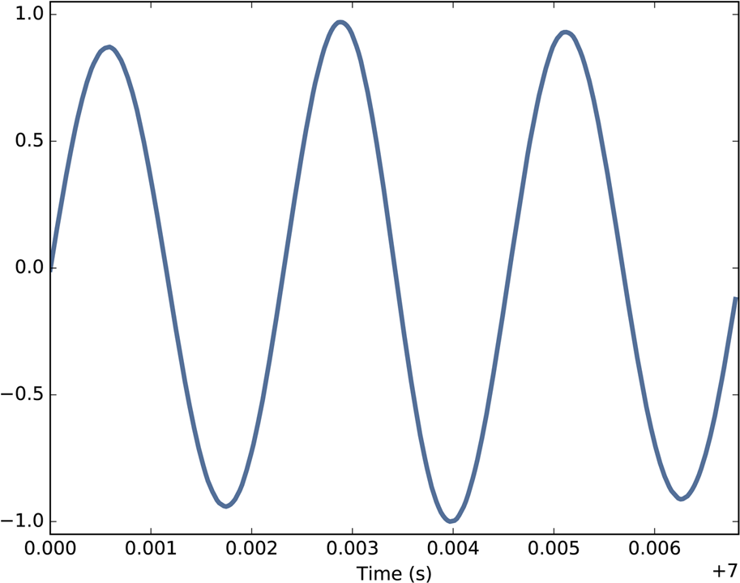

- 종소리 녹음을 **시간 영역**에서 본 파형으로, 진폭이 거의 일정한 매끈한 정현파가 규칙적으로 반복됨
- 하나의 기본 주파수가 지배적인 **주기 신호(periodic signal)** 의 전형 → 성분이 단순해 분석이 쉬움
- 뒤에 나올 복잡한 바이올린 신호와 대비되는 "깨끗한 신호"의 기준 예시

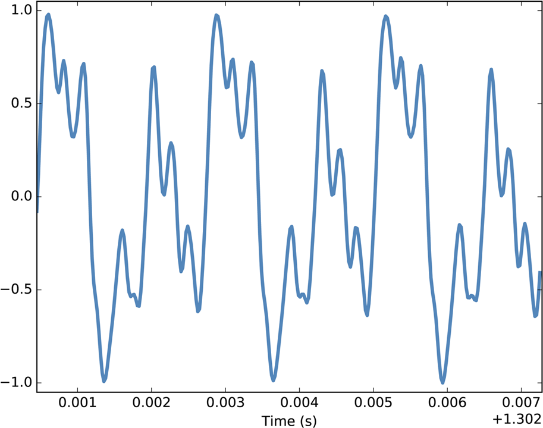

- 같은 시간 영역이지만 여러 정현파가 겹쳐 파형이 복잡하게 일그러져 있음
- 하나의 음(피치)이라도 **기본 주파수 + 여러 고조파**가 섞여 있음을 시사
- 여러 성분이 뒤섞인 실제 CNC 진동 신호와 닮은 형태 → "육안 구분 불가" 문제의 축소판

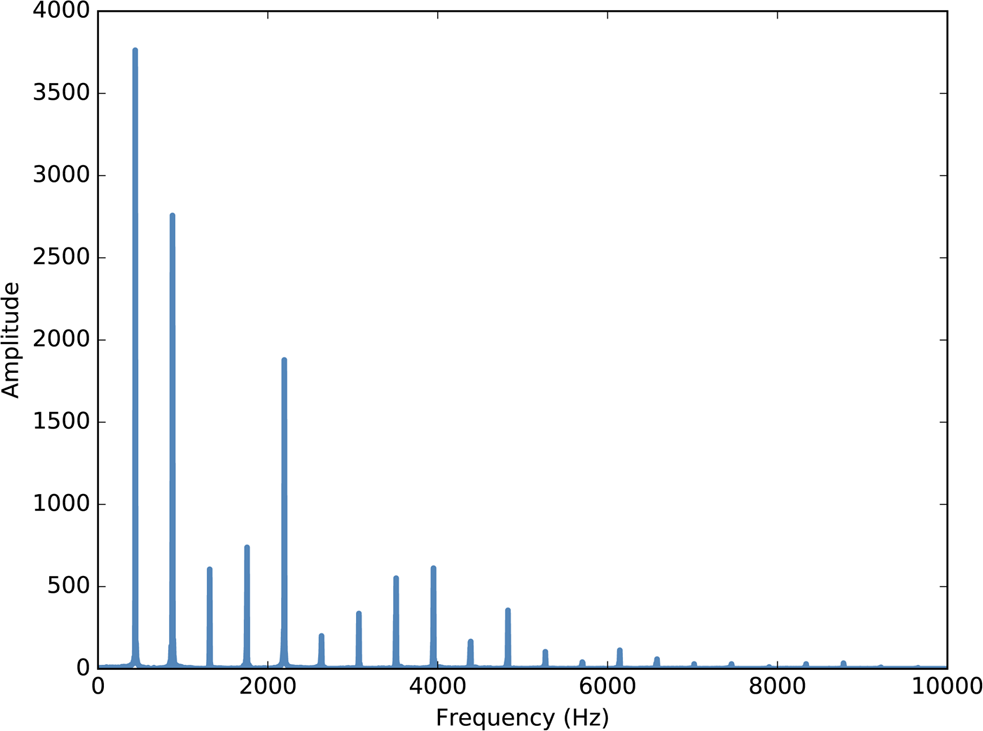

- 바이올린 신호를 **FFT로 분해**한 주파수 스펙트럼 (가로축: 주파수 Hz, 세로축: 진폭)
- 가장 왼쪽의 큰 피크가 **기본 주파수(f₀)**, 그 정수배 위치의 피크들이 **고조파(harmonics)**
- 시간 영역에서 복잡해 보이던 신호가 주파수 영역에선 몇 개의 또렷한 피크로 정리됨 → FFT의 힘

```
[주파수 성분의 구조]

기본 주파수(fundamental frequency): 가장 낮은 주파수 성분
고조파(harmonics): 기본 주파수의 정수배 주파수 성분들
  → 2차 고조파: 2 × f₀
  → 3차 고조파: 3 × f₀

예시) A4 음(440Hz)의 바이올린 신호:
  기본: 440Hz (가장 큰 진폭)
  1차 고조파: 880Hz (A5, 1옥타브 위)
  2차 고조파: 1320Hz (E6, 완전 5도 위)
```

- CNC 진동에서도 동일 원리 적용
  - 절삭 신호 → 특정 주파수 피크
  - 스핀들 노이즈 → 고주파 대역에 규칙적 분포
  - 채터링 → 불규칙 고주파

**스펙트럼의 파워(Power)**: 진폭의 제곱. 노이즈 분석에서는 진폭 대신 파워를 사용하는 것이 일반적 (에너지 측면에서 신호 강도를 더 잘 나타냄)

---

### Spectrogram — FFT의 시간 정보 상실 문제 해결

- 신호를 짧은 구간으로 나누어 각 구간의 스펙트럼을 계산 → **시간-주파수 2차원 플롯**으로 시각화
- **STFT(Short-Time Fourier Transform)** 구현 방식:
  1. 신호를 **Hamming window**로 짧은 구간으로 분할
  2. 각 구간에 FFT 적용
  3. 결과를 시간-주파수 2D 맵으로 시각화

```
[Spectrogram 구조]

    주파수 ↑
           │  ■     ■        ← 고주파 성분이 특정 시간에만 나타남
           │ ■■   ■■■       ← 시간에 따른 주파수 변화가 보임
           │■■■ ■■■■■■      ← FFT 단일 스펙트럼에서는 놓치는 정보
           └────────────→ 시간
```

- 처프(Chirp) 신호: 주파수가 시간에 따라 변하는 신호 → Spectrogram에서 변화가 선명하게 보임

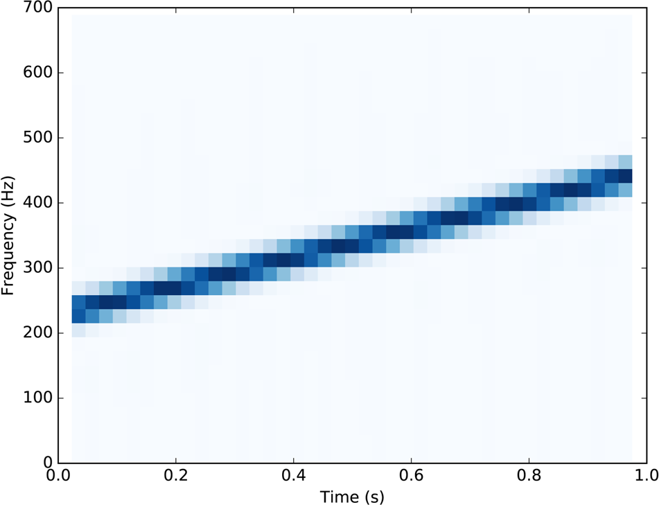

- 주파수가 시간에 따라 변하는 **처프 신호**를 시간-주파수 2차원으로 시각화 (가로축: 시간, 세로축: 주파수, 색/밝기: 세기)
- 시간이 흐르며 주파수가 비스듬히 이동하는 선이 보임 → "언제 어떤 주파수가 나타나는가"를 포착
- 단일 FFT로는 절대 알 수 없는 정보 → **STFT/스펙트로그램의 핵심 가치**

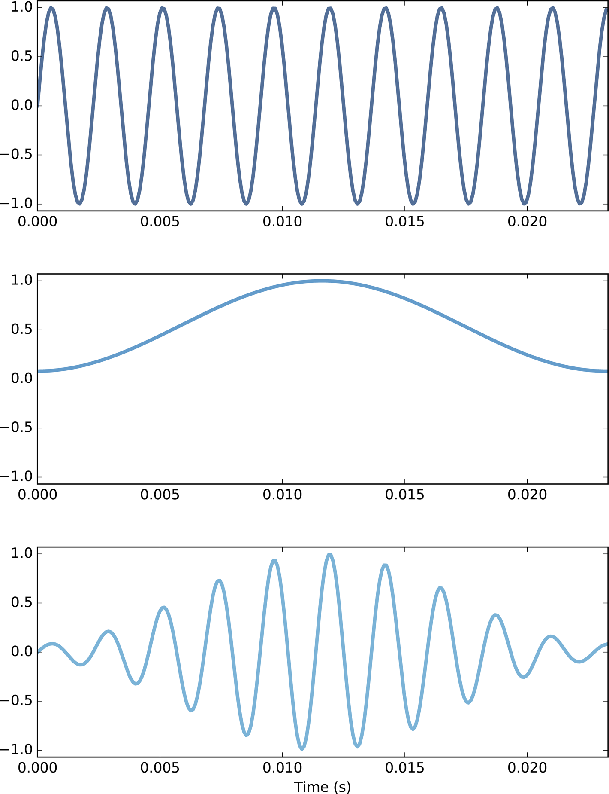

- STFT의 한 구간 처리 과정: **원본 정현파 조각 × Hamming 윈도우 = 양끝이 0으로 부드럽게 수렴**한 신호
- 윈도우를 곱하는 이유는 구간 경계의 급격한 불연속이 만드는 **누설(spectral leakage)** 을 줄이기 위함
- 각 구간마다 이렇게 윈도우를 씌운 뒤 FFT를 수행하는 것이 STFT의 한 스텝

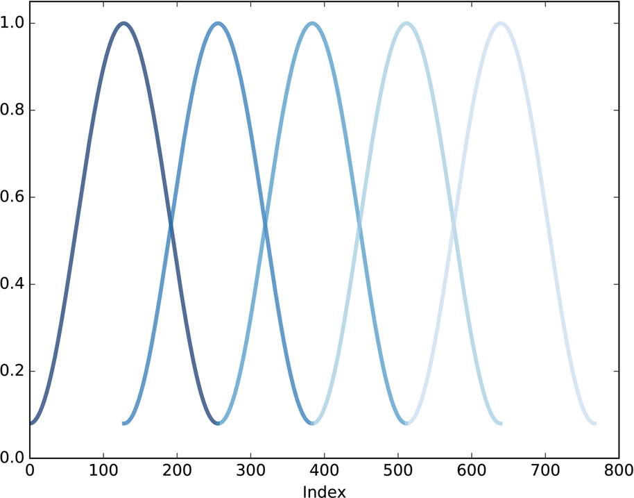

- 연속된 Hamming 윈도우들이 서로 **겹치며(overlap)** 신호 전체를 빠짐없이 덮는 모습
- 겹침 덕분에 윈도우 양끝에서 감쇠된 정보가 옆 구간에서 보완되어 시간 연속성이 유지됨
- 스펙트로그램이 구간들을 어떻게 이어 붙여 계산하는지를 설명

```{admonition} Gabor Limit (가보르 한계)
:class: important

```
시간 해상도 ↑ = 주파수 해상도 ↓
시간 해상도 ↓ = 주파수 해상도 ↑

→ 구간을 짧게 자르면 시간은 정확해지지만 주파수가 뭉개짐
→ 구간을 길게 자르면 주파수는 정확해지지만 시간이 뭉개짐
→ 둘 다 완벽할 수는 없음 (불확정성 원리의 일종)
```

→ **Wavelet Transform이 필요한 이유**: 주파수에 따라 윈도우 크기를 자동 조절하여 Gabor Limit 우회
```

---

### ② Wavelet Transform의 직관

> Think DSP Ch.3 / Ch.8

- **"돋보기를 스케일 바꿔가며 신호를 훑는 것"**

```
큰 스케일 (저주파 돋보기)  → 신호의 전체적인 추세(절삭 패턴)
중간 스케일               → 중간 주파수 성분 (스핀들 진동)
작은 스케일 (고주파 돋보기) → 빠른 변화(채터링, 전기 노이즈)

[Wavelet 분석 결과 예시]

레벨 1 (고주파) ──── 전기 간섭 + 채터링  → 제거 대상
레벨 2 (중주파) ──── 스핀들 노이즈       → 제거 대상
레벨 3 (저주파) ──── 절삭 신호          → 보존 대상
Approximation  ──── 장기 추세           → 보존 대상
```

```{mermaid}
flowchart TB
    subgraph "Wavelet 분석 결과"
        L1["레벨 1 (고주파) — 전기 간섭 + 채터링 → 제거 대상"]
        L2["레벨 2 (중주파) — 스핀들 노이즈 → 제거 대상"]
        L3["레벨 3 (저주파) — 절삭 신호 → 보존 대상"]
        L4["Approximation — 장기 추세 → 보존 대상"]
    end
```

- FFT와의 결정적 차이: **주파수 정보 + 시간 위치 정보를 동시에** 유지

---

### 노이즈의 종류와 특성

> Think DSP Ch.4 Noise

- 노이즈의 두 가지 의미:
  1. "원하지 않는 신호" (일상적)
  2. "다양한 주파수 성분을 포함하여 조화 구조가 없는 신호" (신호 처리적) — 오늘 다루는 의미

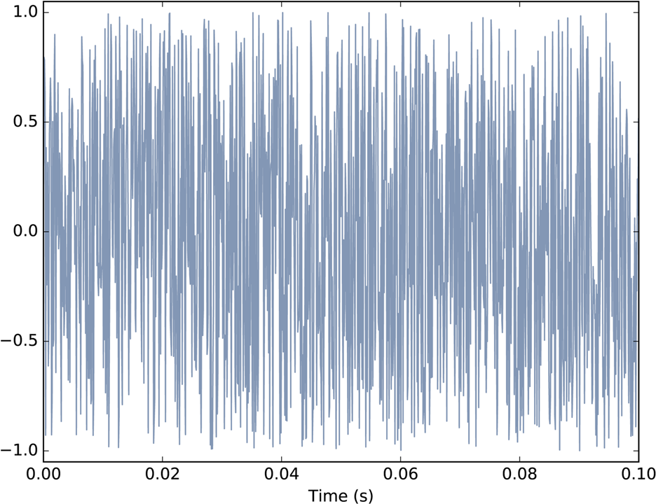

- 시간 영역에서 본 **백색(균일) 잡음** — 인접 샘플 간 상관이 없어 완전히 무작위로 출렁임
- 어떤 규칙·주기도 없는 "조화 구조가 없는 신호"의 전형 → 신호 처리에서 말하는 노이즈의 정의
- 제거 대상 노이즈가 시간 영역에서 어떻게 생겼는지 보여주는 출발점

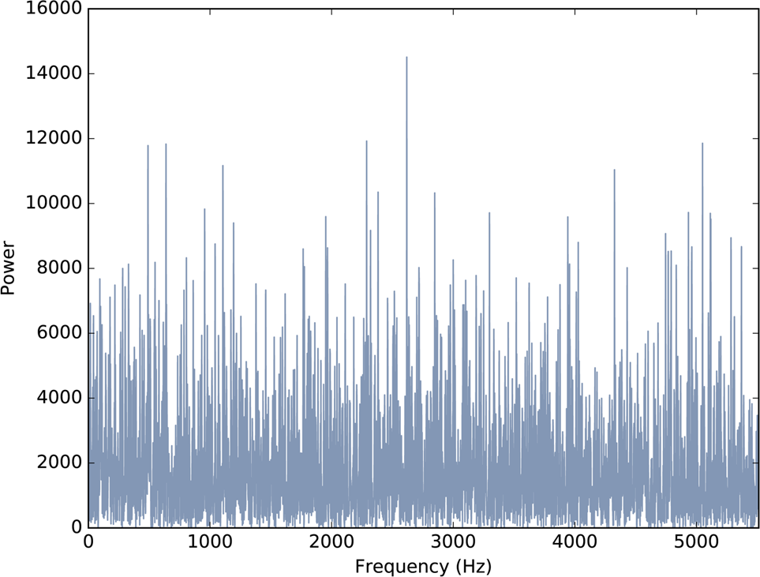

- 같은 잡음을 **주파수 영역**에서 본 파워 스펙트럼 — 특정 피크 없이 전 주파수에 고르게 퍼짐
- 백색 잡음은 모든 주파수에 비슷한 파워 → 스펙트럼이 대체로 **평평**
- 신호(특정 피크)와 노이즈(넓게 퍼짐)를 주파수 영역에서 구분하는 근거

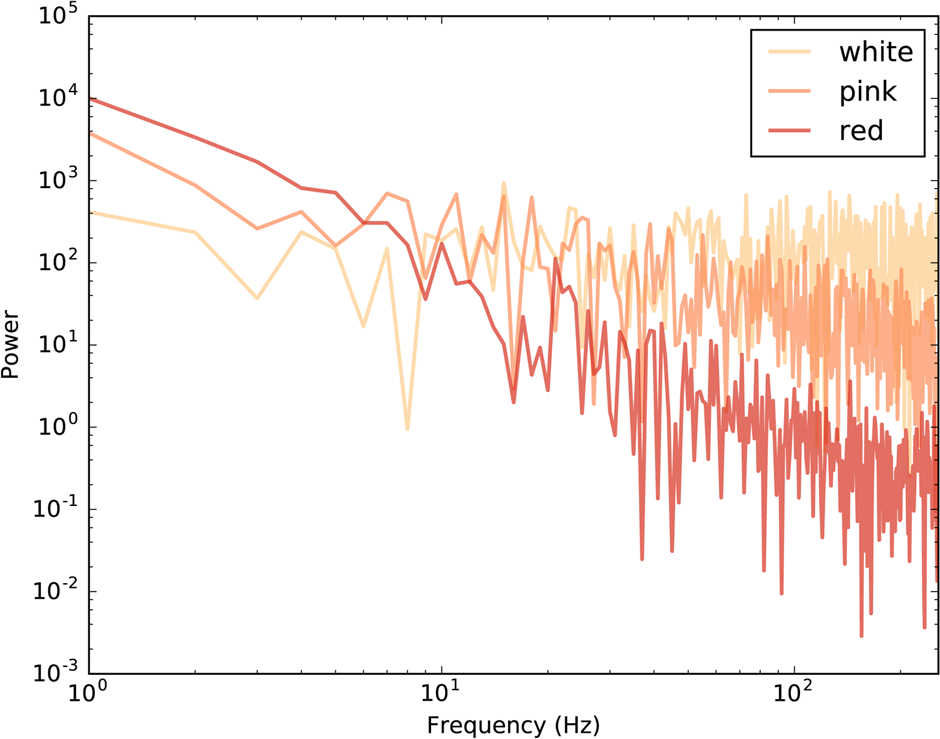

- 세 가지 잡음의 파워 스펙트럼을 **로그 축**에서 비교 — 기울기로 종류가 구분됨
- 백색=평평(P 일정), 분홍=완만한 하강(P∝1/f), 적색/갈색=가파른 하강(P∝1/f²)
- 노이즈마다 주파수 분포가 다름 → **어느 대역을 눌러야 하는지** 제거 전략이 달라지는 이유

```
[노이즈 분류 — 파워와 주파수의 관계]

백색 잡음 (White Noise):
  → 모든 주파수에서 동일한 파워 (P = 일정), 스펙트럼이 평평함
  → 예: 전기 간섭, 센서 열잡음

갈색 잡음 (Brownian/Red Noise):
  → 파워가 주파수에 반비례 (P ∝ 1/f²), 저주파에 파워 집중
  → 예: 기계적 드리프트, 온도 변화로 인한 센서 출력 이동

분홍 잡음 (Pink Noise, 1/f Noise):
  → 파워가 주파수에 반비례 (P ∝ 1/f), 백색과 갈색의 중간

가우시안 잡음 (Gaussian Noise):
  → 값이 정규분포를 따르는 무작위 잡음
  → Universal Threshold의 이론적 기반 (σ 추정 가능)
```

```{admonition} 제조 데이터에서의 의미
:class: important

CNC 진동 노이즈는 대부분 **백색 잡음 + 가우시안 잡음의 혼합**. 고주파 계수(cD1)에서 σ를 추정하여 Threshold 계산에 사용합니다.
```

---

### ③ Hard/Soft Threshold: 어떤 성분을 버릴 것인가

> Think DSP Ch.8 Filtering and Convolution / Ch.4 Noise

- Wavelet 분해 후 각 주파수 대역의 계수를 보고 **노이즈 여부를 판단**
- **Threshold** 기반 필터링이 주파수 영역에서 작동

```
Hard Threshold:  |계수| < T  →  0으로 설정 (잘라내기)
                 |계수| ≥ T  →  그대로 유지

Soft Threshold:  |계수| < T  →  0으로 설정
                 |계수| ≥ T  →  크기를 T만큼 줄임 (부드럽게 처리)
```

```
선택 가이드:
- Hard: 강한 신호 보존, 경계에서 불연속 발생 가능
- Soft: 신호가 약간 왜곡되지만 더 부드러운 결과
- 제조 데이터 실무: 보통 Soft Threshold가 더 안정적
```

```{admonition} 핵심 — Universal Threshold
:class: important

**임계값 T**:

$$T = \sigma \times \sqrt{2 \times \ln(N)}$$

- σ: 노이즈 표준편차 → 고주파 계수 **cD1**에서 추정 (노이즈가 압도적으로 많다는 가정)
- N: 신호 샘플 수
- 가우시안 잡음 가정이 중요
- Donoho & Johnstone, 1994
```

#### 필터링과 합성곱 (Think DSP Ch.8)

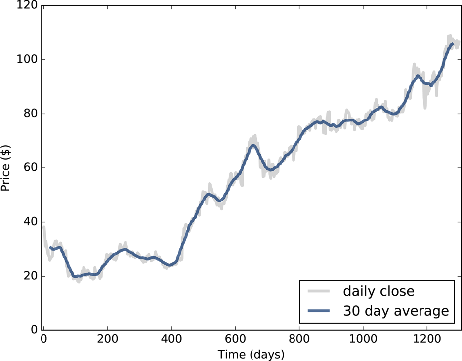

- 들쭉날쭉한 일별 주가에 **30일 이동평균**을 겹쳐 그린 그림
- 이동평균은 가장 단순한 **저역통과 필터** → 단기 변동(고주파)을 깎아내고 추세(저주파)를 남김
- "평활화 = 합성곱"이라는 필터링의 직관을 보여주는 친숙한 사례

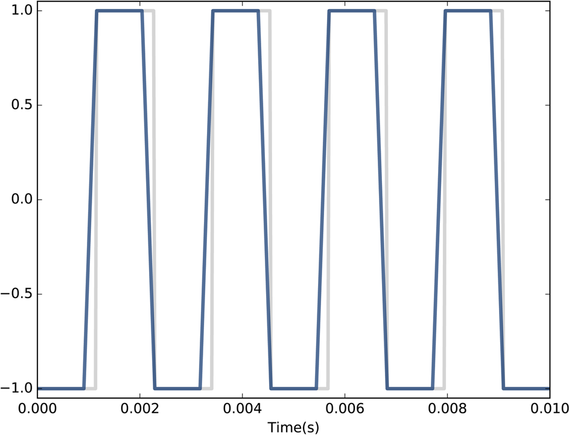

- 날카로운 모서리를 가진 **구형파**에 이동평균을 적용한 결과 — 모서리가 둥글게 뭉개짐
- 이동평균(저역통과)이 급격한 변화(고주파 성분)를 제거함을 시각적으로 확인
- Wavelet에서 고주파 계수를 threshold로 줄이는 것과 **같은 원리**

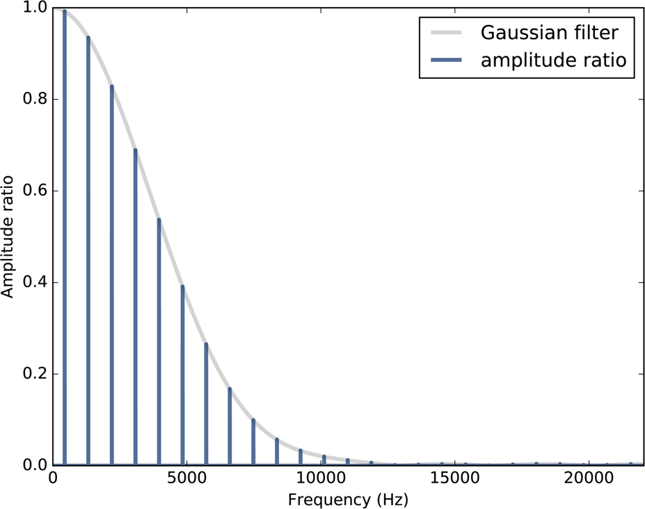

- 가우시안 평활 필터의 **주파수 응답**(입력 대비 출력의 비율)을 주파수에 따라 표시
- 저주파는 비율 ≈ 1(통과), 고주파로 갈수록 비율 ↓(감쇠) → 전형적인 **저역통과** 특성
- "시간 영역의 합성곱 = 주파수 영역의 곱셈"(합성곱 정리)을 수치로 보여줌

**합성곱 정리(Convolution Theorem)**: 시간 영역에서의 합성곱 = 주파수 영역에서의 곱셈

$$\text{DFT}(f * g) = \text{DFT}(f) \times \text{DFT}(g)$$

- 이것이 FFT가 빠른 이유: $O(N^2) \rightarrow O(N \log N)$
- Wavelet threshold도 같은 원리:
  1. Wavelet 분해 → 주파수 영역으로 변환 (합성곱 기반)
  2. 계수에 threshold 적용 → 특정 주파수 성분 감쇠
  3. 역 Wavelet 변환 → 시간 영역으로 복원

---

### ④ pywt 라이브러리 핵심 함수 3개

> Think DSP Ch.8 — pywt의 분해/재합성 대응 이론

**pywt 3단계 흐름**: 레고 블록을 분해 → 각 파트 점검 → 다시 조립

```python
import pywt, numpy as np

# 1. 사용 가능한 wavelet 종류 확인
print(pywt.wavelist(kind='discrete'))  # db, sym, haar 등

# 2. 다중 레벨 분해 (DWT)
coeffs = pywt.wavedec(signal, wavelet='db4', level=5)
# coeffs = [cA5, cD5, cD4, cD3, cD2, cD1]
#            근사  디테일5  ...  디테일1(최고주파)

# 3. 재합성 (역 DWT)
reconstructed = pywt.waverec(coeffs_modified, wavelet='db4')
```

```{mermaid}
flowchart TB
    A["원본 신호"] --> B["pywt.wavedec() — 분해"]
    B --> C["계수 배열 cA, cD5, cD4, cD3, cD2, cD1"]
    C --> D["threshold 적용 — 노이즈 계수를 0에 가깝게"]
    D --> E["수정된 계수 배열"]
    E --> F["pywt.waverec() — 재합성"]
    F --> G["노이즈 제거된 신호"]
```

```{admonition} 주의
:class: warning

분해할 때 쓴 wavelet 이름(예: `db4`)과 재합성할 때 쓴 이름이 **같아야** 제대로 복원됩니다.
```

---

## 1-3. Claude Code 시연

```{admonition} 시연 포인트
:class: tip

코드 자체보다 **Claude에게 어떻게 질문하는가**를 주목하세요. 좋은 프롬프트의 핵심 세 가지:
1. **목적**을 명확히 말하고
2. 사용할 **라이브러리/방법**을 지정하고
3. 원하는 **출력 형태**를 구체적으로 요청
```

**시연 프롬프트**:

```
CNC 밀링머신 진동 데이터에서 채터링 노이즈를 제거하려고 해.
pywt 라이브러리를 사용해서:
1. db4 wavelet으로 5레벨 분해
2. 상위 2개 레벨(고주파)에 soft threshold 적용
3. 재합성 후 원본과 결과를 subplot으로 비교
샘플 데이터는 numpy로 직접 생성해줘.
```

**시연 흐름**:
- Raw signal 생성 → `wavedec` 분해 → Threshold 적용 → `waverec` 재합성 → before/after 비교
- 결과: 윗그래프는 울퉁불퉁한 원본, 아랫그래프는 깔끔하게 정리된 50Hz 사인파

**추가 실험**: "db4 대신 sym5를 쓰면 어떤 차이가 있어?"
- `db4`(Daubechies): 비대칭 → 일반적인 제조 진동에 적합
- `sym5`(Symlets): db보다 대칭적 → 위상 왜곡에 민감한 경우에 유리
- 파라미터를 바꿔가며 실험하는 것이 Claude Code의 핵심 활용법

---

## 1-4. 실습

### 실험 매트릭스

| 조합 | Wavelet | Level | 관찰 포인트 |
|------|---------|-------|-------------|
| A | `db4` | 3 | 기준선 |
| B | `db4` | 5 | 레벨이 늘면? |
| C | `sym5` | 3 | wavelet 종류 변경 시? |
| D | `sym5` | 5 | 둘 다 변경 시? |

### STEP 1: 가상 신호 만들기

```python
import numpy as np, pywt, matplotlib.pyplot as plt

np.random.seed(42)
t = np.linspace(0, 1, 1024)
cutting_signal = np.sin(2 * np.pi * 50 * t)        # 50Hz 절삭 신호
spindle_noise  = 0.3 * np.sin(2 * np.pi * 200 * t) # 200Hz 스핀들 노이즈
chatter        = 0.2 * np.random.randn(len(t))       # 채터링
signal = cutting_signal + spindle_noise + chatter
```

### STEP 2: 노이즈 제거 함수 — 직접 채워보세요

```python
def denoise_wavelet(signal, wavelet='db4', level=5, threshold_mode='soft'):
    # TODO: 3줄을 채워 넣으세요
    # 1. pywt.wavedec 로 분해
    # 2. 고주파 계수에 threshold 적용
    # 3. pywt.waverec 로 재합성
    pass
```

힌트:
```python
T = np.sqrt(2*np.log(len(signal))) * np.std(coeffs[-1])
# coeffs[-1] = cD1 (가장 고주파 계수)에서 σ 추정
# coeffs[0] (근사 계수)는 건드리지 말 것
# coeffs[1:] 슬라이싱으로 디테일 계수만 처리
```

### STEP 3: 결과 시각화

```python
fig, axes = plt.subplots(2, 1, figsize=(12, 6))
axes[0].plot(t, signal, label='원본 신호', alpha=0.7)
# TODO: axes[1]에 denoised 결과 그리기
plt.tight_layout(); plt.show()
```

```{admonition} 성공 체크리스트
:class: tip

- 윗그래프는 **울퉁불퉁**, 아랫그래프는 **50Hz 사인파**에 가까워야 합니다
- 아랫그래프가 여전히 울퉁불퉁 → threshold가 너무 낮음
- 아랫그래프가 너무 매끄러움 → 신호까지 같이 제거됨
- 레벨을 높이면 노이즈 제거가 더 정교해지지만, 너무 높이면 **신호까지 손상**될 수 있음
```

---

## 핵심 요약

1. **FFT**는 주파수 성분은 보여주지만 **시간 정보를 잃는다**
2. **Wavelet Transform**은 **시간과 주파수 정보를 동시에 유지**한다
3. **pywt의 wavedec → threshold → waverec** 3단계 파이프라인으로 노이즈를 제거할 수 있다

---

## 참고 문헌

- *Think DSP: Digital Signal Processing in Python* (Allen B. Downey, O'Reilly)
  - Ch.1 Sounds and Signals — 신호, 주파수, 스펙트럼
  - Ch.3 Non-Periodic Signals — Spectrogram, Gabor Limit
  - Ch.4 Noise — 백색/갈색/분홍/가우시안 잡음
  - Ch.7 DFT — FFT 심화
  - Ch.8 Filtering — Convolution Theorem

### Wavelet 계열 비교

| Wavelet 계열 | 특성 | 적합한 용도 |
|-------------|------|------------|
| Haar | 가장 단순, 불연속 | 단계 함수, 빠른 계산 |
| Daubechies (db) | 비대칭, 지지 소형 | 일반적 제조 진동 |
| Symlets (sym) | db보다 대칭 | 위상 왜곡 민감 |
| Coiflets (coif) | 높은 소멸 모멘트 | 부드러운 신호 |
| Morlet | 연속, 복소수 | 주파수 분석 중심 |
