# 섹션 2 | 데이터 불균형 — 99% 정확도의 함정

> 참고 교재: *Machine Learning for Imbalanced Data* (Kumar Abhishek & Mounir Abdelaziz)
> 소요 시간: 문제 제기 3분 + 이론 13분 + 시연 10분 + 실습 19분

---

## 2-1. 문제 제기

- **상황**: 공장 불량 탐지 모델의 정확도가 **99%**. 잘 만든 걸까요?

```
[데이터 구성]  정상: 9,900개(99%) / 불량: 100개(1%)

[더미 모델] "모든 샘플을 정상으로 예측" → 정확도 = 99% ✓
하지만 불량 100개를 전부 놓쳤습니다
→ 정확도의 역설(Accuracy Paradox)
```

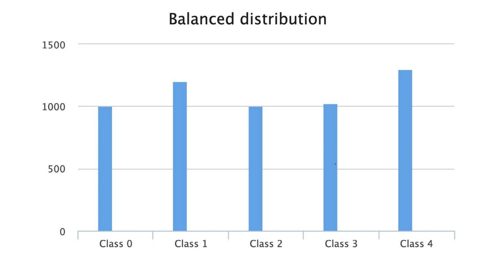

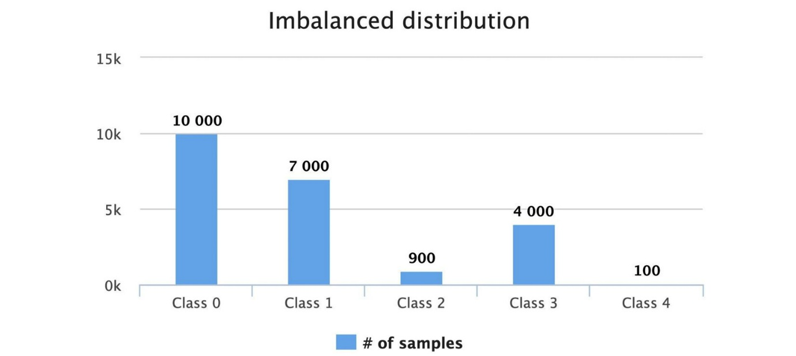

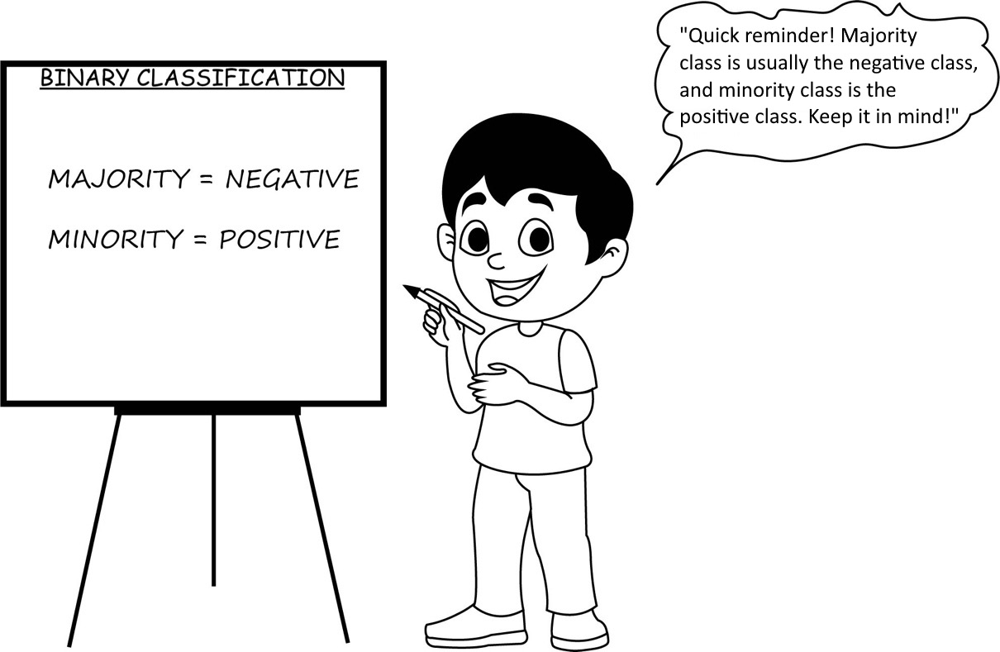

```{admonition} 제조업 현실
:class: important

불량 탐지 실패 → 리콜, 안전사고, 클레임. 하나의 불량이 수억 원의 리콜 비용을 낳을 수 있습니다. 정확도가 아닌 **불량을 얼마나 잡는가(Recall)** 가 핵심 지표입니다.
```

- **불균형 데이터셋(Imbalanced Dataset)**: 타겟 클래스 중 일부가 다른 클래스보다 압도적으로 많은 데이터셋
- 제조업에서는 일상: 정상 99%, 불량 1%은 양반. 불량률 0.1% 이하인 경우도 존재

---

## 2-2. 이론

### ① 정확도의 역설 → 올바른 평가 지표

> ML for Imbalanced Data Ch.1

**Confusion Matrix** — 모델의 예측이 실제 정답과 어떻게 맞고 틀리는지를 네 가지 경우로 분류:

- **TP (True Positive)**: 실제 불량을 불량이라고 올바르게 예측 — 가장 중요
- **FN (False Negative)**: 실제 불량인데 정상이라고 틀리게 예측 — 가장 위험 (놓친 불량)
- **TN (True Negative)**: 실제 정상을 정상이라고 올바르게 예측
- **FP (False Positive)**: 실제 정상인데 불량이라고 틀리게 예측 — 오탐

```
Precision (정밀도) = TP / (TP + FP)
  → "불량이라 예측한 것 중 실제 불량"
  → Precision이 높다 = 불량이라고 하면 진짜 불량일 확률이 높음

Recall (재현율) = TP / (TP + FN)
  → "실제 불량 중 모델이 잡아낸 비율" ← 핵심!
  → Recall 0.8 = 불량 100개 중 80개 잡고 20개 놓침

F1-Score = 2 × (Precision × Recall) / (Precision + Recall)
  → Precision과 Recall의 조화평균
  → 하나라도 낮으면 F1이 급격히 하락
```

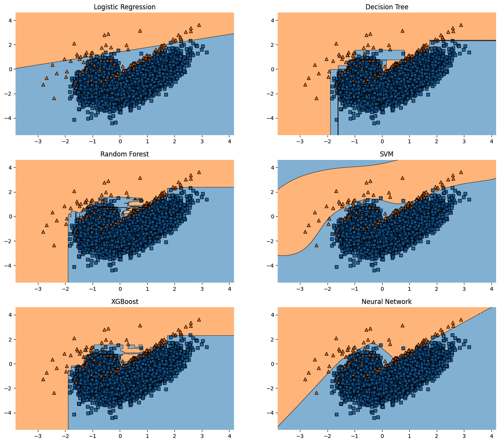

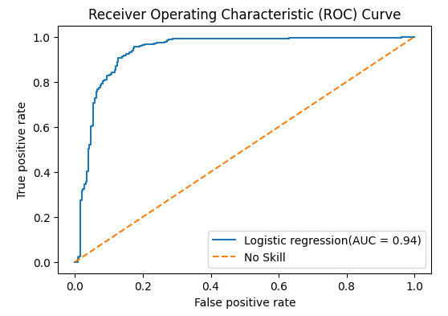

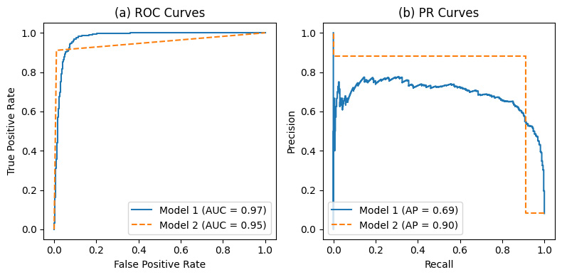

#### F-beta Score — 상황에 맞춰 가중치 조절

$$F_\beta = (1 + \beta^2) \times \frac{\text{Precision} \times \text{Recall}}{\beta^2 \times \text{Precision} + \text{Recall}}$$

- $\beta = 1$: F1-Score (동등 가중)
- $\beta > 1$: **Recall을 더 중시** (불량 탐지에서 놓치는 것이 더 치명적)
- $\beta < 1$: Precision을 더 중시 (오탐 비용이 높을 때)
- 제조업에서는 보통 **$\beta = 2$ 이상**으로 설정하여 Recall 강조

#### ROC Curve vs PR Curve

```
ROC Curve: TPR vs FPR → 불균형이 심하면 모델 간 차이가 안 보임
  (정상이 99%이면 FPR이 아주 낮게 나와 모델이 다 똑같아 보임)

PR Curve:  Precision vs Recall → 불균형에서도 모델 간 차이가 명확
```

```{admonition} 핵심
:class: important

**불균형 제조 데이터에서는 PR Curve + F1-Score 조합을 권장**합니다.
```

---

### ② SMOTE: 합성 샘플로 균형 맞추기

> ML for Imbalanced Data Ch.2

**SMOTE(Synthetic Minority Over-sampling Technique)**: 소수 클래스(불량)의 합성 샘플을 생성하여 균형을 맞추는 기법

**동작 원리**:

```{mermaid}
flowchart LR
    A["소수 클래스 샘플 x_i 선택"] --> B["k-최근접 이웃 x_nn 탐색"]
    B --> C["그 사이 임의 지점에 새 샘플 생성\nx_new = x_i + λ × (x_nn - x_i)"]
    C --> D["그럴듯한 새 불량 샘플 생성"]
```

```
2D 특징 공간 예시:

  불량 ●─────────────● 불량
              ↑
       SMOTE가 생성한
       합성 샘플 ☆
```

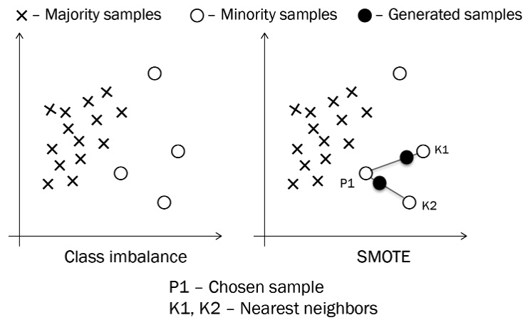

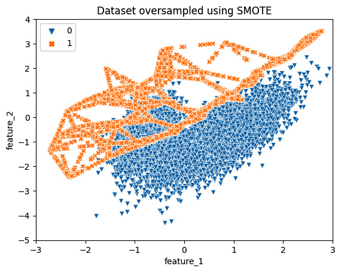

**장점**: 단순 복사(Oversampling)보다 모델이 더 다양한 경계를 학습
- 복사하면 같은 점이 여러 개 있어 과적합 위험
- SMOTE는 새로운 점을 만들어내어 **일반화된 결정 경계** 학습

**주의점**:
- 노이즈 샘플 근처에서 생성된 합성 샘플은 오히려 혼란 유발
- 잘못 라벨링된 샘플 주변에 합성 샘플을 만들면 모델이 잘못된 경계를 학습

```{admonition} 핵심 — SMOTE는 학습 데이터에만 적용
:class: important

**SMOTE는 학습 데이터에만 적용!** 테스트에 쓰면 부정행위입니다.

순서: 데이터 분할 → 학습셋에만 SMOTE → 모델 학습 → 테스트셋으로 평가
```

```python
from imblearn.over_sampling import SMOTE

smote = SMOTE(k_neighbors=5, random_state=42)
X_resampled, y_resampled = smote.fit_resample(X_train, y_train)
```

#### SMOTE 변형 알고리즘 (Ch.2)

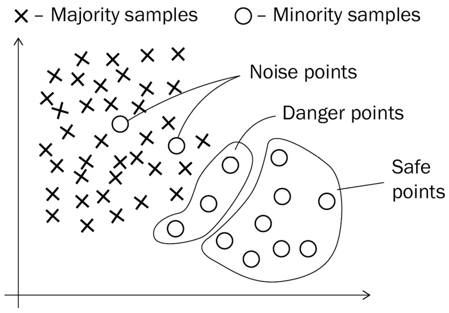

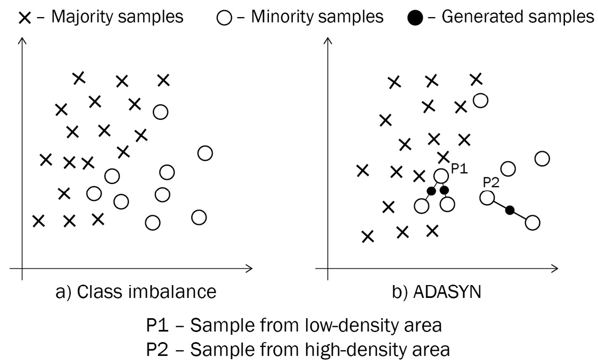

```
ADASYN:          학습하기 어려운 샘플(경계 근처)에 더 많이 생성
Borderline-SMOTE: 경계에 있는 샘플만 선택하여 SMOTE 적용
SMOTE-ENN:       SMOTE 후 ENN으로 노이즈 제거 (깨끗하지만 느림)
SMOTE-Tomek:     SMOTE + Tomek link 제거 (경계 선명화)

실무 팁: 기본 SMOTE로 시작 → 불만족시 ADASYN → SMOTE-ENN 순차 시도
k_neighbors는 소수 클래스 샘플 수보다 작아야 함
```

---

### ③ class_weight: 손실함수 레벨에서 조정

> ML for Imbalanced Data Ch.5 Cost-Sensitive Learning

- 데이터를 건드리지 않고 **모델의 손실 함수에서 불균형을 처리**

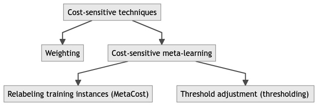

```python
from sklearn.ensemble import RandomForestClassifier

# 자동 가중치 (데이터 비율 기반)
model = RandomForestClassifier(class_weight='balanced', random_state=42)

# 수동 설정 (도메인 지식 기반)
model = RandomForestClassifier(class_weight={0: 1, 1: 99}, random_state=42)
```

**직관**: 불량 1개를 틀리면 정상 99개를 틀린 것과 같은 페널티 → 모델이 불량에 더 민감하게 반응

#### 가중치 결정 3가지 방식

```
1. 데이터 비율 기반: class_weight='balanced' (자동, 빠른 시작점)
   → w_j = N / (n_classes × n_j)

2. 비용 기반: 도메인 지식으로 수동 설정
   → 예: "불량 리콜 비용 = 정상 폐기 비용의 50배"
   → class_weight={0: 1, 1: 50}

3. 탐색 기반: GridSearchCV로 최적 가중치 탐색
   → param_grid = {'class_weight': [{0:1, 1:w} for w in [10, 50, 99, 200]]}
```

#### 비용 민감 학습(CSL) vs 리샘플링(SMOTE) 비교

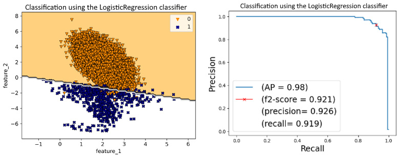

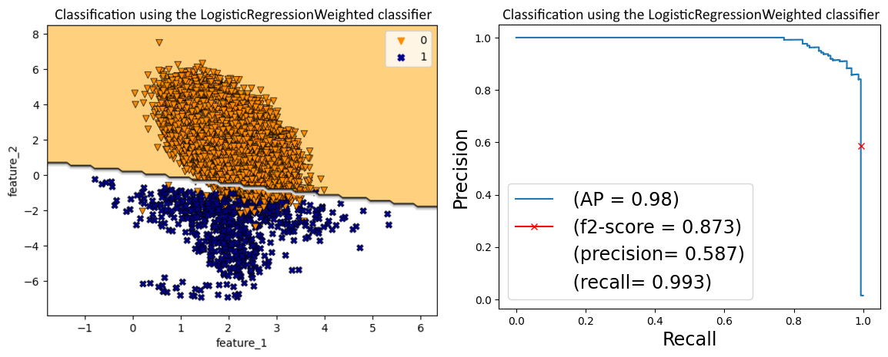

```
리샘플링(SMOTE): 데이터 자체를 변경 → 오버피팅 위험, 학습 시간 ↑
CSL(class_weight): 손실 함수 내에서 가중치 조절 → 데이터 불변, 학습 시간 동일

둘 다 불량에 더 민감하게 만드는 건 같음
실무에서는 둘 다 해보고 더 잘 되는 쪽 선택
```

---

### ④ 임계값 조정: 0.5가 항상 최선이 아니다

> ML for Imbalanced Data Ch.5 — Threshold Adjustment

- 기본적으로 모델은 확률이 0.5 이상이면 불량, 미만이면 정상으로 분류
- 불량을 더 많이 잡고 싶으면 **임계값을 낮추면 됨**

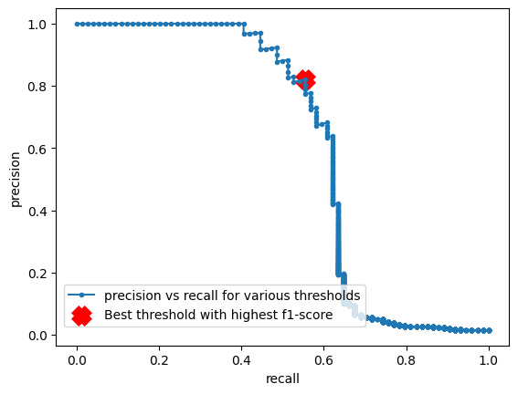

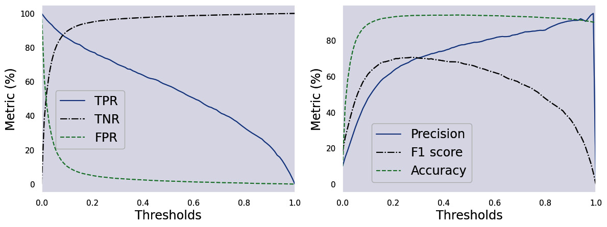

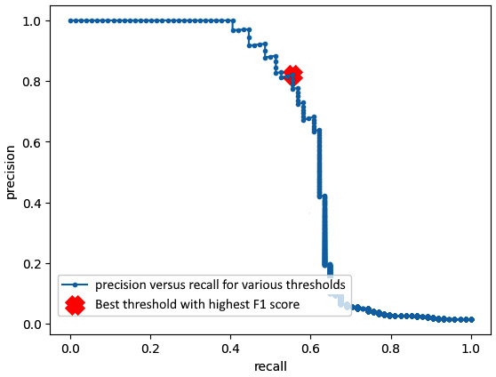

```
모델 출력: P(불량) = 0.3 → 기본(0.5 기준): "정상"

임계값을 0.2로 낮추면: P(불량) = 0.3 → "불량" ← 더 민감하게

트레이드오프:
- 임계값 ↓: Recall ↑, Precision ↓ (더 많이 잡지만 오탐도 증가)
- 임계값 ↑: Recall ↓, Precision ↑ (덜 잡지만 잡으면 맞음)
```

```python
from sklearn.metrics import precision_recall_curve
import numpy as np

probas = model.predict_proba(X_test)[:, 1]
precision, recall, thresholds = precision_recall_curve(y_test, probas)
f1_scores = 2 * precision * recall / (precision + recall + 1e-8)
best_threshold = thresholds[np.argmax(f1_scores)]
```

```{admonition} 실무 주의사항
:class: warning

이 최적 임계값은 **현재 테스트셋에서 가장 좋은 값**이지, 미래 데이터에서도 항상 최고라는 뜻은 아닙니다. 현장에서는 **검증셋을 따로 두고** 거기서 찾은 임계값을 실제 서비스에 써야 합니다.
```

---

## 2-3. Claude Code 시연

**시연 프롬프트**:

```
불량률 1%인 제조 데이터를 시뮬레이션해줘.
1. 기본 RandomForest 모델 학습
2. SMOTE 적용 후 재학습
3. class_weight='balanced' 적용 후 재학습
세 모델의 Confusion Matrix와 F1-score를 나란히 비교하는 시각화를 만들어줘.
```

**시연 결과**:
- **기본 모델**: 불량을 거의 잡지 못함, FN이 엄청나게 많음, Recall ≈ 0. 정확도는 99%
- **SMOTE 적용**: Recall 크게 개선, FN이 확 줄음. Precision은 약간 하락(오탐 증가)
- **class_weight**: SMOTE와 비슷한 수준으로 Recall 개선. 데이터는 건드리지 않음

**추가 질문**: "SMOTE가 항상 최선인가? 안 쓰는 게 나을 때는?"
- 데이터에 노이즈가 많거나 소수 클래스 샘플 자체가 잘못 라벨링된 경우 → SMOTE가 오히려 해가 됨
- 이럴 때는 class_weight가 더 안전
- 데이터가 충분히 많으면 불균형 자체가 큰 문제가 아닐 수도 있음

---

## 2-4. 실습

### STEP 1: 데이터 준비

```python
from sklearn.datasets import make_classification
from sklearn.model_selection import train_test_split
from sklearn.ensemble import RandomForestClassifier
from sklearn.metrics import f1_score, recall_score
from imblearn.over_sampling import SMOTE

X, y = make_classification(n_samples=10000, weights=[0.99, 0.01],
                           n_features=10, random_state=42)
X_train, X_test, y_train, y_test = train_test_split(X, y, test_size=0.2, random_state=42)
```

### STEP 2: k_neighbors별 실험

```python
results = {}
for k in [3, 5, 7, 10]:
    smote = SMOTE(k_neighbors=k, random_state=42)
    X_res, y_res = smote.fit_resample(X_train, y_train)
    model = RandomForestClassifier(random_state=42).fit(X_res, y_res)
    pred = model.predict(X_test)
    results[k] = {'f1': f1_score(y_test, pred), 'recall': recall_score(y_test, pred)}
    print(f"k={k}: {sum(y_res == 1)} minority samples")
```

### STEP 3: 결과 비교

```python
import matplotlib.pyplot as plt
ks = list(results.keys())
plt.plot(ks, [results[k]['f1'] for k in ks], marker='o', label='F1')
plt.plot(ks, [results[k]['recall'] for k in ks], marker='s', label='Recall')
plt.xlabel('k_neighbors'); plt.ylabel('score'); plt.legend(); plt.show()
```

```{admonition} 실험 관찰 포인트
:class: tip

- **k=3**: 이웃이 너무 가까워 합성 샘플의 다양성이 떨어짐 (비슷한 점만 생성)
- **k=5~7**: 보통 F1이 가장 높게 나옴 (적절한 균형)
- **k=10**: 멀리 있는 샘플까지 포함 → 노이즈가 섞여 경계가 흐려짐
- 최적의 k는 **문제와 데이터에 따라 다름** — 이게 실무 모델 튜닝의 기본 과정
```

---

## 핵심 요약

1. 불균형 데이터에서는 **정확도만 보면 안 되고, F1과 Recall을 같이 봐야 한다**
2. **SMOTE의 k_neighbors** 같은 작은 파라미터도 성능에 영향을 준다
3. SMOTE, class_weight, 임계값 조정 — **세 가지 해결책을 상황에 맞게 선택**

---

## 참고 문헌

- *Machine Learning for Imbalanced Data* (Kumar Abhishek & Mounir Abdelaziz, Packt)
  - Ch.1 Introduction — 정확도 역설, Confusion Matrix
  - Ch.2 Oversampling — SMOTE, ADASYN, Borderline
  - Ch.3 Undersampling — Tomek Links, ENN, NearMiss
  - Ch.4 Ensemble — EasyEnsemble, RUSBoost
  - Ch.5 CSL — class_weight, MetaCost
  - Ch.10 Calibration — Platt Scaling, Brier Score
