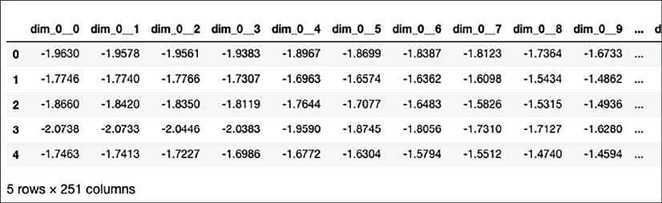
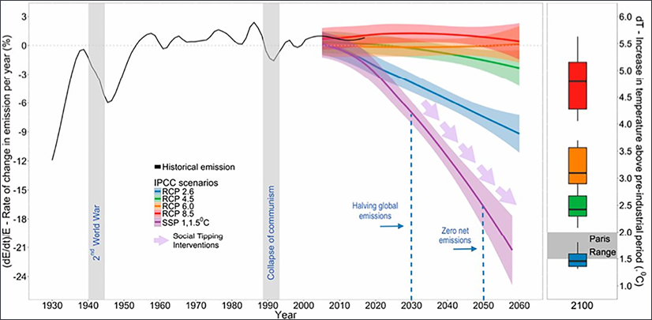
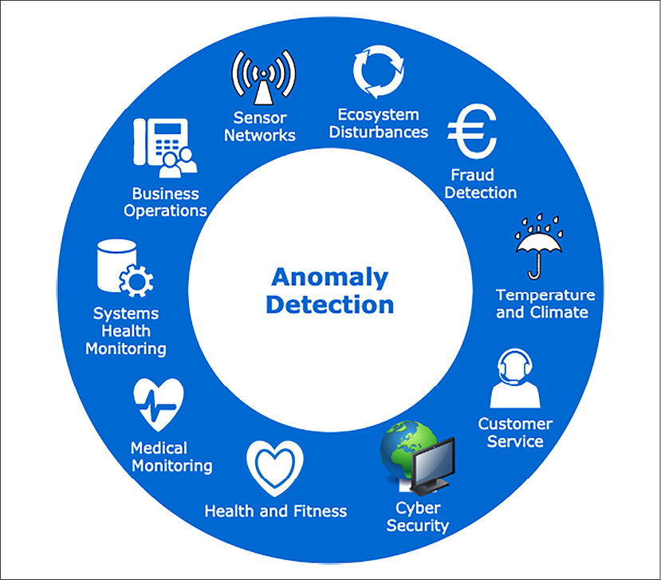
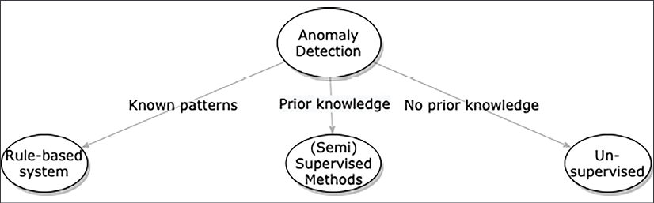
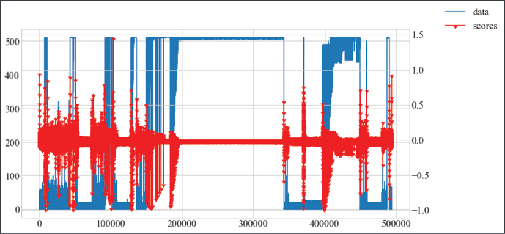
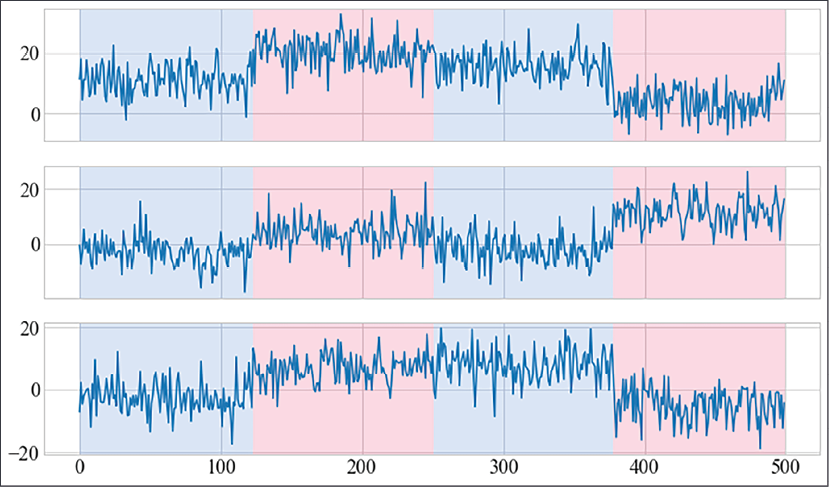
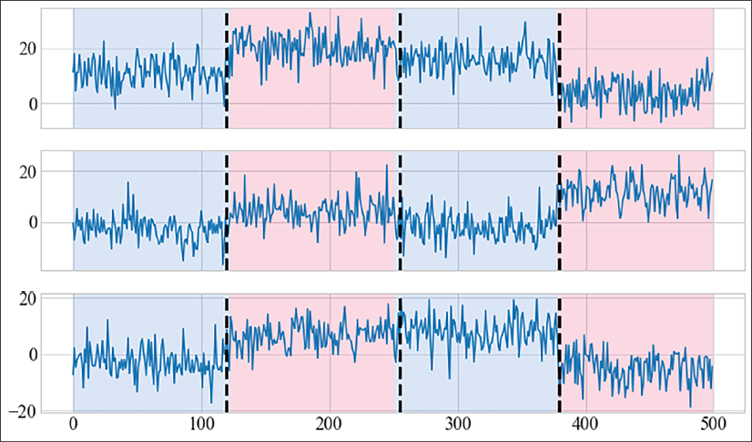
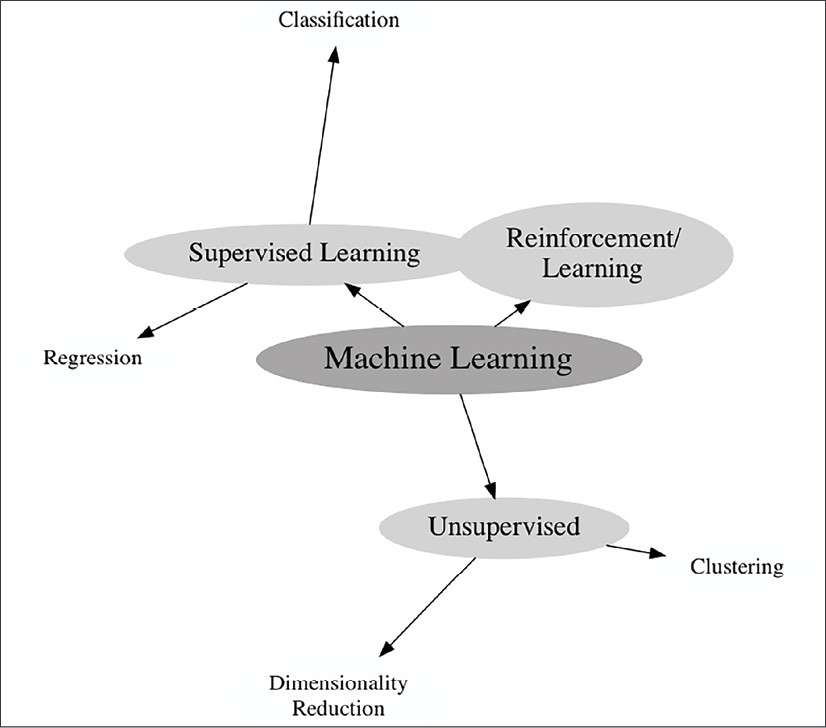
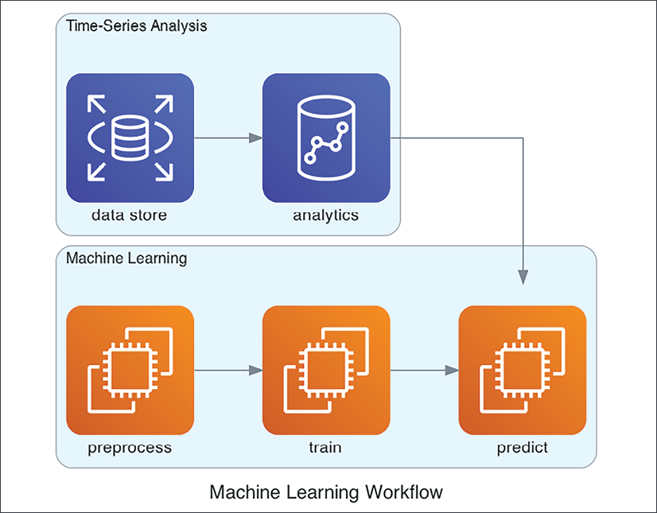
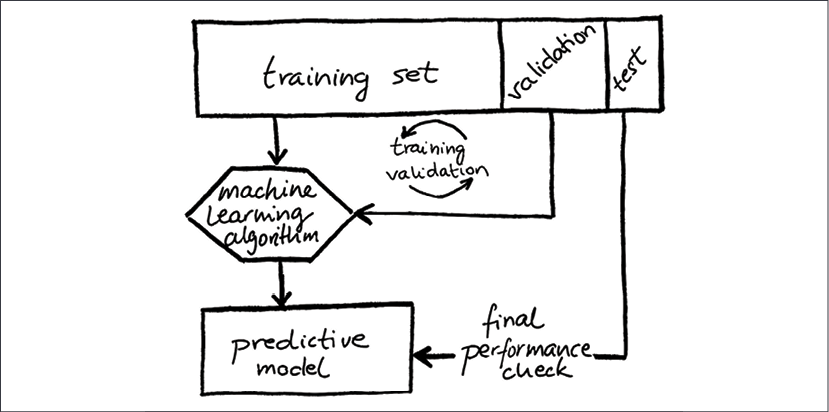

# 섹션 3 | CNC 이상탐지 파이프라인 — 공구 마모 시작점 잡기

---

## 3-1. 문제 제기 + 데이터 확인

- **목표**: 공구 마모가 **시작되는 순간**을 실시간으로 포착할 수 있을까?
- 이상 탐지(Anomaly Detection): 드물거나 정상 범위를 벗어난 이벤트를 식별하는 작업 (교재 6장)
- 제조업에서의 공구 마모 탐지 = 센서 데이터에서 정상 범위를 벗어나는 패턴을 찾아내는 것

```{mermaid}
flowchart LR
    A["정상 가공\n진동 안정적\nRMS 낮음"] --> B["초기 마모 시작\n진동 약간 증가\nRMS 서서히 상승"]
    B --> C["심각한 마모\n진동 급격히 증가\nRMS 급등, 불규칙"]
```

```
[공구 마모 진행 단계]

정상 가공           초기 마모 시작        심각한 마모
    ↓                    ↓                   ↓
진동 안정적       진동 약간 증가         진동 급격히 증가
RMS 낮음          RMS 서서히 상승        RMS 급등, 불규칙
```

- **핵심**: 세 번째 단계가 되기 전에, **두 번째 단계(초기 마모)** 에서 잡아야 함
- 교재에서는 이런 변화를 **변화점 탐지(Change Point Detection)** 라고 부름
  - "이 시점부터 데이터의 분포가 변했다"를 찾는 문제
  - 공구 마모 시작점 = 변화점

**이 순간을 잡지 못하면**:
- 마모된 공구로 계속 가공 → 불량 발생
- 공구 교체 시점 놓침 → 심각한 손상, 비용 증가
- 공구 하나가 파손되면 수천만 원의 손실 가능

**오늘 만들 파이프라인**: 섹션 1의 노이즈 제거 + 섹션 2의 평가 지표를 결합하여 마모 시작점을 자동 탐지하는 엔드투엔드 시스템

---

## 3-2. 이론: 파이프라인 설계 논리

### ① 왜 Raw Signal을 그대로 쓰면 안 되는가

> ML for Time-Series Ch.3 Preprocessing / Ch.4 ML for Time-Series

- **차원의 저주(Curse of Dimensionality)**: 1초에 10,000개 샘플 × 10시간 = **3억 6천만 개의 입력값**
- 교재 3장: "실제 현장 데이터는 여러 소스에서 수집되고, 불완전하고, 불일치가 있다"
- **특징 공학(Feature Engineering)**: 원시 특징에서 더 유용한 특징을 구성하는 과정이 필수

```
[핵심 특징 3가지 — 물리적으로 의미 있는 숫자로 압축]

1. RMS (Root Mean Square) — 신호의 에너지
   RMS = √(Σx² / N)  → 마모 진행될수록 RMS 상승

2. Peak Value — 순간 최대 진폭
   → 채터링, 충격 발생 시 급등

3. Kurtosis — 신호의 첨도 (뾰족한 정도)
   Kurtosis = E[(X-μ)⁴] / σ⁴
   → 정상: ~3 (정규분포), 결함 발생: 3 이상으로 상승
```




```python
def extract_features(signal_window):
    """진동 신호 윈도우에서 특징 추출"""
    rms = np.sqrt(np.mean(signal_window**2))
    peak = np.max(np.abs(signal_window))
    mean = np.mean(signal_window)
    std = np.std(signal_window)
    kurtosis = np.mean(((signal_window - mean) / std)**4) if std > 0 else 0
    return {'rms': rms, 'peak': peak, 'kurtosis': kurtosis}
```

- 교재 3장에서 ROCKET 같은 자동 특징 추출 방법도 소개하지만, 오늘은 직관적으로 이해할 수 있는 세 가지를 사용

---

### ② 이상탐지 방식 선택: 레이블 유무에 따른 전략

> ML for Time-Series Ch.6 Unsupervised Methods

```{mermaid}
flowchart TD
    A{"레이블 유무?"} -->|"레이블 있음\n(정상/불량 알고 있음)"| B["지도학습 분류기\nRandomForest, SVM\n+ 섹션 2의 불균형 처리 기법"]
    A -->|"레이블 없음\n(정상만 알고 있음)"| C["비지도 이상탐지\nIsolation Forest, One-Class SVM\n실제 현장에서 더 흔한 상황"]
```

- 실제 현장에서는 **레이블이 없는 경우가 더 흔함**
  - "지금까지 공구가 정상이었다"는 알지만 "정확히 몇 시부터 마모가 시작되었다"는 라벨이 없음
- 오늘은 **Isolation Forest**를 사용 (비지도학습)

#### Isolation Forest 원리 — "이상값은 고립시키기 쉽다"

```
랜덤하게 데이터를 분할할 때:
- 정상 데이터: 많은 분할이 필요 (데이터가 밀집)
- 이상 데이터: 적은 분할로 고립됨 (데이터가 희박)
→ 고립에 필요한 평균 분할 수 = 이상 점수
```

```python
from sklearn.ensemble import IsolationForest

model = IsolationForest(contamination=0.05, random_state=42)
model.fit(X_normal)                    # 정상 데이터로만 학습
predictions = model.predict(X_test)     # 1: 정상, -1: 이상
```







#### 시계열 이상의 3가지 유형

```
1. Point Anomaly (점 이상):
   개별 포인트가 정상 범위를 벗어남
   → 예: 순간 전원 서지, 센서 고장

2. Contextual Anomaly (문맥적 이상):
   값은 정상 범위 내지만 문맥상 비정상
   → 예: 공구 마모 초기의 미세한 RMS 증가

3. Collective Anomaly (집단 이상):
   개별 값은 정상이지만 연속된 패턴이 비정상
   → 예: 진동 주파수가 서서히 이동하는 채터링 패턴
```

#### 이상탐지 vs 변화점 탐지 — 공구 마모 시작점의 본질

```
이상탐지:   "이 데이터 포인트는 비정상이다"
변화점 탐지: "이 시점부터 데이터의 분포가 변했다"

공구 마모 탐지에서의 의미:
→ 마모 시작점 = 변화점 (change point)
→ 정상 구간 → 마모 구간으로 전환되는 시점
→ 이상 점수가 급증하는 시점을 찾는 것 = 변화점 탐지

구현: Isolation Forest → 이상 점수 시계열 계산
     → 이동평균 또는 CUSUM으로 급증 시점 탐지
```







#### 온라인/실시간 이상탐지

```
배치 처리 vs 스트리밍 처리:
  배치: 전체 데이터를 한 번에 처리 (지금까지의 실습)
  스트리밍: 데이터가 들어오는 즉시 실시간 처리

실시간 처리 도구 (River 라이브러리):
```

```python
from river import anomaly

model = anomaly.HalfSpaceTrees(n_trees=25, height=15, window_size=250)
for x in data_stream:
    score = model.score_one(x)
    model.learn_one(x)
    if score > threshold:
        trigger_alert()
```

---

### ③ 전체 파이프라인 설계







```{mermaid}
flowchart TB
    A["1. 데이터 수집\n센서 실시간 스트림"] --> B["2. 전처리 (섹션 1)\nWavelet 노이즈 제거"]
    B --> C["3. 윈도우 분할\n슬라이딩 윈도우 (1초, 0.5초 겹침)"]
    C --> D["4. 특징 추출\nRMS, Peak, Kurtosis"]
    D --> E["5. 이상탐지\nIsolation Forest → 이상 점수"]
    E --> F["6. 알림\n이상 점수 > 임계값 → 경보"]
```

```
[CNC 공구 마모 탐지 파이프라인]

1. 데이터 수집 → 센서 실시간 스트림
2. 전처리 (섹션 1) → Wavelet 노이즈 제거
3. 윈도우 분할 → 슬라이딩 윈도우 (1초, 0.5초 겹침)
4. 특징 추출 → [RMS, Peak, Kurtosis]
5. 이상탐지 → Isolation Forest → 이상 점수
6. 알림 → 이상 점수 > 임계값 → 경보
```

#### 시계열 교차 검증 — 일반 k-fold를 쓰면 안 되는 이유

```{admonition} 핵심 — 데이터 누수 방지
:class: important

시계열에서 k-fold CV를 쓰면 **"미래 데이터로 과거 예측"**하는 데이터 누수가 발생합니다. 반드시 **TimeSeriesSplit**을 사용하세요.
```

```python
from sklearn.model_selection import TimeSeriesSplit

tscv = TimeSeriesSplit(n_splits=5)
for train_idx, test_idx in tscv.split(features):
    model.fit(features[train_idx])
    scores = model.score_samples(features[test_idx])
```

- 교재에서 "워크-포워드 검증(Walk-Forward Validation)"이라고도 부름

#### 오차 지표 선택 — 회귀 vs 분류

```
회귀 (이상 점수 연속값):
  MSE:  오차 제곱 평균 → 이상치에 민감
  MAE:  오차 절대값 평균 → 이상치에 덜 민감
  RMSE: MSE의 제곱근 → 원래 단위와 동일 스케일

분류 (정상/이상 이진):
  → 섹션 2에서 배운 Precision, Recall, F1-Score가 그대로 적용
  → 불균형 데이터이므로 Accuracy 지양, PR Curve + F1 권장
```

---

## 핵심 요약

1. **노이즈 제거**(섹션 1) → **특징 추출**(RMS, Peak, Kurtosis) → **이상탐지**(Isolation Forest)의 6단계 파이프라인
2. 라벨이 없어도 **정상 데이터만으로** 이상탐지 모델 구축 가능
3. 시계열에서는 반드시 **TimeSeriesSplit**으로 교차 검증 (일반 k-fold 금지)
4. 모든 단계가 **섹션 1과 2에서 배운 이론**과 연결됨

---

## 실제 CNC 밀링머신 데이터 분석 결과

### 데이터 개요

```
[실제 CNC 밀링머신 데이터 구성]

데이터: 12개 CSV 파일(+ CAD 파일 1개), 2,994,307개 샘플
센서: 3축 가속도 센서 (acc_x, acc_y, acc_z)

3가지 조건:
  정상 (normal)  — 12.0%
  채터링 (chatter) — 10.1%
  마모 (wear)    — 77.9%
```

### 핵심 발견 — 조건별 acc_x 통계량 비교

```
표준편차 (std):
  Normal:  5.88   ← 매우 안정적
  Wear:    292    ← Normal의 약 50배
  Chatter: 373    ← Normal의 약 63배

RMS (Root Mean Square):
  Normal:  28.58
  Wear:    220
  Chatter: 363

→ Normal, Wear, Chatter 간 명확한 구분 가능
```

```{admonition} 심화 발견 — 단순 통계가 놓치는 패턴
:class: tip

- **평균은 조건 무관 거의 동일** (분류 단서는 변동성과 동역학에 있음)
- **정상 라벨의 숨은 스파이크**: 표준편차는 작지만 acc_x 첨도 ≈ 2,900 — 드문 강한 충격 혼입
- **채터링의 축 결합**: 축 간 상관 |0.59~0.64| — 단순 진폭이 아닌 축 위상 결합으로도 구분
```

### 주파수 분석 결과 (정규화 주파수)

```
※ 샘플링 주파수(fs) 정보가 없어 정규화 주파수(cycles/sample, Nyquist=0.5)로 분석

지배 정규화 주파수 (acc_x):
  Normal:  0.08–0.11   ← 저주파, 안정적
  Chatter: ~0.40       ← 나이퀴스트의 약 80%, 고주파 떨림
  Wear:    0.14–0.46   ← 넓은 대역 분포

→ FFT 스펙트럼으로도 조건 구분 가능
→ fs 확인 시 Hz = 정규화주파수 × fs로 환산 가능
```

### Wavelet 노이즈 제거 결과

```
[적용 파라미터]
Wavelet:    db4 (Daubechies 4)
Level:      5
Threshold:  soft threshold
대상:       채터링 데이터 (label_11, acc_x)

[결과]
원본 std 대비 노이즈 성분이 효과적으로 제거됨을 확인
→ 섹션 1에서 배운 파이프라인이 실제 데이터에도 유효
```

### 클래스 불균형 처리 결과

| 방법 | F1-Score | 정상 클래스 Recall | 비고 |
|------|----------|-------------------|------|
| Basic RandomForest | 0.99 | 0.98 | 기본 모델 |
| SMOTE + RandomForest | 0.99 | 0.99 | 소수 클래스(정상) recall 개선 |
| class_weight='balanced' | 0.98 | — | 손실함수 가중치로도 유사한 성능 |

```{admonition} 핵심 인사이트
:class: important

SMOTE 적용 시 소수 클래스(정상)의 Recall이 0.98에서 0.99로 개선. class_weight만으로도 유사한 수준의 성능을 달성할 수 있어, 현장 상황에 따라 더 간단한 방식을 선택 가능합니다.
```

### Isolation Forest 이상탐지 결과

```
[모델 설정]
알고리즘:       IsolationForest
학습 데이터:    정상(normal) 조건 데이터만 사용
contamination:  0.05

[이상 점수 분포]
Normal 조건:
  → 낮고 안정적인 이상 점수 (정상 범위)

Chatter 조건:
  → 높은 이상 점수 — 채터링 패턴이 정상과 확연히 다름

Wear 조건:
  → 높은 이상 점수 — 마모로 인한 진동 변화가 명확히 감지됨

→ 마모 시작점 탐지 가능 확인!
→ 섹션 3에서 설계한 파이프라인이 실제 데이터에서도 작동
```

```{admonition} 실무 인사이트
:class: tip

정상 데이터로만 학습해도 Chatter와 Wear 조건을 명확히 구분할 수 있었습니다. 이는 실제 현장에서 **라벨링 비용을 크게 절감**할 수 있다는 것을 의미합니다.
```

---

## 참고 문헌

- *Machine Learning for Time-Series with Python* (Ben Auffarth, Packt)
  - Ch.3 Preprocessing — Feature Engineering, ROCKET
  - Ch.4 ML for Time-Series — Classification, Evaluation
  - Ch.6 Unsupervised — Anomaly Detection, CPD
  - Ch.7 ML Models — KNN+DTW, Gradient Boosting
  - Ch.8 Online Learning — Drift Detection, Adaptive

### 이상탐지 알고리즘 비교

| 알고리즘 | 방식 | 장점 | 단점 |
|---------|------|------|------|
| Isolation Forest | 트리 분리 | 빠름, 고차원 | contamination 설정 |
| One-Class SVM | 경계 학습 | 이론적 근거 | 느림, 파라미터 민감 |
| LOF | 밀도 기반 | 지역적 탐지 | n_neighbors 필요 |
| AutoEncoder | 딥러닝 | 복잡 패턴 | 데이터 많이 필요 |
