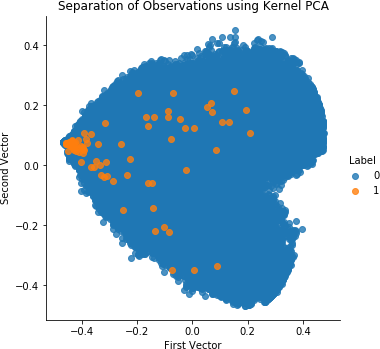
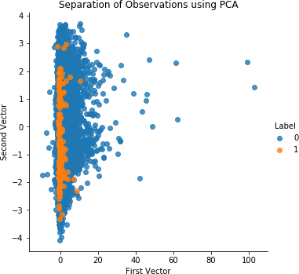
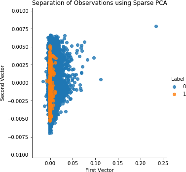
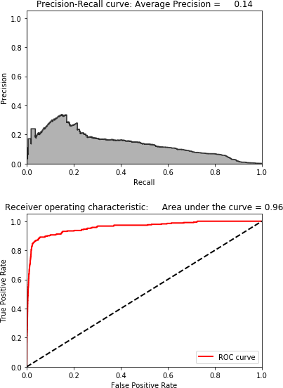
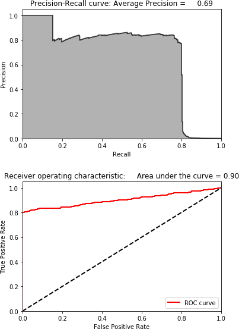
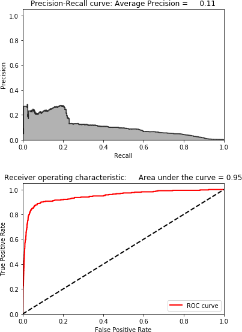
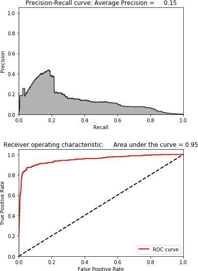

# 섹션 1 | Autoencoder — 정상을 학습해서 이상을 찾는다

---

## 1-1. 문제 제기

### 라벨 문제: 현장의 현실

- 공장에서 **수만 건의 정상**이 생산되는 동안 **결함은 수십 건**에 불과
- 그 수십 건에 **정확한 라벨**이 붙어 있을 가능성은 극히 낮음
  - "이건 분명 결함인데 어떤 종류인지 모르겠다"
  - "정상인가 결함인가 경계가 애매하다"
  - "검사원마다 판정이 다르다"

```
[현실적인 제조 데이터의 모습]

정상 데이터: ████████████████████████████  수만 건 (라벨 있음)
이상 데이터: █                             수십 건 (라벨 없음 or 불확실)
```

### 지도 학습의 한계

- **지도 학습은 라벨을 먹고 자란다** — RandomForest든 신경망이든 "이건 정상, 저건 결함"이라는 정답이 있어야 학습 가능
- 라벨이 없으면 출발 자체가 안 됨
- 새로운 결함 유형이 나타날 때마다 사람이 일일이 라벨링하는 것은 비현실적
- 신제품 라인이 가동되면 라벨이 쌓이기 전에 모델이 필요

```{admonition} 교재 인용
:class: tip

*Hands-On Unsupervised Learning Using Python* 1장: **"라벨이 충분히 있으면 지도 학습이 우월하다. 하지만 대부분의 실제 문제에서는 라벨이 부족하다."**

Yann LeCun의 비유: **"지능이 케이크라면, 비지도 학습은 케이크 자체이고, 지도 학습은 그 위의 아이싱이다."**
```

### 핵심 질문과 아이디어

- **핵심 질문**: "라벨 없이, 정상 데이터만 가지고 이상을 탐지할 수 있는가?"
- **핵심 아이디어**: **"정상만 학습한 모델은 이상을 재현하지 못한다."**
- 정상 패턴을 압축→복원하는 능력은 키웠지만, 처음 보는 이상 패턴은 복원이 안 됨
- 복원 실패의 크기, 즉 **재구성 오차(reconstruction error)** 가 이상 점수가 됨



- 고차원 데이터를 PCA로 2차원에 투영한 산점도 — 정상 군집과 이상 샘플의 위치 차이를 보여줌
- 정상은 한곳에 모이고 이상은 군집에서 벗어나 분포 → "정상과 다름"이 **거리**로 드러남
- 라벨 없이 정상 패턴만으로 이상을 가려낼 수 있다는 직관의 출발점

---

## 1-2. 이론

### ① 비지도 학습의 프레임워크

**지도 학습** 은 입력과 정답 라벨이 쌍으로 주어지고 모델이 그 정답을 맞히도록 배우는 방식인 반면, **비지도 학습** 은 라벨 없이 데이터 자체의 구조를 학습합니다.

```{mermaid}
flowchart LR
    subgraph "지도학습"
        A1["입력"] --> B1["모델"]
        B1 --> C1["예측값\n(정답 라벨로 학습)"]
    end
    subgraph "비지도학습"
        A2["입력"] --> B2["모델"]
        B2 --> C2["구조/표현\n(데이터 자체로 학습)"]
    end
```

비지도 학습은 두 가지 질문에 답합니다. 하나는 "이 데이터는 어떤 구조를 가지고 있는가?"이고, 다른 하나는 "이 샘플은 다른 샘플들과 얼마나 다른가?"입니다. 이상 탐지는 이 가운데 두 번째 질문을 활용하며, 그 전략은 다음과 같습니다.

```{mermaid}
flowchart LR
    A["① 정상 데이터만으로\n'정상이 어떤 모습인지' 학습"] --> B["② 새 데이터가 들어오면\n'정상과 얼마나 다른지' 측정"]
    B --> C{"③ 차이가 임계값 초과?"}
    C -->|"Yes"| D["이상으로 판단"]
    C -->|"No"| E["정상으로 판단"]
```



- 비지도 이상탐지의 전체 흐름(정상 학습 → 차이 측정 → 임계값 판정)을 한 장으로 정리
- 바로 위 순서도를 그림으로 보강한 개요
- 이후 Autoencoder가 이 틀의 "정상 학습 + 차이 측정"을 어떻게 구현하는지로 연결됨

**PCA와 Autoencoder의 관계**:

Session 1에서 배운 PCA도 비지도 학습(차원 축소)의 일종으로 고차원 데이터를 저차원으로 압축합니다. 다만 PCA는 **선형 변환** 이라 복잡한 패턴을 잡기 어려운 반면, Autoencoder는 **비선형 차원 축소** 를 수행해 더 복잡한 패턴까지 학습할 수 있습니다. 실제로 PCA는 선형 Autoencoder의 특수한 형태로 볼 수 있습니다.

---

### ② Autoencoder 구조와 재구성 오차

Autoencoder는 **인코더(Encoder)** 와 **디코더(Decoder)** 두 부분으로 구성됩니다.

```{mermaid}
flowchart LR
    A["입력 x\n[64차원]"] --> B["Encoder\n(압축)"]
    B --> C["잠재 표현 z\n[8차원]\n(latent space)"]
    C --> D["Decoder\n(복원)"]
    D --> E["재구성 x̂\n[64차원]"]
```

**인코더** 는 입력을 점차 압축합니다(64 → 32 → 8차원). 이때 가장 좁은 8차원이 **잠재 공간(latent space)** 입니다. **디코더** 는 이 압축된 표현을 다시 원래 차원으로 복원합니다(8 → 32 → 64차원). **손실 함수** 로는 MSE(평균 제곱 오차)를 사용하는데, 학습의 목표는 원본 $x$와 복원 $\hat{x}$의 차이, 즉 재구성 오차 $\|x - \hat{x}\|^2$를 최소화하는 것입니다.

**표현 학습(Representation Learning)**:

*Deep Learning with Python* 1장은 이를 각 층을 거치며 중요한 정보만 남기고 불필요한 정보는 걸러내는 **"다단계 정보 증류 과정"** 이라 설명합니다. 데이터를 다른 관점에서 바라보고 더 유용한 형태로 변환하는 것이 표현 학습의 핵심입니다.

**이상 탐지 원리**:

```{mermaid}
flowchart TB
    subgraph "정상 데이터 (학습한 패턴)"
        A1["정상 입력"] --> B1["Encoder"]
        B1 --> C1["정상 패턴의 잠재 표현"]
        C1 --> D1["Decoder"]
        D1 --> E1["잘 복원됨\n재구성 오차 낮음"]
    end
    subgraph "이상 데이터 (처음 보는 패턴)"
        A2["이상 입력"] --> B2["Encoder"]
        B2 --> C2["정상 패턴으로 억지로 표현"]
        C2 --> D2["Decoder"]
        D2 --> E2["복원 실패\n재구성 오차 높음"]
    end
```

결론적으로 **재구성 오차가 곧 이상 점수** 가 됩니다.



- 정상/이상 각각의 **재구성 오차 분포**를 겹쳐 그린 핵심 그림
- 정상은 낮은 오차에 몰리고 이상은 높은 오차 쪽으로 분리됨
- "재구성 오차 = 이상 점수"가 실제로 작동함을 시각적으로 증명

**신용카드 사기 탐지 사례** (*Hands-On Unsupervised Learning* 4장):

28만 건 거래 중 사기는 492건뿐인 데이터셋에서, PCA로 차원을 축소한 뒤 재구성 오차를 계산해 상위 350개 의심 거래를 추렸더니 그중 **264개가 실제 사기** 였습니다(정밀도 75%). 라벨 없이도 강력하게 작동한 사례입니다.

**PyTorch 구현**:

```python
import torch
import torch.nn as nn

class Autoencoder(nn.Module):
    def __init__(self, input_dim=64, latent_dim=8):
        super().__init__()
        self.encoder = nn.Sequential(
            nn.Linear(input_dim, 32),
            nn.ReLU(),
            nn.Linear(32, latent_dim)
        )
        self.decoder = nn.Sequential(
            nn.Linear(latent_dim, 32),
            nn.ReLU(),
            nn.Linear(32, input_dim)
        )

    def forward(self, x):
        z = self.encoder(x)
        return self.decoder(z)
```

여기서 `nn.Sequential` 은 층들을 순서대로 묶어 주는 컨테이너이고, `latent_dim=8` 은 잠재 공간의 차원입니다. 이 값이 작을수록 압축이 강해져 이상 탐지에 유리합니다.

**재구성 오차 계산**:

```python
def reconstruction_error(model, x):
    x_hat = model(x)
    return ((x - x_hat) ** 2).mean(dim=1)  # 샘플별 MSE
```

**latent_dim — 핵심 하이퍼파라미터**:

latent_dim이 **너무 크면** 이상까지 잘 복원되어 이상 탐지가 안 되고(교재 4장에서 PCA 성분을 30개로 두자 사기 탐지가 전혀 되지 않았습니다), **너무 작으면** 정상조차 복원하지 못합니다. 결국 **적절한 크기를 찾는 것이 관건** 이며, 이것이 이번 실습 과제입니다.

---

### ③ 임계값 설정: 어디서부터 이상인가

모델 학습만큼이나 **임계값 설정**이 중요합니다. 실무에서는 이 단계에서 가장 많은 시간을 씁니다.

정상 데이터의 재구성 오차는 대부분 낮은 값에 몰린 분포를 이룹니다. 여기에 임계값 T를 정해, 오차가 T보다 낮으면 정상, 높으면 이상으로 판정합니다.

임계값을 정하는 방법은 세 가지가 흔합니다. 첫째는 정상 오차의 **95번째 백분위수** 를 쓰는 방법으로(`np.percentile(normal_errors, 95)`), 정상 샘플의 5%가 오탐되는 것을 허용한다는 뜻입니다. 둘째는 **평균 + 3시그마**($\mu + 3\sigma$, 3-시그마 규칙)로 정상 데이터의 99.7%를 포함합니다. 셋째는 **도메인 전문가 판단** 으로, "재구성 오차 0.05 이상이면 작업자에게 알림"처럼 최종 조정은 결국 사람이 합니다.



- 임계값을 옮길 때 **이상 탐지율(Recall)이 어떻게 변하는지** 보여줌
- 임계값↓ → 더 많이 잡지만 오탐↑의 트레이드오프
- 95번째 백분위수 같은 기준선을 어디에 둘지 정하는 근거



- 재구성 오차를 점수로 사용한 이상탐지의 **ROC 곡선**
- 곡선이 좌상단에 가까울수록 정상/이상 분리가 잘 됨(AUC↑)
- 임계값과 무관하게 모델 자체의 분리 성능을 요약

**트레이드오프**:

| 임계값 설정 | 민감도 | 오탐율 | 적용 사례 |
|:-----------|:------|:------|:---------|
| T 낮게 | 이상을 더 많이 잡음 | 정상을 이상으로 오탐 (현장 피로도 증가) | 안전 직결 설비 |
| T 높게 | 실제 이상 놓칠 수 있음 | 알림이 울리면 진짜 이상 | 단순 품질 검사 |

```{admonition} 주의 — 알림 피로의 위험
:class: warning

임계값을 낮추면 오탐이 늘어나 현장 작업자가 "늘 알림이 울리는데 다 괜찮은 거네"라며 알림을 무시하게 됨.
오히려 위험한 상황이 발생할 수 있음.
```

**비지도 학습 평가의 어려움** (교재 4장):

비지도 학습은 알려진 패턴은 잡아내지만 아직 발견되지 않은 새로운 패턴은 평가하기 어렵다는 한계가 있습니다. 그러나 바로 그 점에서 **알려지지 않은 새로운 이상 패턴을 발견할 수 있다** 는 것이 비지도 학습의 진정한 가치이기도 합니다.

---

### PCA vs Autoencoder 비교



- 같은 데이터를 PCA(선형)와 Autoencoder(비선형)로 축소한 결과를 나란히 비교
- 비선형 구조가 있을 때 Autoencoder가 더 잘 분리함을 보여줌
- "PCA는 선형 Autoencoder의 특수형"이라는 설명의 시각적 근거


- PCA가 **분산을 최대화**하는 축으로 데이터를 투영한 결과
- 선형 축이라 복잡하게 휘어진 패턴은 한 평면에 잘 펴지지 않음
- 다음 Autoencoder 결과와 대비하기 위한 그림



- Autoencoder가 학습한 **잠재 공간(latent space)** 에 데이터를 투영한 모습
- 비선형 압축이라 정상/이상이 더 선명하게 갈라질 수 있음
- Autoencoder가 더 높은 표현력을 가진다는 결론을 뒷받침

- PCA는 데이터의 **분산을 최대화**하는 축을 찾음 (선형)
- Autoencoder는 **재구성 오차를 최소화**하는 잠재 표현을 학습 (비선형)
- 결과적으로 유사한 목적이지만 Autoencoder가 더 높은 표현력을 가짐

---

## 참고 문헌

- *Hands-On Unsupervised Learning Using Python* (Ankur A. Patel, O'Reilly)
  - Ch.1: 비지도 학습 개요
  - Ch.3: 차원 축소 (PCA 등)
  - Ch.4: 이상 탐지
- *Deep Learning with Python* 2판 (Francois Chollet, Manning)
  - Ch.1: 표현 학습
