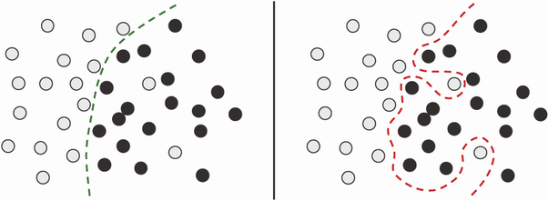
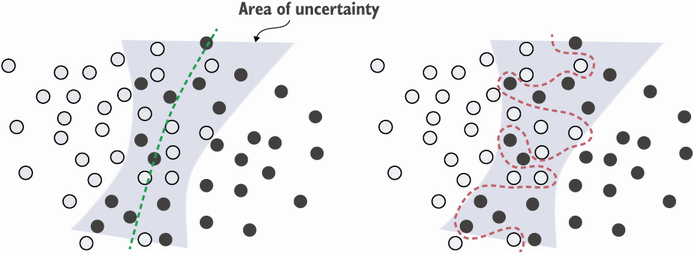
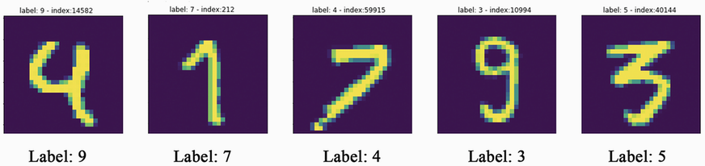
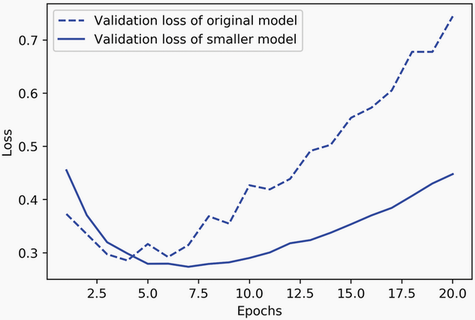
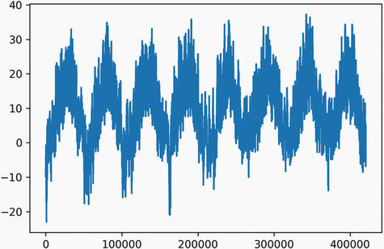
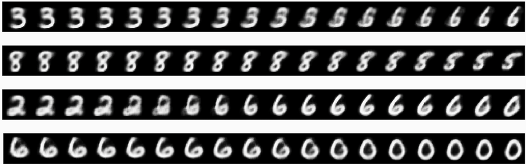
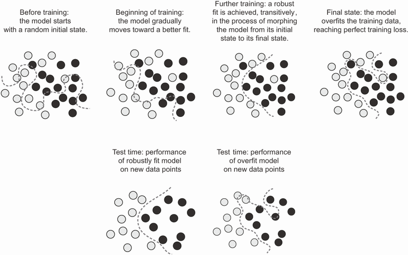

# 섹션 2 | RUL 예측 — 얼마나 버틸 수 있는가

---

## 2-1. 문제 제기

### "이상인가 아닌가"에서 "얼마나 더 버틸 수 있는가"로

- 섹션 1의 Autoencoder: 이상 탐지 (이진 판정)
- 섹션 2의 LSTM: **RUL(Remaining Useful Life, 잔여 유효 수명) 예측** (회귀 문제)
- "지금 이상한가?"를 넘어 "앞으로 얼마나 더 쓸 수 있는가?"에 답하는 것

### 유지보수 세 가지 전략

```{mermaid}
flowchart LR
    A["① 사후보전\n고장 → 수리\n비용: 최대\n위험: 최대"] --> B["② 예방보전\n일정 주기마다 교체\n비용: 중간\n위험: 낮음"]
    B --> C["③ 예지보전 ← 목표\nRUL 예측 기반 교체\n비용: 최소\n위험: 최저"]
```



- 사후보전·예방보전·예지보전 **세 전략의 비용/위험**을 비교한 그림
- 오른쪽(예지보전)으로 갈수록 비용과 위험이 동시에 낮아짐
- RUL 예측이 왜 "예지보전"의 핵심인지 보여주는 동기

- **사후보전**: 고장 나면 고침. 긴급 수리 비용 + 생산 중단
- **예방보전**: 일정 주기로 교체. 아직 쓸 수 있는 부품을 버리는 낭비 (예: 30일마다 교체하지만 실제로는 50일까지 쓸 수 있는 부품)
- **예지보전**: RUL 예측 기반으로 교체 시점 결정. 필요한 시점에 정확하게 교체

### RUL의 정의

```
엔진이 총 300 사이클 후 고장난다면:

사이클   1: RUL = 299
사이클 100: RUL = 200
사이클 250: RUL = 50   ← 이 시점에 교체 결정
사이클 300: RUL = 0    ← 고장
```

→ **핵심 질문**: 현재 센서 데이터만으로 RUL을 예측할 수 있는가?

---

## 2-2. 이론

### ① 왜 일반 회귀가 아닌 LSTM인가

RUL 예측은 숫자를 맞추는 회귀 문제. 그런데 **왜 선형 회귀나 MLP로는 부족할까?**

**순서가 중요하기 때문**:

```
[문제: 순서가 중요한 데이터]

센서 값만 보면:
  사이클 50:  온도=300도, 진동=0.02  → RUL = ? (초반이면 정상)
  사이클 250: 온도=300도, 진동=0.02  → RUL = ? (말기면 마모 징후)

→ "지금 값"이 아니라 "값이 변해온 패턴"이 중요
```



- 순차 데이터를 MLP와 RNN이 각각 어떻게 처리하는지 대비
- MLP는 입력을 펼쳐 **순서를 잃고**, RNN은 시점을 이어가며 **순서를 기억**
- "지금 값"이 아니라 "변해온 패턴"이 중요하다는 주장의 근거

- **MLP**: 각 샘플을 독립적으로 처리 → 시간 순서 정보 무시. 입력을 펼쳐서 처리하므로 시간이라는 개념이 사라짐
- **LSTM**: 시퀀스를 기억 → 시간에 따른 변화 패턴 학습

```{admonition} 교재 인용 — MLP의 한계
:class: tip

*Deep Learning with Python* 10장: 독일 예나 날씨 데이터로 온도 예측 실험에서 **MLP 모델이 상식적인 기준선**("내일 온도는 오늘과 같다")**조차 이기지 못함**. 하지만 LSTM은 기준선을 넘어서는 성능을 보임.
```

---

### ② LSTM의 직관

LSTM(Long Short-Term Memory)의 핵심: **무엇을 기억하고 무엇을 버릴지 학습**

```
[LSTM 셀의 직관적 이해]

일반 RNN의 문제:
  먼 과거 정보가 현재에 영향을 못 줌 (기울기 소실)

LSTM의 해결책: 게이트 3개
  ┌─────────────────────────────────────────┐
  │  입력 게이트: "새 정보를 얼마나 받아들일까?" │
  │  망각 게이트: "과거 정보를 얼마나 잊을까?"   │
  │  출력 게이트: "지금 무엇을 내보낼까?"        │
  └─────────────────────────────────────────┘
```



- LSTM 셀 내부의 **입력·망각·출력 3개 게이트** 구조를 도식화
- 게이트가 "무엇을 기억하고 무엇을 버릴지"를 학습 → 장기 의존성 유지
- 일반 RNN의 기울기 소실 문제를 어떻게 우회하는지 설명

```{admonition} 교재 인용 — LSTM의 수명
:class: tip

*Deep Learning with Python* 1장: LSTM은 **1997년에 개발된 이후 거의 변하지 않고 여전히 널리 사용**되고 있음. 그만큼 설계가 훌륭했다는 뜻.
```

**엔진 마모 예시**:

- **초반 사이클**: 망각 게이트가 이전 정보를 유지하면서 입력 게이트는 새로운 정상 패턴을 조금씩 받아들임
- **마모 진행**: 온도 상승 패턴이 누적됨 — LSTM이 이 변화를 기억
- **말기 사이클**: 누적된 마모 패턴을 바탕으로 RUL이 낮다는 신호를 출력

**슬라이딩 윈도우 시퀀스 구성**:

```
window_size=30 사이클:

사이클 1~30   → [센서값 30×14] → LSTM → RUL 예측값
사이클 2~31   → [센서값 30×14] → LSTM → RUL 예측값
사이클 3~32   → [센서값 30×14] → LSTM → RUL 예측값
...
```


- 연속 사이클을 window_size 단위로 잘라 **(시점 × 센서)** 시퀀스를 만드는 과정
- 한 칸씩 밀며 다음 샘플을 생성 → 시간 흐름을 입력에 담음
- LSTM이 받는 입력 텐서 (30, 14)가 어떻게 구성되는지 보여줌

*Keras `timeseries_dataset_from_array` 함수가 이 슬라이딩 윈도우를 자동 생성*

**Keras LSTM 모델**:

```python
import tensorflow as tf

model = tf.keras.Sequential([
    tf.keras.layers.LSTM(64, input_shape=(30, 14),
                         return_sequences=False),
    tf.keras.layers.Dropout(0.2),
    tf.keras.layers.Dense(32, activation='relu'),
    tf.keras.layers.Dense(1)  # 활성화 없음 — 회귀 문제
])
model.compile(optimizer='adam', loss='mse', metrics=['mae'])
```

- `input_shape=(30, 14)`: 30개 사이클 동안 14개 센서값
- `return_sequences=False`: 마지막 시점의 출력만 반환
- 마지막 `Dense(1)`: 활성화 함수 없이 숫자를 그대로 출력 (회귀)

---

### ③ 과적합 방지: Dropout과 Early Stopping

딥러닝에서 가장 큰 적은 **과적합(overfitting)**.

```{admonition} 교재 인용 — 최적화와 일반화의 긴장
:class: tip

*Deep Learning with Python* 5장: **"머신러닝의 근본적인 문제는 최적화와 일반화 사이의 긴장"**
- 최적화: 학습 데이터에 최대한 잘 맞추는 것
- 일반화: 새로운 데이터에도 잘 작동하는 것
- 이 둘이 항상 같은 방향으로 가지 않는 것이 문제
```

**과적합 발생 신호**:

```
[과적합이 발생하는 신호]

학습 손실:    ↓↓↓↓↓↓↓↓↓  (계속 감소)
검증 손실:    ↓↓↓↓↑↑↑↑↑  (어느 순간 다시 상승)
                    ↑
               이 시점이 최적
```

→ 교재 5장에서 **"정준 과적합 패턴(the canonical overfitting pattern)"** 이라고 부름. 어떤 모델, 어떤 데이터셋에서도 보편적으로 나타나는 패턴.

**Dropout** — 학습 중 뉴런의 일부를 무작위로 비활성화:



- 학습 중 일부 뉴런을 **무작위로 꺼서(0으로)** 비활성화하는 모습
- 특정 뉴런 과의존을 막아 일반화 성능을 높임(앙상블 효과)
- 추론 시에는 전부 켜짐 — 학습할 때만 적용됨

- Geoffrey Hinton이 은행에서 영감: 담당 직원들을 무작위로 바꾸면 공모해서 사기를 칠 수 없듯이, 뉴런도 무작위로 꺼버리면 특정 뉴런에 의존하지 않게 됨
- 특정 뉴런에 대한 과의존을 막아 일반화 성능 향상
- 비율은 보통 0.2~0.3 사용
- 매 배치마다 다른 네트워크를 학습하는 것과 비슷한 앙상블 효과
- 추론 시에는 자동으로 비활성화됨

**Early Stopping** — 검증 손실이 더 이상 개선되지 않으면 학습 중단:

```python
early_stopping = tf.keras.callbacks.EarlyStopping(
    monitor='val_loss',
    patience=10,                # 10 epoch 동안 개선 없으면 중단
    restore_best_weights=True   # 최적의 가중치 복원
)

model.fit(
    X_train, y_train,
    validation_split=0.2,       # 학습 데이터의 20%를 검증용으로 분리
    epochs=200,
    callbacks=[early_stopping]
)
```



- 학습 손실은 계속 감소하지만 **검증 손실은 어느 시점부터 다시 상승**
- 두 곡선이 갈라지는 지점이 **과적합 시작점**
- Early Stopping이 그 직전의 최적 모델을 복원하는 근거

**표준 워크플로우** (*Deep Learning with Python* 5장):

1. 먼저 **과적합이 발생할 수 있는 모델**을 만듦
2. 정규화 기법(Dropout, Early Stopping)을 적용해서 과적합을 제어
3. "완벽한 적합을 찾으려면 **먼저 과적합을 해야 한다**" — 이것이 5장의 핵심 메시지

---

### 심화: 표현 학습 (Representation Learning)

딥러닝의 핵심은 데이터를 더 나은 **"표현(representation)"** 으로 변환하는 것. 각 층이 점점 더 추상적인 특징을 학습:

- **입력층**: 원본 센서값
- **은닉층 1**: 지역적 패턴 (진동 주기, 온도 변화율)
- **은닉층 2**: 전역적 패턴 (마모 추세, 이상 징후)
- **출력층**: RUL 예측값

이런 "자동 특징 추출"이 딥러닝을 전통 ML과 구분하는 핵심.



- 신경망이 층을 거치며 **점점 더 추상적인 특징**을 학습하는 모습
- 입력(원본 센서) → 지역 패턴 → 전역 패턴(마모 추세) → RUL
- "자동 특징 추출"이 딥러닝과 전통 ML을 가르는 지점



- 예측을 만드는 **순전파**와 오차로 가중치를 갱신하는 **역전파**의 흐름
- 신경망이 어떻게 학습되는지의 기본 원리
- 위의 표현 학습이 실제로 일어나는 메커니즘

---

## 2-3. Claude Code 시연

```{admonition} 시연 포인트
:class: tip

코드를 짜는 게 핵심이 아님. Claude가 코드를 만듦.
진짜 봐야 할 건 **학습 곡선과 산점도가 들려주는 이야기**.
그 그림에서 무엀이 정상이고 무엀이 경고 신호인지 읽어내는 게 훈련 포인트.
```

**Claude 프롬프트**:

```text
NASA Turbofan FD001 데이터로 LSTM RUL 예측을 구현해줘.
- RUL 클리핑: max 125
- window_size=30, 14개 센서
- LSTM(64) -> Dropout(0.2) -> Dense(32) -> Dense(1)
- Early Stopping patience=10
- 학습/검증 손실 곡선 시각화
- 실제 vs 예측 RUL 산점도
```

### 시연 흐름 5단계

**1단계 — 데이터 로드와 RUL 라벨 생성**

- FD001은 100개 엔진의 사이클별 센서 데이터
- RUL = 각 유닛의 최대 사이클 - 현재 사이클
- 125로 클리핑 (이유는 섹션 3에서 상세 설명)

**2단계 — 슬라이딩 윈도우 시퀀스 구성**

- 14개 센서 × 30 사이클 = (30, 14) 형태의 입력 텐서가 한 샘플
- Chollet 책 10장의 `timeseries_dataset_from_array` 함수가 자동 처리

**3단계 — 모델 정의와 학습**

- `LSTM(64) -> Dropout(0.2) -> Dense(32, relu) -> Dense(1)` 구조
- 회귀이므로 마지막 Dense에 활성화 함수 없음
- Early Stopping: `patience=10`, `restore_best_weights=True`

**4단계 — 학습 곡선 읽기**

- 학습 손실은 계속 떨어지는데, **검증 손실은 어느 시점에서 꺾이고 다시 상승** → 과적합 시작
- *Deep Learning with Python* 5장: **"정준 과적합 패턴"** — 보편적으로 나타나는 패턴
- Early Stopping이 과적합 직전의 최적 모델을 복원

**5단계 — 산점도로 예측 품질 확인**

- x축: 실제 RUL, y축: 예측 RUL. 완벽하면 대각선 위에 있어야 함
- 대각선을 따라가긴 하지만 **RUL이 큰 구간(초기 마모)에서 예측값이 실제보다 낮게 나옴**
  - 초기 구간 센서 값이 RUL 200, 250, 300에서 거의 비슷
  - 125로 클리핑했기 때문에 큰 RUL을 학습해 본 적이 없음
  - **버그가 아니라 의도된 설계**


- 왼쪽: 학습/검증 손실 곡선, 오른쪽: 실제 vs 예측 RUL 산점도
- 산점도가 대각선을 따르되 **큰 RUL 구간에서 과소예측** → 125 클리핑의 흔적
- "버그가 아니라 의도된 설계"임을 보여주는 핵심 결과

### 시연 후 질문

> **"RMSE는 낮은데 실제로 고장 알림이 잘 작동하지 않는다면 어디가 문제인가? 비대칭 평가 지표가 왜 필요한가?"**

- RMSE는 **조기 예측과 지연 예측을 똑같이 취급**
  - 실제 RUL=10, 예측=20 → 10사이클 조기 예측 → 불필요한 교체. 비용은 들지만 설비는 안전
  - 실제 RUL=10, 예측=0 → 10사이클 지연 예측 → 고장 발생, 생산 중단, 안전 사고
  - 두 오차의 크기는 같은 10인데 비즈니스 충격은 완전히 다름
- NASA Scoring Function 같은 **비대칭 평가 지표**가 필요 — 지연 예측에 더 큰 패널티

---

## 2-4. 실습

### 과제: LSTM 레이어 수와 Dropout 비율 조합으로 트레이드오프 분석

| 실험 | LSTM 레이어 | Dropout | 예상 결과 |
|:-----|:-----------|:--------|:---------|
| A | 1개 | 0.0 | 기준선 (과적합 가능) |
| B | 1개 | 0.2 | Dropout 효과 확인 |
| C | 2개 | 0.0 | 복잡한 모델 (과적합↑) |
| D | 2개 | 0.2 | 복잡 + 정규화 |

### 실습 시작 코드

**Step 1: 데이터 로드**

```python
import numpy as np
import pandas as pd
import tensorflow as tf
import matplotlib.pyplot as plt

cols = ['unit', 'cycle', 'op1', 'op2', 'op3'] + [f's{i}' for i in range(1, 22)]
train_df = pd.read_csv('train_FD001.txt', sep=' ', header=None, names=cols)
train_df = train_df.dropna(axis=1)
```

**Step 2: RUL 라벨 만들기 (클리핑 포함)**

```python
max_cycle = train_df.groupby('unit')['cycle'].max()
train_df = train_df.merge(max_cycle.rename('max_cycle'), on='unit')
train_df['RUL'] = (train_df['max_cycle'] - train_df['cycle']).clip(upper=125)
```

**Step 3: 슬라이딩 윈도우 시퀀스 생성**

```python
sensor_cols = ['s2','s3','s4','s7','s8','s9','s11','s12',
               's13','s14','s15','s17','s20','s21']

def create_sequences(df, sensor_cols, window_size=30):
    X, y = [], []
    for unit in df['unit'].unique():
        unit_data = df[df['unit'] == unit][sensor_cols].values
        unit_rul  = df[df['unit'] == unit]['RUL'].values
        for i in range(len(unit_data) - window_size):
            X.append(unit_data[i:i+window_size])
            y.append(unit_rul[i+window_size])
    return np.array(X, dtype=np.float32), np.array(y, dtype=np.float32)

X, y = create_sequences(train_df, sensor_cols)
```

**Step 4: 정규화 (Min-Max Scaling)**

```python
from sklearn.preprocessing import MinMaxScaler
scaler = MinMaxScaler()
X_reshaped = X.reshape(-1, len(sensor_cols))
X_scaled = scaler.fit_transform(X_reshaped).reshape(X.shape)

split = int(len(X_scaled) * 0.8)
X_train, X_val = X_scaled[:split], X_scaled[split:]
y_train, y_val = y[:split], y[split:]
```

**Step 5: LSTM 4가지 설정으로 실험**

```python
results = {}
for n_layers, dropout_rate in [(1, 0.0), (1, 0.2), (2, 0.0), (2, 0.2)]:
    # TODO: 모델 구성 -> 학습 -> RMSE 계산
    pass
```

**Step 6: 결과 비교 시각화** — 4가지 설정의 학습 곡선과 RMSE를 한눈에 비교


- 4가지 LSTM 설정(레이어 수 × Dropout)의 학습 곡선·RMSE를 비교
- Dropout이 있는 쪽이 과적합 시점이 늦고 검증 성능이 더 안정적
- 실습에서 직접 찾아야 할 트레이드오프를 미리 보여줌

### 실습 포인트

- 각 조합에 대해 학습 곡선에서 **과적합이 발생하는 시점**(검증 손실이 상승하기 시작하는 epoch)을 찾기
- Dropout이 있는 조합은 그 시점이 더 늦게 나타날 것
- 교재 5장: "완벽한 적합을 찾으려면 먼저 과적합을 만들어야 한다"

### 제출물

- 4가지 조합의 학습/검증 손실 곡선 subplot
- 각 조합의 RMSE 비교 표
- "Dropout이 없을 때와 있을 때 학습 곡선이 어떻게 달랐는가?" 한 문단

---

## 참고 문헌

- *Deep Learning with Python, Second Edition* (Francois Chollet, Manning)
  - Ch.1: 표현 학습
  - Ch.5: 과적합 방지
  - Ch.10: 시계열과 LSTM
- *ML for Time-Series with Python* (Ben Auffarth, Packt)
  - Ch.2: 시계열 분석
  - Ch.7: LSTM 심화
