# 섹션 3 | NASA Turbofan 통합 실습

---

## 3-1. 데이터 확인 + RUL 라벨 설계

### NASA Turbofan 데이터셋 소개

항공 엔진 센서 데이터로, **RUL 예측 연구의 벤치마크**. NASA에서 공개, 전 세계 수백 편의 논문에서 사용.

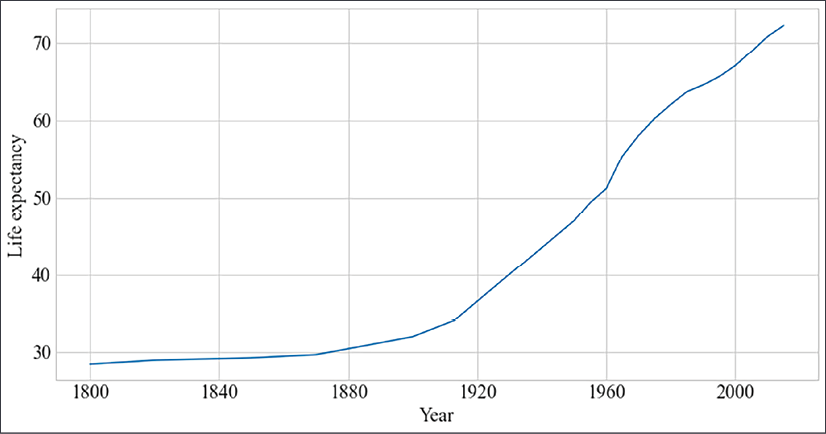

```
[데이터셋 구성]

FD001: 단일 운전 조건, 단일 고장 모드  ← 이번 실습 주 데이터
FD002: 6가지 운전 조건, 단일 고장 모드
FD003: 단일 운전 조건, 2가지 고장 모드
FD004: 6가지 운전 조건, 2가지 고장 모드

각 파일 구조:
  열: unit번호 | 사이클 | 운전조건 3개 | 센서값 21개
  행: 각 유닛의 사이클별 측정값
  train: 고장 시점까지의 전체 이력
  test: 고장 전 일부 구간 (RUL을 맞춰야 함)
```

### EDA 요청

```text
NASA Turbofan FD001 train 데이터를 탐색해줘.
1. 기본 정보: shape, 결측치, 유닛 수, 사이클 범위
2. 센서별 시계열 플롯 (유닛 1개 선택, 센서 21개를 4×6 subplot)
3. 변동이 거의 없는 센서 식별 (std < 0.01인 센서)
4. 유닛별 수명(max cycle) 분포 히스토그램
```


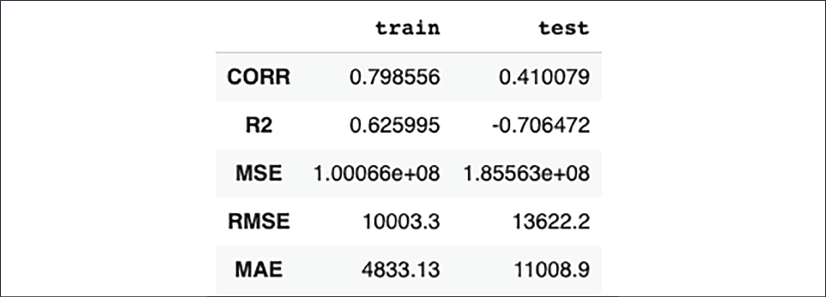

### EDA 결과

| 항목 | 값 |
|:-----|:---|
| Train 샘플 수 | 4,163 |
| Train 엔진 수 | 100 |
| 평균 수명 | 204 cycles (126~361) |
| 상수 센서 (제외) | sensor_1, 5, 6, 10, 16, 18, 19 (7개) |
| 유효 센서 | 14개 (sensor_2,3,4,7,8,9,11,12,13,14,15,17,20,21) |

```{admonition} 참고
:class: note

이 실습용 사본은 원본 C-MAPSS를 5사이클 간격으로 서브샘플한 버전입니다(cycle 1, 6, 11, ...).
그래서 Train 샘플 수가 4,163행(공식 20,631)이고 수명도 126~361 cycle(공식 128~362)로 공식 데이터셋과 다릅니다.
```

**핵심 발견**:

- 결측치 없음
- 21개 센서 중 **7개가 거의 상수** (표준편차 < 0.01) → RUL 예측에 도움 안 됨
- **14개 센서만 사용** → 이것이 실습 코드에서 `sensor_cols`에 14개만 포함하는 이유

### RUL 클리핑: 왜 125로 자르는가

클리핑이 필요한 이유는 이렇습니다. 엔진 초기(사이클 1~100)에는 RUL이 250, 300, 350처럼 크지만 이 구간의 센서 데이터는 사실상 모두 "정상"으로 거의 같습니다. 그런데도 서로 다른 RUL 라벨을 구분하라고 하면 모델이 헛수고를 하게 됩니다. 그래서 RUL이 125를 넘는 구간은 모두 125로 고정(클리핑)해 "남은 수명이 125 이하인 구간"만 정밀하게 학습하도록 하고, 실무적으로 의미 있는 예측 범위에 집중시킵니다.

```python
# RUL 라벨 생성 + 클리핑
max_cycle = train_df.groupby('unit')['cycle'].max().reset_index()
max_cycle.columns = ['unit', 'max_cycle']
train_df = train_df.merge(max_cycle, on='unit')
train_df['RUL'] = (train_df['max_cycle'] - train_df['cycle']).clip(upper=125)
```

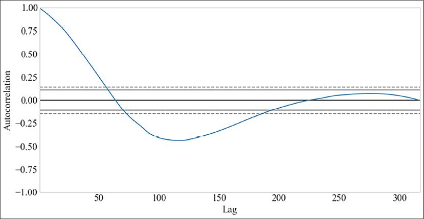

### 센서-RUL 상관관계 분석

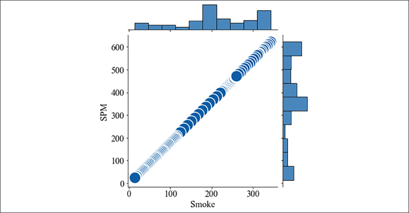

| 센서 | 상관계수 | 해석 |
|:-----|:---------|:-----|
| sensor_11 | -0.70 | RUL 감소 시 값 증가 (가장 강한 음의 상관) |
| sensor_4 | -0.68 | RUL 감소 시 값 증가 |
| sensor_12 | +0.67 | RUL 감소 시 값 감소 |
| sensor_7 | +0.65 | RUL 감소 시 값 감소 |
| sensor_21 | +0.64 | RUL 감소 시 값 감소 |

정리하면, **음의 상관 센서** 는 고장이 임박할수록 값이 증가하고(온도·압력 등), **양의 상관 센서** 는 고장이 임박할수록 값이 감소합니다(효율·유량 등).

```{admonition} 핵심 발견
:class: tip

RUL이 125 이하로 떨어지면 센서 변화가 가속화되는 **"급격한 성능 저하 구간"** 이 시작됨.
RUL > 200 구간에서는 센서 값이 거의 일정.
이것이 **RUL 클리핑(125)의 실증적 근거**. 데이터가 직접 말해주는 것.
```

### RUL 구간별 센서 평균값

| RUL 구간 | sensor_9 | sensor_14 | 특징 |
|:---------|:---------|:----------|:-----|
| 0~50 (고장 임박) | 9079 | 8153 | 값이 가장 높음 |
| 300 이상 (초기) | 9056 | 8137 | 상대적으로 낮음 |

엔진 #1의 노화 패턴을 보면, **sensor_12** 는 시간이 지날수록 서서히 감소하다가 말기에 급격히 떨어지고, **sensor_11** 은 반대로 말기에 급격히 상승합니다.

### 심화: 시계열 정상성 검정

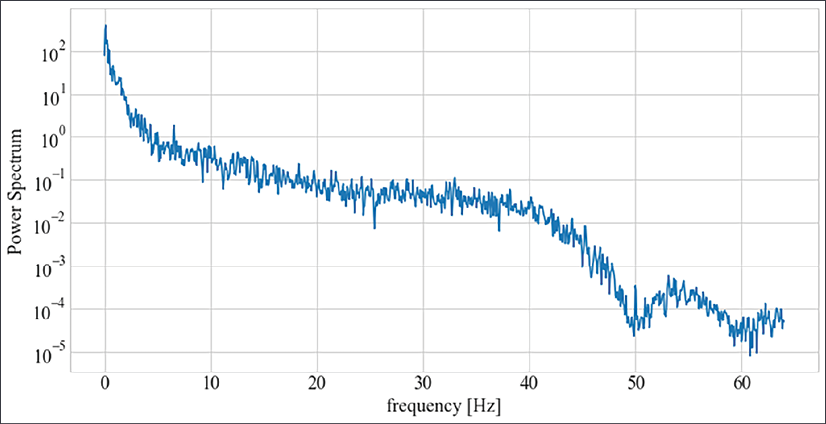

**정상성(stationarity)** 은 통계적 특성이 시간에 따라 변하지 않는 성질로, ADF(Augmented Dickey-Fuller)·KPSS·ACF 분석 등으로 검정합니다. NASA Turbofan의 센서 대부분은 마모가 진행되며 추세(trend)를 보이는 **비정상 시계열** 이며, 바로 이 점이 슬라이딩 윈도우와 LSTM 접근이 유리한 이유입니다.

---

## 3-2. 모델링 + 평가

### LSTM 모델 적용

섹션 2에서 만든 LSTM 구조를 Turbofan 데이터에 적용. **2층 LSTM** 모델 사용.

```python
# 2층 LSTM + Dropout
model = tf.keras.Sequential([
    tf.keras.layers.LSTM(64, input_shape=(30, 14),
                         return_sequences=True),
    tf.keras.layers.Dropout(0.2),
    tf.keras.layers.LSTM(32),
    tf.keras.layers.Dropout(0.2),
    tf.keras.layers.Dense(32, activation='relu'),
    tf.keras.layers.Dense(1)
])

early_stop = tf.keras.callbacks.EarlyStopping(
    monitor='val_loss', patience=10, restore_best_weights=True
)
history = model.fit(
    X_train, y_train,
    validation_split=0.2,
    epochs=100, batch_size=256,
    callbacks=[early_stop], verbose=1
)
```


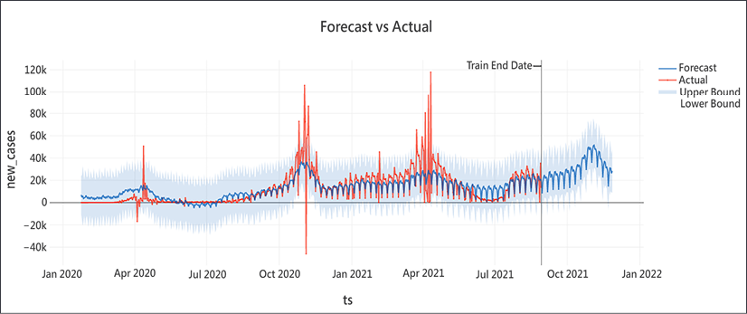

### 평가 지표: RMSE만으로는 부족한 이유

RMSE만으로는 부족한 이유가 있습니다. 예를 들어 실제 RUL이 10인데 20으로 예측하면(10사이클 일찍 교체) 교체 비용만 발생하지만, 0으로 예측하면(10사이클 늦게 알림) 설비 고장과 생산 중단, 안전사고로 이어집니다.

RMSE는 두 오차를 **같은 크기**로 취급. 하지만 비즈니스 충격은 완전히 다름.

**NASA Scoring Function** (비대칭 평가):

```python
import numpy as np

def nasa_score(y_true, y_pred):
    """
    조기 예측(예측 > 실제): 덜 엄격한 페널티
    지연 예측(예측 < 실제): 더 엄격한 페널티
    """
    d = y_pred - y_true  # 양수: 조기 예측, 음수: 지연 예측
    score = np.where(
        d < 0,
        np.exp(-d / 13) - 1,   # 지연 예측: 페널티 급격히 증가
        np.exp(d / 10) - 1     # 조기 예측: 페널티 완만하게 증가
    )
    return np.sum(score)

y_pred = model.predict(X_val).flatten()
rmse = np.sqrt(np.mean((y_val - y_pred) ** 2))
score = nasa_score(y_val, y_pred)
print(f"RMSE: {rmse:.2f}")
print(f"NASA Score: {score:.2f}  (낮을수록 좋음)")
```

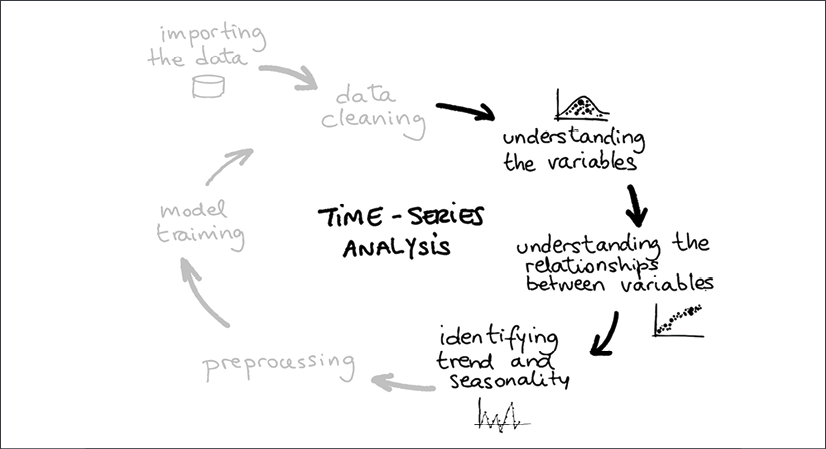
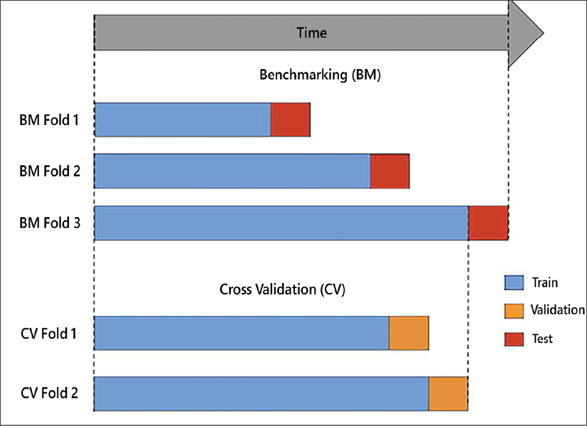

```{admonition} 핵심
:class: warning

모델을 선택할 때는 **RMSE와 NASA Score를 함께 봐야 함**.
RMSE만 보면 지연 예측의 위험을 놓칠 수 있음.
```

### 실습 모델 결과 해석

**Autoencoder 이상 탐지 결과** (FD001):

| 지표 | 값 |
|:-----|:---|
| 정상 재구성 오차 (mean) | 0.00936 |
| 노화 재구성 오차 (mean) | 0.02104 |
| 임계값 (95th %ile) | 0.01762 |
| ROC-AUC | 0.671 |
| 정상 recall | 95% (1,484/1,563) |

정상 데이터로만 학습했는데도 노화 구간을 재구성 오차로 구분해 냈고, 잠재 공간(latent space)에서도 건강 상태와 노화 상태의 분리가 시각적으로 확인됩니다.

**LSTM RUL 예측 결과** (FD001):

| 지표 | 값 | 해석 |
|:-----|:---|:-----|
| Best Val RMSE | 31.98 cycles | 검증 세트 기준 |
| Test RMSE | 52.45 cycles | 테스트 세트 (보수적 경향) |
| Early Stopping | Epoch 29 | 과적합 방지로 조기 종료 |

예측값의 표준편차가 0에 가까운 것은 30 epoch로는 충분히 학습되지 않았음을 뜻합니다. 오히려 **교육적으로 좋은 사례** 인데, 모델이 왜 수렴하지 않았는지, 학습률이나 epoch 수를 어떻게 조정해야 할지 직접 고민해 볼 수 있습니다.

**Dropout 실험 결과**:

| Dropout | Val RMSE | Test RMSE |
|:--------|:---------|:----------|
| 0.0 | 32.17 | 51.47 |
| 0.1 | 32.01 | 52.71 |
| 0.2 | 32.21 | **51.25** |
| 0.3 | 32.03 | 52.51 |
| 0.5 | 31.99 | 54.06 |

결과를 보면 **Dropout 0.1~0.3** 구간이 일반화에 유리하고, **0.5** 에서는 학습이 부족해 Test RMSE가 악화됩니다. *Deep Learning with Python* 의 "은행의 모든 직원이 동시에 이직하면 안 된다"는 비유처럼, 적절한 비율이 중요합니다.

### 심화: 특징 공학 (Feature Engineering)

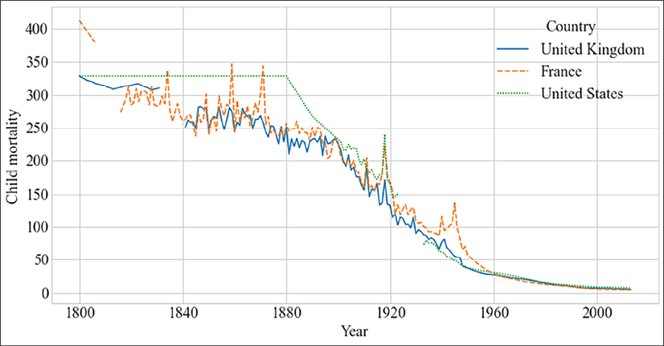

시계열 데이터에서는 여러 파생 특징이 유용합니다. **롤링 통계**(이동평균·이동표준편차, window=5/10/30), **차분 특징**(1·2차 차분으로 추세와 변화율 포착), **주파수 특징**(FFT 기반 스펙트럼 에너지), 그리고 온도×압력 상호작용이나 진동 피크 간격 같은 **도메인 특징** 이 대표적입니다.

LSTM이 자동으로 이런 특징을 학습하지만, 명시적으로 추가하면 적은 데이터로도 성능 향상 가능.

### Autoencoder + LSTM 통합 관점

```{mermaid}
flowchart TB
    A["센서 데이터"] --> B["Autoencoder → 재구성 오차 계산"]
    B --> C{"재구성 오차 > 임계값?"}
    C -->|"Yes"| D["이상 경보 발생\n'이 센서 패턴은 정상이 아닙니다'"]
    C -->|"No"| E["LSTM → RUL 예측"]
    E --> F{"RUL < 30?"}
    F -->|"Yes"| G["교체 권고\n'30사이클 이내 고장 가능성 높음'"]
    F -->|"No"| H["정상 운영"]
```

Autoencoder는 **"지금 이상한가?"** 에 답하고, LSTM은 **"얼마나 더 쓸 수 있는가?"** 에 답합니다. 두 모델을 통합하면 예지 보전의 두 핵심 질문에 **동시에** 답할 수 있습니다.

---

## 3-3. 자유 실습

세 가지 난이도로 준비. **본인 수준에 맞춰 하나를 깊게** 파는 것을 추천.

### 기본 — FD001 단일 학습 및 평가

시연에서 한 흐름을 본인 손으로 다시 만들어 보는 과정.

1. FD001 데이터 로드 + RUL 라벨 생성 (클리핑 125)
2. 저분산 센서 6개를 제외한 **14개 센서**만 사용
3. 슬라이딩 윈도우(`window_size=30`)로 시퀀스 생성
4. 2층 LSTM 모델 학습
5. **RMSE, MAE, NASA Score** 세 가지 지표 계산
6. 실제 RUL vs 예측 RUL 산점도

**제출물**: 세 지표 표 + 산점도 + "어느 RUL 구간에서 오차가 큰가, 그 이유는?" 한 문단

### 중급 — FD001 학습 모델의 FD002 일반화 테스트

기본을 끝낸 분을 위한 일반화 문제.

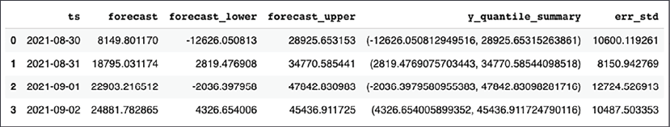
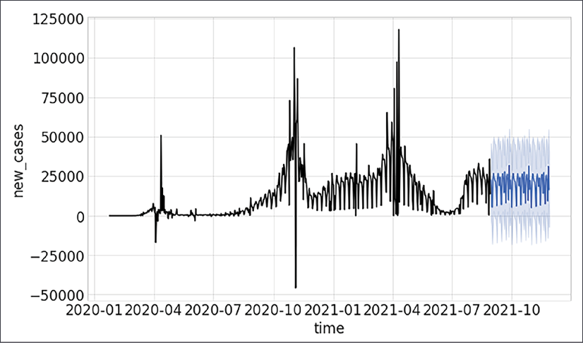

- FD001은 **단일 운전 조건**, FD002는 **6가지 운전 조건**이 섞여 있음
- 같은 엔진이라도 고도와 출력 설정이 다르면 센서 값 패턴이 달라짐

1. 기본 과제에서 만든 FD001 학습 모델을 그대로 가져옴
2. FD002 데이터를 같은 전처리(센서 선택, 윈도우)로 준비
3. FD002에 대해 RMSE와 NASA Score 측정
4. FD001 결과와 FD002 결과를 표로 비교

→ **성능이 크게 떨어질 것** (모델이 한 번도 본 적 없는 운전 조건이 섞여 있으므로)

- *ML for Time-Series with Python*: **"비정상 시계열의 분포 변화"** 문제를 직접 체감

**제출물**: FD001 vs FD002 지표 비교 표 + "성능 격차의 원인과 대응 방향" 한 문단

여유가 있으면 FD002로 재학습해서 다시 평가. 멀티 조건 학습이 단일 조건 모델을 어떻게 보강하는지 확인 가능.

### 심화 — Autoencoder + LSTM 통합 파이프라인

섹션 1의 Autoencoder와 섹션 2의 LSTM을 **하나의 시스템으로 통합**.

```{mermaid}
flowchart TB
    A["센서 데이터"] --> B["Autoencoder → 재구성 오차 계산"]
    B --> C{"재구성 오차 > 임계값?"}
    C -->|"Yes"| D["이상 경보 발생"]
    C -->|"No"| E["LSTM → RUL 예측"]
    E --> F{"RUL < 30?"}
    F -->|"Yes"| G["교체 권고"]
    F -->|"No"| H["정상 운영"]
```

구현 순서:

1. 섹션 1 Autoencoder를 FD001 **정상 구간(RUL > 125)** 으로만 학습
2. 모든 윈도우에 대해 재구성 오차 계산
3. 기존 14개 센서 + 재구성 오차 = **15차원 특징** 생성
4. 이 15차원 특징으로 LSTM RUL 예측 모델 학습
5. 14차원 베이스라인과 15차원 통합 모델의 RMSE/NASA Score 비교

**가설**: 재구성 오차가 노화의 **조기 신호** 역할을 해서 LSTM이 RUL을 더 정확하게 추정할 것

**제출물**: 두 모델의 지표 비교 + 재구성 오차가 노화 사이클을 따라 어떻게 변하는지 시계열 그래프 + "통합이 도움이 되었는가, 그 이유는?" 한 문단


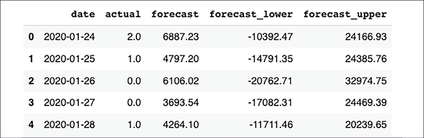

---

## 참고 문헌

- *Hands-On Unsupervised Learning Using Python* (Ankur A. Patel, O'Reilly)
  - Ch.1: 비지도 학습 개요
  - Ch.4: 이상 탐지
- *ML for Time-Series with Python* (Ben Auffarth, Packt)
  - Ch.2: 시계열 분석
  - Ch.7: LSTM 심화
- NASA C-MAPSS Turbofan Dataset
