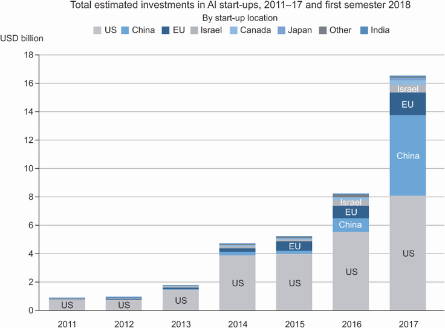
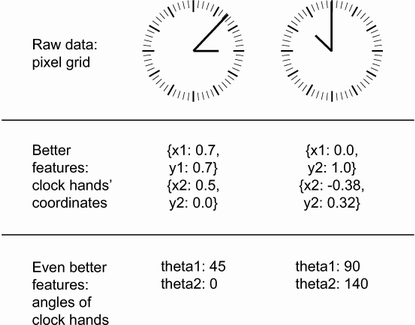

# [실습 시 프롬프트 제안] 세션 2 — Claude Code 시연 & 실습 모음


> 세션 2(딥러닝 이상 탐지)의 각 강의 섹션에 있던 **Claude Code 시연**과 **실습** 부분을 한곳에 모았습니다.
> 각 항목의 이론·배경 설명은 해당 강의 섹션을 참고하세요.


---

```{admonition} 출처: Autoencoder
:class: note dropdown
아래 시연/실습은 원래 Autoencoder** 섹션에 있던 내용입니다.
```

## 1-3. Claude Code 시연

```{admonition} 시연 포인트
:class: tip

모델 구현 자체가 아니라, **"재구성 오차가 실제로 이상 신호를 포착하는지"** 를 데이터로 확인하는 흐름에 집중.
Autoencoder는 PyTorch 몇 줄이면 만들 수 있음. 진짜 어려운 건 결과의 분포를 보고 의미를 읽어내는 것.
```

**Claude 프롬프트**:

```text
제조 진동 데이터 이상탐지용 Autoencoder를 만들어줘.
- 정상 데이터: 사인파 기반 합성 신호 (1000개)
- 이상 데이터: 노이즈가 추가된 신호 (50개, 학습에는 사용 안 함)
- PyTorch로 Autoencoder 구현 (input_dim=64, latent_dim=8)
- 정상 데이터로만 학습 (epoch=50)
- 결과: 정상/이상 재구성 오차 분포를 겹쳐서 시각화
- 95th percentile 임계값 표시
```

### 시연 흐름 5단계

**1단계 — 합성 데이터 생성**

- 정상: 깨끗한 사인파 + 작은 가우시안 노이즈 (1000개)
- 이상: 같은 사인파 + 강한 노이즈 + 임의의 스파이크 (50개)
- **이상 50개는 학습에 절대 사용하지 않음** — 평가용으로만

**2단계 — Autoencoder 정의**

```python
# 인코더: Linear(64→32) → ReLU → Linear(32→8)
# 디코더: Linear(8→32) → ReLU → Linear(32→64)
# 잠재 공간 8차원이 정보의 병목 역할
```

**3단계 — 정상 데이터로만 학습**

- MSE 손실로 정상 입력과 복원 출력 사이의 거리를 최소화
- 50 epoch 학습
- **이상 데이터는 학습에 들어가지 않음**

**4단계 — 재구성 오차 계산**

- 정상 1000개와 이상 50개 각각에 대해 MSE 계산
- 가설: 정상은 학습한 패턴이라 오차가 낮고, 이상은 처음 보는 패턴이라 오차가 높을 것

**5단계 — 분포 비교 시각화**

- 정상 분포가 왼쪽에 몰려 있고, 이상 분포가 오른쪽에 위치하면 성공
- 정상 오차의 95번째 백분위수에 빨간 세로선 = 임계값

### 시연 결과

- **정상 재구성 오차**: 평균 0.01 근처에 몰려 있음
- **이상 재구성 오차**: 0.05~0.15 사이에 퍼져 있음
- 두 분포가 거의 겹치지 않으며, 임계값이 두 분포 사이에 깔끔하게 위치
- 이상 샘플 중 약 90% 이상이 임계값 초과

### 시연 후 질문

> **"latent_dim을 8에서 2로 줄이면 분리가 어떻게 변할까? 반대로 32나 64로 키우면?"**

- **latent_dim 축소**: 압축이 강해져 정상의 핵심 패턴만 살아남고 이상은 더더욱 복원 안 됨 — **분리가 더 선명해질 수 있음**. 하지만 너무 작으면 정상도 제대로 복원이 안 돼서 임계값이 모호해짐
- **latent_dim 확대**: 잠재 공간이 입력 차원과 같아지면 사실상 복사가 가능해짐 — 이상조차도 거의 완벽히 복원 — **두 분포가 겹쳐서 분리 안 됨**

---

## 1-4. 실습

### 과제: latent_dim 변경하며 정상/이상 분리도 비교

| 실험 | latent_dim | 관찰 포인트 |
|:-----|:-----------|:-----------|
| A | 32 | 압축이 거의 없음 — 이상도 잘 복원? |
| B | 16 | 기준선 |
| C | 8 | 강의 시연과 동일 |
| D | 4 | 강한 압축 — 분리도 변화? |

### 분리도 측정

```python
threshold = np.percentile(normal_errors, 95)
recall = (anomaly_errors > threshold).mean()
print(f"latent_dim={latent_dim}, 이상 탐지율: {recall:.2%}")
```

### 실습 시작 코드

```python
import numpy as np
import torch
import torch.nn as nn
import matplotlib.pyplot as plt

np.random.seed(42)
t = np.linspace(0, 1, 64)

# 정상 데이터: 사인파 (약간의 노이즈 포함)
normal_data = np.array([
    np.sin(2 * np.pi * 5 * t) + 0.05 * np.random.randn(64)
    for _ in range(1000)
], dtype=np.float32)

# 이상 데이터: 강한 노이즈
anomaly_data = np.array([
    np.sin(2 * np.pi * 5 * t) + 0.5 * np.random.randn(64)
    for _ in range(50)
], dtype=np.float32)

class Autoencoder(nn.Module):
    def __init__(self, input_dim=64, latent_dim=8):
        super().__init__()
        self.encoder = nn.Sequential(
            nn.Linear(input_dim, 32), nn.ReLU(),
            nn.Linear(32, latent_dim)
        )
        self.decoder = nn.Sequential(
            nn.Linear(latent_dim, 32), nn.ReLU(),
            nn.Linear(32, input_dim)
        )
    def forward(self, x):
        return self.decoder(self.encoder(x))

def train_and_evaluate(latent_dim, normal_data, anomaly_data, epochs=50):
    # TODO: 모델 생성 -> 학습 -> 오차 계산 -> 분리도 평가
    pass

for latent_dim in [32, 16, 8, 4]:
    train_and_evaluate(latent_dim, normal_data, anomaly_data)
```

### 실습 포인트

1. 각 `latent_dim`에서 정상과 이상의 재구성 오차 분포 변화를 그래프로 확인
2. 탐지율이 가장 높은 `latent_dim`을 찾기
3. 압축이 너무 약할 때와 너무 강할 때 각각 어떤 문제가 생기는지 직접 경험

### 제출물

- 4개 분포 그래프
- Recall 비교 표
- "너무 강하거나 약한 압축이 초래하는 문제는 무엇인가?"에 대한 한 문단

---

```{admonition} 출처: RUL 예측
:class: note dropdown
아래 시연/실습은 원래 RUL 예측** 섹션에 있던 내용입니다.
```

## 2-3. Claude Code 시연

```{admonition} 시연 포인트
:class: tip

코드를 짜는 게 핵심이 아님. Claude가 코드를 만듦.
진짜 봐야 할 건 **학습 곡선과 산점도가 들려주는 이야기**.
그 그림에서 무엀이 정상이고 무엀이 경고 신호인지 읽어내는 게 훈련 포인트.
```

**Claude 프롬프트**:

```text
NASA Turbofan FD001 데이터로 LSTM RUL 예측을 구현해줘.
- RUL 클리핑: max 125
- window_size=30, 14개 센서
- LSTM(64) -> Dropout(0.2) -> Dense(32) -> Dense(1)
- Early Stopping patience=10
- 학습/검증 손실 곡선 시각화
- 실제 vs 예측 RUL 산점도
```

### 시연 흐름 5단계

**1단계 — 데이터 로드와 RUL 라벨 생성**

- FD001은 100개 엔진의 사이클별 센서 데이터
- RUL = 각 유닛의 최대 사이클 - 현재 사이클
- 125로 클리핑 (이유는 상세 설명)

**2단계 — 슬라이딩 윈도우 시퀀스 구성**

- 14개 센서 × 30 사이클 = (30, 14) 형태의 입력 텐서가 한 샘플
- Chollet 책 10장의 `timeseries_dataset_from_array` 함수가 자동 처리

**3단계 — 모델 정의와 학습**

- `LSTM(64) -> Dropout(0.2) -> Dense(32, relu) -> Dense(1)` 구조
- 회귀이므로 마지막 Dense에 활성화 함수 없음
- Early Stopping: `patience=10`, `restore_best_weights=True`

**4단계 — 학습 곡선 읽기**

- 학습 손실은 계속 떨어지는데, **검증 손실은 어느 시점에서 꺾이고 다시 상승** → 과적합 시작
- *Deep Learning with Python* 5장: **"정준 과적합 패턴"** — 보편적으로 나타나는 패턴
- Early Stopping이 과적합 직전의 최적 모델을 복원

**5단계 — 산점도로 예측 품질 확인**

- x축: 실제 RUL, y축: 예측 RUL. 완벽하면 대각선 위에 있어야 함
- 대각선을 따라가긴 하지만 **RUL이 큰 구간(초기 마모)에서 예측값이 실제보다 낮게 나옴**
  - 초기 구간 센서 값이 RUL 200, 250, 300에서 거의 비슷
  - 125로 클리핑했기 때문에 큰 RUL을 학습해 본 적이 없음
  - **버그가 아니라 의도된 설계**



- 왼쪽: 학습/검증 손실 곡선, 오른쪽: 실제 vs 예측 RUL 산점도
- 산점도가 대각선을 따르되 **큰 RUL 구간에서 과소예측** → 125 클리핑의 흔적
- "버그가 아니라 의도된 설계"임을 보여주는 핵심 결과

### 시연 후 질문

> **"RMSE는 낮은데 실제로 고장 알림이 잘 작동하지 않는다면 어디가 문제인가? 비대칭 평가 지표가 왜 필요한가?"**

- RMSE는 **조기 예측과 지연 예측을 똑같이 취급**
  - 실제 RUL=10, 예측=20 → 10사이클 조기 예측 → 불필요한 교체. 비용은 들지만 설비는 안전
  - 실제 RUL=10, 예측=0 → 10사이클 지연 예측 → 고장 발생, 생산 중단, 안전 사고
  - 두 오차의 크기는 같은 10인데 비즈니스 충격은 완전히 다름
- NASA Scoring Function 같은 **비대칭 평가 지표**가 필요 — 지연 예측에 더 큰 패널티

---

## 2-4. 실습

### 과제: LSTM 레이어 수와 Dropout 비율 조합으로 트레이드오프 분석

| 실험 | LSTM 레이어 | Dropout | 예상 결과 |
|:-----|:-----------|:--------|:---------|
| A | 1개 | 0.0 | 기준선 (과적합 가능) |
| B | 1개 | 0.2 | Dropout 효과 확인 |
| C | 2개 | 0.0 | 복잡한 모델 (과적합↑) |
| D | 2개 | 0.2 | 복잡 + 정규화 |

### 실습 시작 코드

**Step 1: 데이터 로드**

```python
import numpy as np
import pandas as pd
import tensorflow as tf
import matplotlib.pyplot as plt

cols = ['unit', 'cycle', 'op1', 'op2', 'op3'] + [f's{i}' for i in range(1, 22)]
train_df = pd.read_csv('train_FD001.txt', sep=' ', header=None, names=cols)
train_df = train_df.dropna(axis=1)
```

**Step 2: RUL 라벨 만들기 (클리핑 포함)**

```python
max_cycle = train_df.groupby('unit')['cycle'].max()
train_df = train_df.merge(max_cycle.rename('max_cycle'), on='unit')
train_df['RUL'] = (train_df['max_cycle'] - train_df['cycle']).clip(upper=125)
```

**Step 3: 슬라이딩 윈도우 시퀀스 생성**

```python
sensor_cols = ['s2','s3','s4','s7','s8','s9','s11','s12',
               's13','s14','s15','s17','s20','s21']

def create_sequences(df, sensor_cols, window_size=30):
    X, y = [], []
    for unit in df['unit'].unique():
        unit_data = df[df['unit'] == unit][sensor_cols].values
        unit_rul  = df[df['unit'] == unit]['RUL'].values
        for i in range(len(unit_data) - window_size):
            X.append(unit_data[i:i+window_size])
            y.append(unit_rul[i+window_size])
    return np.array(X, dtype=np.float32), np.array(y, dtype=np.float32)

X, y = create_sequences(train_df, sensor_cols)
```

**Step 4: 정규화 (Min-Max Scaling)**

```python
from sklearn.preprocessing import MinMaxScaler
scaler = MinMaxScaler()
X_reshaped = X.reshape(-1, len(sensor_cols))
X_scaled = scaler.fit_transform(X_reshaped).reshape(X.shape)

split = int(len(X_scaled) * 0.8)
X_train, X_val = X_scaled[:split], X_scaled[split:]
y_train, y_val = y[:split], y[split:]
```

**Step 5: LSTM 4가지 설정으로 실험**

```python
results = {}
for n_layers, dropout_rate in [(1, 0.0), (1, 0.2), (2, 0.0), (2, 0.2)]:
    # TODO: 모델 구성 -> 학습 -> RMSE 계산
    pass
```

**Step 6: 결과 비교 시각화** — 4가지 설정의 학습 곡선과 RMSE를 한눈에 비교



- 4가지 LSTM 설정(레이어 수 × Dropout)의 학습 곡선·RMSE를 비교
- Dropout이 있는 쪽이 과적합 시점이 늦고 검증 성능이 더 안정적
- 실습에서 직접 찾아야 할 트레이드오프를 미리 보여줌

### 실습 포인트

- 각 조합에 대해 학습 곡선에서 **과적합이 발생하는 시점**(검증 손실이 상승하기 시작하는 epoch)을 찾기
- Dropout이 있는 조합은 그 시점이 더 늦게 나타날 것
- 교재 5장: "완벽한 적합을 찾으려면 먼저 과적합을 만들어야 한다"

### 제출물

- 4가지 조합의 학습/검증 손실 곡선 subplot
- 각 조합의 RMSE 비교 표
- "Dropout이 없을 때와 있을 때 학습 곡선이 어떻게 달랐는가?" 한 문단
