# 섹션 1 | Object Detection — YOLO가 어떻게 그렇게 빠른가

> 참고 교재: *Practical Machine Learning for Computer Vision* (Valliappa Lakshmanan et al., O'Reilly) Ch.4 / *Practical Deep Learning for Cloud, Mobile, and Edge* (Anirudh Koul et al., O'Reilly) Ch.6, Appendix A

---

## 1-1. 문제 제기

**상황**: 공장 CCTV로 실시간 안전 모니터링을 구축하려면 어떤 방식이 필요한가?

### 클라우드 분석의 현실적 문제

- 모든 영상을 GPU 서버로 보내서 분석 → 세 가지 치명적 문제
  - **지연 시간**: 0.5~2초 (영상 왕복). 사고는 0.5초 안에도 일어남
  - **네트워크 비용**: 30FPS 풀HD 1채널 = 시간당 약 1.5GB. 카메라 50대면 하루 수 TB
  - **보안**: 공장 내부 영상(라인 배치, 공정 순서, 인력 동선)이 외부로 전송됨

```{mermaid}
flowchart LR
    A[카메라] --> B[인터넷] --> C[GPU 서버] --> D[결과] --> E[카메라]
```

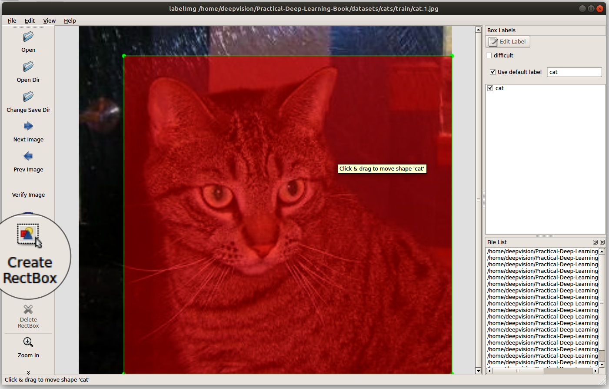
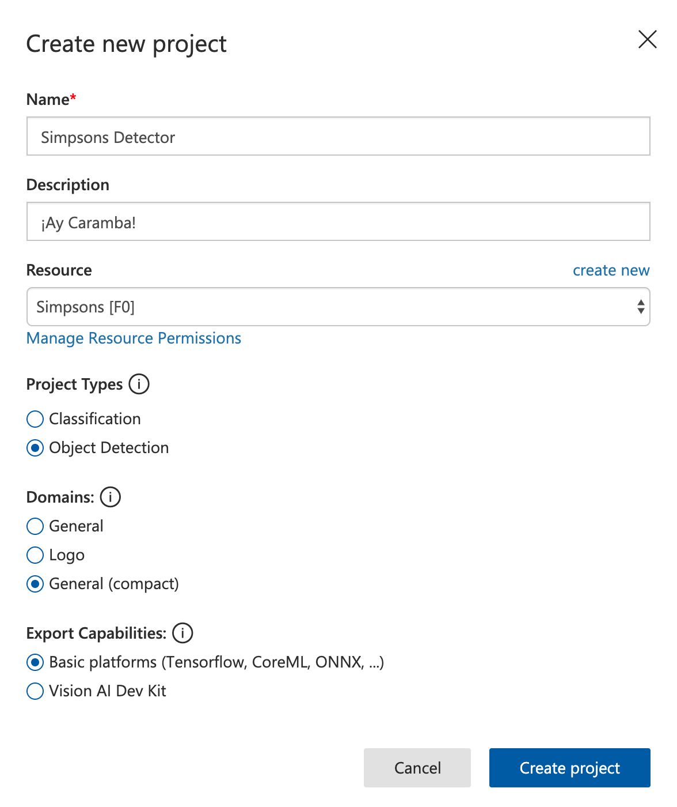
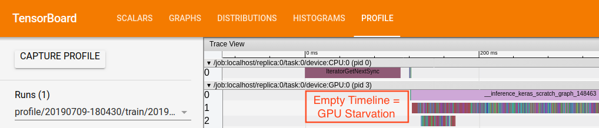

### 해결 방향: 엣지 컴퓨팅

- 카메라 옆에 **작은 컴퓨터(엣지 디바이스)** 를 두고 현장에서 바로 분석
- Jetson Nano, Raspberry Pi 등 활용
- 영상은 로컬 처리, 결과 한 줄만 서버 전송 ("12번 라인 안전모 미착용 의심")

```{mermaid}
flowchart LR
    A[카메라] --> B["Jetson Nano / 라즈베리파이"]
    B --> C[즉시 결과]
```

```{admonition} 핵심 질문
:class: important

GPU가 없는, 손바닥만 한 컴퓨터에서 실시간 객체 탐지가 가능한가?
**정확도 vs 속도의 트레이드오프**를 어떻게 풀 것인가?
```

---

## 1-2. 이론

### ① Object Detection의 발전: 왜 YOLO인가

> *Practical Deep Learning* Appendix A — CNN 기본 구조 / Ch.14 — CNN 기반 탐지 모델 발전 흐름

**2-Stage Detector: R-CNN 계열** (R-CNN → Fast R-CNN → Faster R-CNN → Mask R-CNN)

```{mermaid}
flowchart TD
    A[입력 이미지] --> B["Region Proposal<br/>(후보 영역 추출)"]
    B --> C["각 영역에서 분류 + 위치 보정"]
    C --> D["정확도: 높음<br/>속도: 느림 2~10 FPS → 실시간 불가"]
```

- 1단계: 후보 영역을 수백~수천 개 생성
- 2단계: 각 후보 영역을 분류
- 정확도 높으나 속도가 느려 **실시간 불가** (CCTV 30FPS의 1/10도 못 따라감)

**1-Stage Detector: YOLO 계열** (YOLO, SSD, RetinaNet)

```{mermaid}
flowchart LR
    A[입력 이미지] --> B["단 한 번의 추론으로<br/>위치 + 클래스 동시 예측"]
    B --> C["정확도: 약간 낮음<br/>속도: 빠름 30~100+ FPS → 실시간 가능"]
```

- 단 한 번의 추론으로 위치와 클래스를 **동시 예측**
- YOLO = **"You Only Look Once"**, 한 번만 본다
- 정확도는 약간 낮으나 **30~100+ FPS** 로 실시간 가능

```{admonition} 핵심
:class: important

**YOLO**: 이미지를 한 번만 보고 모든 객체를 동시에 예측.
제조 현장 실시간 안전 모니터링에는 YOLO 계열이 **사실상의 표준**.
정확도 1~2% 양보하고 속도 10배를 얻는 트레이드오프.
```

**YOLO의 한계** (*Practical ML for Computer Vision* Ch.4 지적):

- 한 그리드 셀당 하나의 클래스만 예측 → 작은 객체 떼는 잘 못 잡음
- 마지막 feature map만 사용 → 작은 객체 탐지 약함
- 후속 아키텍처(RetinaNet, FPN)가 이 한계를 보완

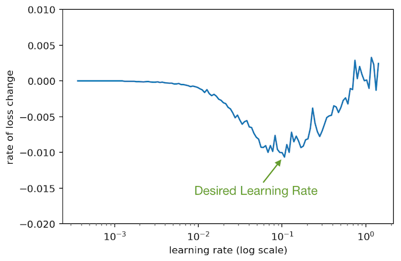
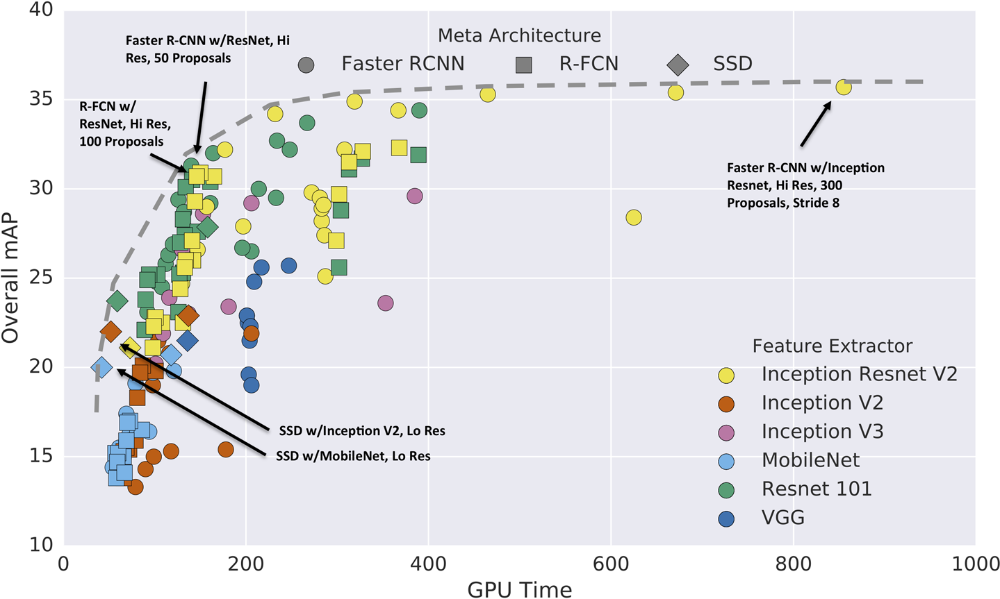
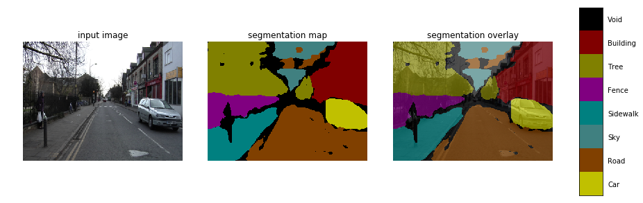

---

### ② YOLOv8 구조 직관

> *Practical Deep Learning* Ch.14 — Backbone/Neck/Head 구조 / Ch.6 — 추론 최적화와 모델 경량화

YOLOv8은 **세 부분**으로 구성됩니다.

```{mermaid}
flowchart TD
    A["입력 이미지 (640×640)"] --> B["Backbone (CSPDarknet)<br/>역할: 이미지에서 특징 추출<br/>→ 이미지 안에 무엇이 있는지 감지"]
    B --> C["Neck (FPN + PAN)<br/>역할: 다양한 크기의 특징 결합<br/>→ 멀리 있는 것도, 가까운 것도 탐지"]
    C --> D["Head (Decoupled)<br/>역할: 위치(bbox) + 클래스 동시 예측<br/>→ 어디에, 무엇이, 얼마나 확실한가"]
```

- **Backbone (CSPDarknet)**: 이미지에서 특징을 추출. 텍스처, 모서리, 형태, 색상을 점점 더 추상화된 표현으로 압축
- **Neck (FPN + PAN)**: 다양한 크기의 특징을 결합. 깊은 층(의미 풍부, 해상도 낮음)과 얕은 층(해상도 좋음, 의미 빈약)을 합쳐 크기 무관 탐지
- **Head (Decoupled)**: 위치 예측(회귀)과 클래스 예측(분류)을 분리. 학습 신호가 서로 다르므로 분리하면 학습 안정

**YOLOv8 모델 크기 계열**:

| 모델 | 파라미터 수 | 속도 | 정확도 | 배포 대상 |
|------|-----------|------|--------|----------|
| YOLOv8n (nano) | 3.2M | 최고 | 낮음 | 엣지 디바이스 |
| YOLOv8s (small) | 11.2M | 빠름 | 중간 | 중간 사양 |
| YOLOv8m (medium) | 25.9M | 중간 | 높음 | 서버 |
| YOLOv8l (large) | 43.7M | 느림 | 더 높음 | 서버 |
| YOLOv8x (xlarge) | 68.2M | 최저 | 최고 | GPU 서버 |

```{admonition} 팁
:class: tip

같은 모델 패밀리 안에서 **정확도-속도 트레이드오프를 슬라이더처럼 조절** 가능.
엣지 → n/s, 서버 → m/l, 최고 정확도 → x.
```

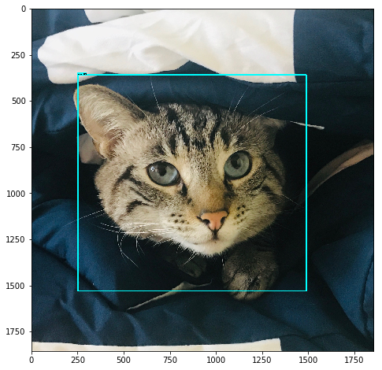
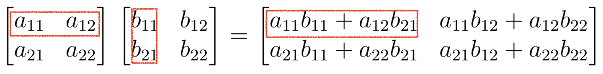
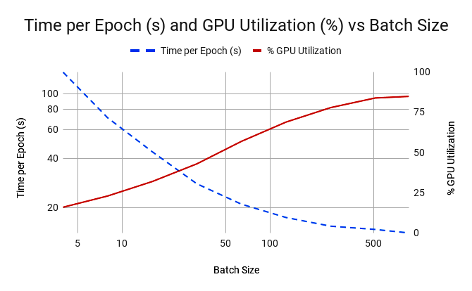

---

### ③ 경량화의 핵심: Depthwise Separable Convolution

> *Practical Deep Learning* Appendix A — 일반 Convolution 연산량 분석 / Ch.6 — MobileNet의 Depthwise Separable Convolution

**일반 Convolution의 연산량**:

$$\text{FLOPs} = H \times W \times K^2 \times C_{in} \times C_{out}$$

- 예) 224×224 이미지, 3×3 필터, $C_{in}=64$, $C_{out}=128$ → 약 **3.7억 번** 곱셈 (한 레이어)

**MobileNet의 해결책**: 한 단계 연산을 **두 단계로 쪼갬**

```{mermaid}
flowchart LR
    A["일반 Conv<br/>K×K×C_in 필터<br/>× C_out"] --> B["Depthwise Conv<br/>K×K×1 필터<br/>× C_in"]
    B --> C["Pointwise Conv 1×1<br/>1×1×C 필터<br/>× C_out"]
```

| 단계 | 역할 | 설정 |
|------|------|------|
| **Depthwise Conv** | 각 채널마다 따로 3×3 필터 적용 (공간만 처리) | `groups=in_channels` |
| **Pointwise Conv** | 1×1 필터로 채널 간 정보 결합 (채널만 처리) | `kernel_size=1` |

- **연산량 감소**: 약 **1/8 ~ 1/9** 수준
- **정확도 손실**: 1~2%에 불과

```python
import torch.nn as nn

# 일반 Convolution
standard_conv = nn.Conv2d(
    in_channels=64, out_channels=128,
    kernel_size=3, padding=1
)

# Depthwise Separable Convolution (MobileNet 방식)
depthwise = nn.Conv2d(
    in_channels=64, out_channels=64,
    kernel_size=3, padding=1,
    groups=64  # groups=in_channels → 채널별 독립 적용
)
pointwise = nn.Conv2d(
    in_channels=64, out_channels=128,
    kernel_size=1  # 1×1 conv로 채널 수 조정
)
```

**양자화(Quantization)** (*Practical Deep Learning* Ch.6 "Quantize the Model"):

- FP32(32비트) 가중치를 **INT8(8비트)** 로 저장
- 모델 크기 **4배 축소**, 추론 속도 **2~3배 향상**, 정확도 손실 **1% 미만**
- TensorFlow Lite, Core ML, TensorRT 등이 지원

```{admonition} 팁
:class: tip

**실무 판단 기준**:
- 엣지 디바이스 → YOLOv8n 또는 MobileNet 기반 모델
- 서버 배포 → YOLOv8m 이상으로 정확도 우선
- 엣지 + 정확도 모두 중요 → **Quantization** 적용

**기억할 키워드**: Depthwise Separable Convolution + Quantization.
둘 다 "정확도를 조금 양보하고 속도와 크기를 크게 얻는" 같은 철학.
```

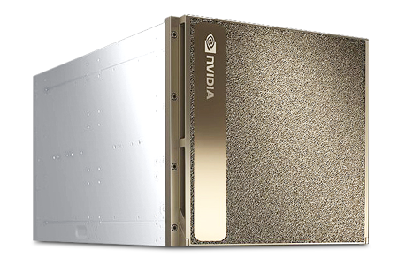
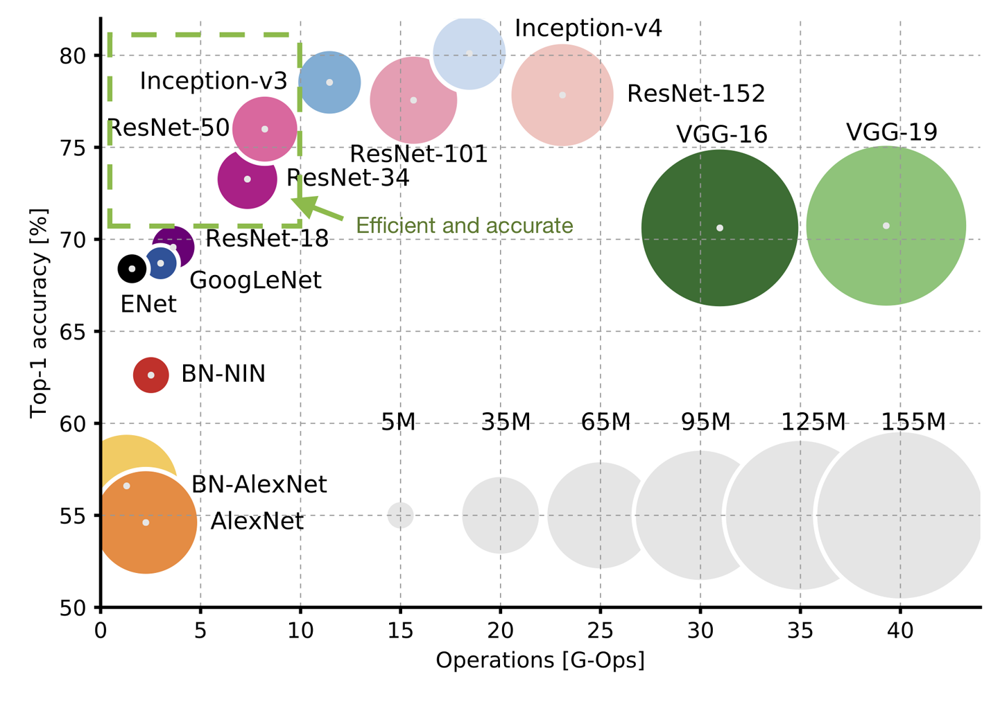

---

## 1-3. Claude Code 시연

**시연 포인트**: 모델 크기에 따른 **속도-정확도 트레이드오프**를 숫자로 확인하는 과정에 집중.

### 프롬프트

```
YOLOv8로 안전모 탐지 데모를 만들어줘.
- ultralytics 라이브러리 사용
- 모델 3개 비교: YOLOv8n, YOLOv8s, YOLOv8m
- 동일한 테스트 이미지로 각 모델 추론
- 결과: 각 모델의 추론 시간(ms), 탐지 수, bbox 시각화, 속도 vs mAP 비교
```

### 시연 흐름

- `from ultralytics import YOLO` — 가중치 파일 자동 다운로드
- 테스트 이미지 준비 (640×640 더미 이미지로 속도 비교)
- **워밍업** 필수: 첫 추론은 CUDA 초기화 비용 포함 → 측정값에서 제외
- 10회 반복 측정 후 **평균** 산출

```{admonition} 시연 후 질문
:class: warning

"모델 크기를 반으로 줄이면 속도가 정확히 두 배가 되는 건 아닌데, 왜 그런 거야?"

이유 3가지:
1. GPU 메모리 대역폭과 연산 처리량 비율이 모델마다 다름 (작은 모델은 메모리 접근이 병목)
2. 후처리(NMS 등) 시간은 모델 크기와 무관한 **고정 비용**
3. GPU 워프(warp) 단위로 작업이 묶이므로 일정 크기 전까지는 모델이 커도 안 느려짐
```

---

## 1-4. 실습

**목표**: 세 가지 모델로 추론 시간과 탐지 결과를 비교하는 표를 완성

| 모델 | 파라미터 수 | 추론 시간(ms) | 탐지율 | 선택 기준 |
|------|-----------|-------------|--------|----------|
| YOLOv8n | 3.2M | 측정 | 측정 | 엣지 디바이스 |
| YOLOv8s | 11.2M | 측정 | 측정 | 중간 사양 |
| YOLOv8m | 25.9M | 측정 | 측정 | 서버 |

### STEP 1 — 테스트 이미지 준비

```python
import time, numpy as np, matplotlib.pyplot as plt
from ultralytics import YOLO

test_image = np.random.randint(0, 255, (640, 640, 3), dtype=np.uint8)
```

### STEP 2 — 3가지 모델 로드

```python
models = {
    'YOLOv8n': YOLO('yolov8n.pt'),
    'YOLOv8s': YOLO('yolov8s.pt'),
    'YOLOv8m': YOLO('yolov8m.pt'),
}
```

### STEP 3 — 추론 시간 측정

```python
results_summary = {}
for model_name, model in models.items():
    _ = model(test_image, verbose=False)      # 워밍업 (측정에서 제외)
    times = []
    for _ in range(10):
        start = time.time()
        result = model(test_image, verbose=False)
        elapsed = (time.time() - start) * 1000
        times.append(elapsed)
    avg_time = np.mean(times)
    n_detections = len(result[0].boxes) if result[0].boxes else 0
```

### STEP 4 — 결과 시각화

```python
    results_summary[model_name] = {'avg_time_ms': avg_time, 'n_detections': n_detections}
    print(f"{model_name}: {avg_time:.1f}ms, 탐지 수: {n_detections}")
# TODO: 속도 vs 탐지 수 막대그래프
```

```{admonition} 성공 체크리스트
:class: tip

- n < s < m 순서로 추론 시간이 **단조 증가**하면 성공
- 막대그래프나 산점도로 속도 대 탐지 수 트레이드오프를 한 화면에서 확인

**도전 과제**:
- 입력 해상도를 320, 640, 1280으로 변경하며 영향 측정
- `device='cpu'` vs `device='cuda'` 비교
```
