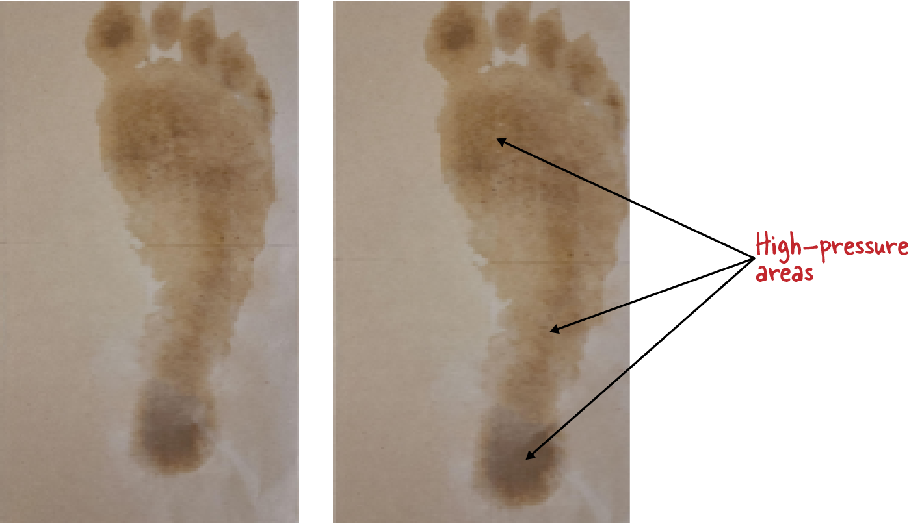
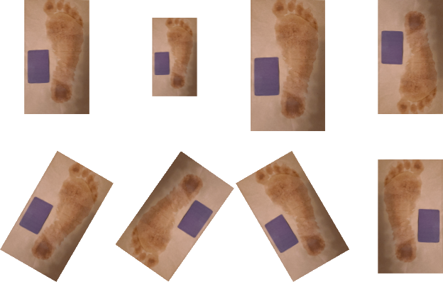
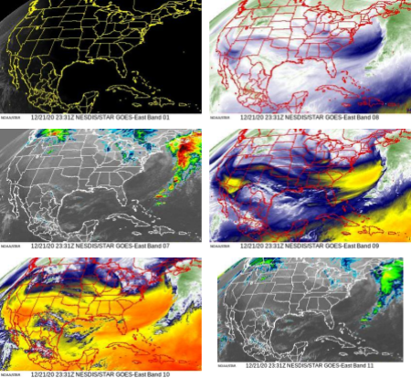
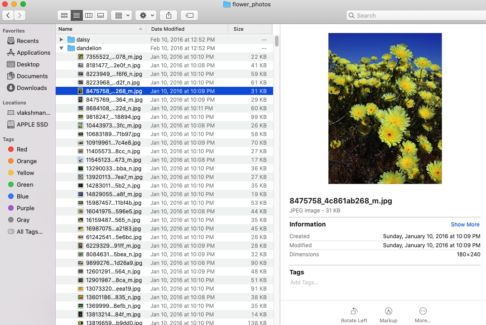
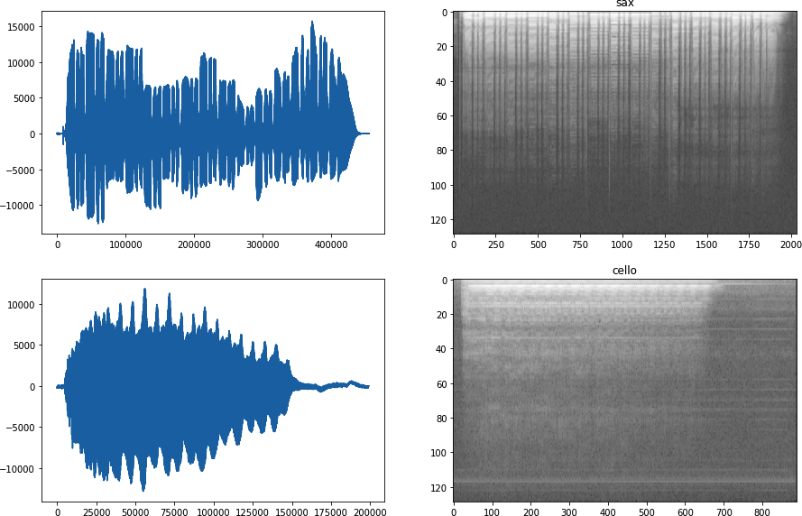
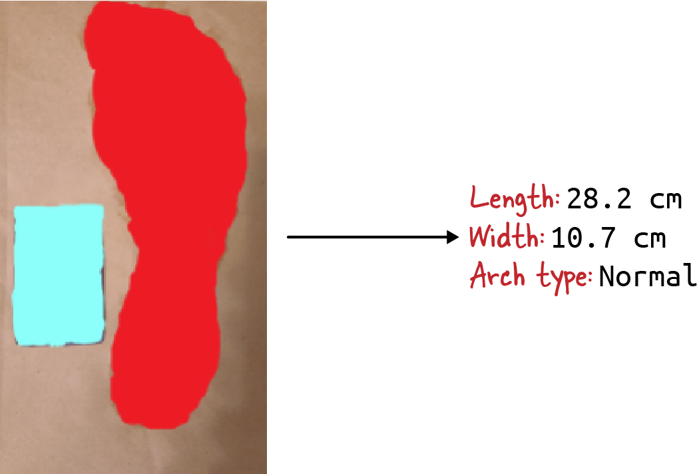

# 섹션 2 | Action Recognition — 사람의 행동을 숫자로 읽는다

> 참고 교재: *Practical Machine Learning for Computer Vision* (Valliappa Lakshmanan et al., O'Reilly) Ch.5, Ch.11

---

## 2-1. 문제 제기

**섹션 1**: YOLO로 **"무엇이 있는가(객체)"** 를 탐지
**섹션 2**: **"그 사람이 무엇을 하고 있는가(행동)"** 를 인식

```
[탐지와 인식의 차이]

Object Detection:   [사람] [안전모] [지게차]  ← 무엇이 있는가
Action Recognition: [사람이 난간 없이 높은 곳 작업 중]  ← 무엇을 하는가
```

**제조 현장의 위험 행동 예시**:

- **2인 1조 작업 규정 위반**: 혼자 중량물 이동 (객체 탐지만으로는 "사람 한 명 있음"으로만 보임)
- **안전 난간 없는 고소 작업**: 추락 위험 (자세 패턴으로 포착 가능)
- **위험 구역 무단 진입**: 보호구 미착용 상태로 진입 (객체 탐지 + 행동 인식 결합 필요)
- **근골격계 위험 자세**: 허리 과도 굽힘 반복 작업 → 관절 각도 측정 필요

```{admonition} 핵심 질문
:class: important

CCTV 영상에서 이런 위험 행동을 **실시간으로 자동 감지**할 수 있을까?
```

---

## 2-2. 이론

### ① 비디오 이해의 접근법: 왜 골격 기반인가

> *Practical ML for Computer Vision* Ch.11 — 비디오 분류 접근법 비교

**픽셀 기반 접근** (3D CNN / Two-Stream):

- 영상 프레임을 그대로 입력으로 시공간 패턴 학습
- 장점: 배경 정보까지 활용, 높은 정확도 가능
- 단점:
  - 연산량 매우 큼 → **엣지 불가**
  - 사생활 침해 우려 (얼굴, 개인 식별 가능)
  - 조명·카메라 각도 변화에 취약

**골격 기반 접근** (Skeleton / Keypoint):

- 영상에서 사람의 **관절 좌표만** 추출하여 시퀀스 분류
- 장점:
  - 연산량 적음 (33개 좌표만 처리) → **엣지 가능**
  - 사생활 보호 (픽셀 없이 좌표만 사용, 개인 식별 불가)
  - 조명·배경 변화에 강건
  - 해석 가능 (어떤 관절이 이상한지 설명 가능)
- 단점:
  - **가림(occlusion)** 에 취약 — 기계 뒤에 가려지면 관절 추출 불가
  - 미세한 동작(손가락 움직임 등)은 33개 키포인트로 표현 한계

```{admonition} 팁
:class: tip

**제조 현장 선택 기준**: 24시간 운영 + 엣지 배포 + 개인정보 보호
→ **골격 기반 방식이 현실적인 선택** (*Practical ML for Computer Vision* Ch.11 결론과 동일)
```





---

### ② MediaPipe로 골격 추출

> *Practical ML for Computer Vision* Ch.11 — 포즈 추정 원리 / Ch.5 — 비디오 데이터 키포인트 추출

**MediaPipe Pose**: Google 오픈소스, 이미지/영상에서 **33개 키포인트** 좌표를 실시간 추출

```
[MediaPipe 33개 키포인트]

         0 코
    1·2·3·4·5·6·7·8 얼굴
         11·12 어깨
    13·14 팔꿈치  15·16 손목
    17·18·19·20·21·22 손
         23·24 엉덩이
    25·26 무릎    27·28 발목
         29·30·31·32 발
```

**각 키포인트 = 3개 값** (x, y, visibility):

- **x, y**: 0~1 사이 정규화된 좌표 (이미지 크기에 무관)
- **visibility**: 0~1 사이 가시성 (가려지면 낮아짐)
- **1프레임 = 33 × 3 = 99차원 벡터**

```python
import mediapipe as mp, cv2, numpy as np

mp_pose = mp.solutions.pose

def extract_keypoints(frame):
    """단일 프레임에서 키포인트 추출"""
    with mp_pose.Pose(
        min_detection_confidence=0.5,
        min_tracking_confidence=0.5
    ) as pose:
        rgb = cv2.cvtColor(frame, cv2.COLOR_BGR2RGB)
        results = pose.process(rgb)
        if results.pose_landmarks:
            kp = np.array([
                [lm.x, lm.y, lm.visibility]
                for lm in results.pose_landmarks.landmark
            ])  # shape: (33, 3)
            return kp
        return np.zeros((33, 3))
```

```{admonition} 주의
:class: warning

- `min_detection_confidence=0.5`: 50% 미만 확신은 무시. 너무 낮추면 잡음, 너무 높이면 진짜 사람 놓침
- `cv2.cvtColor(frame, cv2.COLOR_BGR2RGB)` **필수**: OpenCV는 BGR, MediaPipe는 RGB. 빼먹으면 결과 미묘하게 이상 (디버깅 어려운 함정)
- 키포인트 미검출 시 **영행렬 반환** (시퀀스 입력 차원 유지)
```

**MediaPipe 핵심 장점**: CPU만으로도 **초당 30프레임** 가능. GPU 불필요 → Raspberry Pi급 엣지에서도 동작





---

### ③ 키포인트 시퀀스를 LSTM으로 분류

> *Practical ML for Computer Vision* Ch.11 — 시계열 키포인트 분류

행동은 한 프레임으로 판단할 수 없음. "허리를 굽히는 동작 중이다"는 **시간에 따른 변화**이므로 본질적으로 **시퀀스 분류 문제**.

→ **Session 2에서 배운 LSTM**이 여기서 재등장. 센서 시계열 → 키포인트 시계열로 입력만 교체.

```{mermaid}
flowchart TD
    A["비디오 프레임 시퀀스"] --> B["MediaPipe"]
    B --> C["키포인트 시퀀스 30 × 99<br/>(30프레임 × 33관절 × 3좌표)"]
    C --> D["LSTM"]
    D --> E["행동 분류 결과<br/>정상 작업 / 위험 행동A / 위험 행동B"]
```

**슬라이딩 윈도우**:

- `window_size=30`: 30FPS 영상에서 1초 분량 (대부분의 작업 동작 단위 포착)
- `step=15`: 15프레임씩 이동 (절반 겹침) → 0.5초마다 결과 갱신, 반응 속도 2배

```python
def create_sequences(keypoint_data, labels, window_size=30, step=15):
    """키포인트 시계열 → LSTM 입력 시퀀스"""
    X, y = [], []
    for i in range(0, len(keypoint_data) - window_size, step):
        X.append(keypoint_data[i:i+window_size].reshape(window_size, -1))
        y.append(labels[i+window_size])
    return np.array(X), np.array(y)
```

**LSTM 행동 분류 모델**:

```python
import tensorflow as tf

model = tf.keras.Sequential([
    tf.keras.layers.LSTM(64, input_shape=(30, 99),
                         return_sequences=True),
    tf.keras.layers.Dropout(0.3),
    tf.keras.layers.LSTM(32),
    tf.keras.layers.Dense(32, activation='relu'),
    tf.keras.layers.Dense(3, activation='softmax')  # 행동 클래스 수
])

model.compile(
    optimizer='adam',
    loss='sparse_categorical_crossentropy',
    metrics=['accuracy']
)
```

| 레이어 | 역할 |
|--------|------|
| `LSTM(64, return_sequences=True)` | 첫 번째 LSTM. 64차원 은닉 상태. 시퀀스 전체를 다음 층에 전달 |
| `Dropout(0.3)` | 학습 중 30% 뉴런 무작위 off → 과적합 방지 |
| `LSTM(32)` | 두 번째 LSTM. 마지막 타임스텝 출력만 반환 |
| `Dense(3, softmax)` | 3개 클래스 확률 출력 |
| `sparse_categorical_crossentropy` | 라벨이 원-핫이 아닌 정수(0, 1, 2)일 때 사용 |

```{admonition} 핵심
:class: important

**Session 2의 LSTM과 본질적으로 같은 구조**.
입력만 센서 시계열 → 키포인트 시계열로 바뀐 것.
한 번 익힌 모듈은 도메인을 옮겨서 재활용 가능.
```

```{admonition} 팁
:class: tip

**실무 판단 기준**:
- 위험 행동은 종류가 적고 패턴이 명확 → 클래스 수 **3~5개**로 시작
- 데이터가 부족할 경우 → 정상 행동만 학습한 **Autoencoder**로 이상탐지 (세션 2 섹션 1 재활용)
```




---

## 2-3. Claude Code 시연

**시연 포인트**: MediaPipe 출력을 LSTM 입력으로 **어떻게 변환하는가**. 두 도구 사이의 데이터 흐름을 손으로 잡는 게 목표.

### 프롬프트

```
작업자 위험 행동 인식 모델을 만들어줘.
- MediaPipe Pose로 웹캠/영상에서 키포인트 추출
- window_size=30 프레임으로 슬라이딩 윈도우 생성
- LSTM(64) → Dropout(0.3) → LSTM(32) → Dense(3, softmax)
- 행동 클래스: ["정상작업", "허리위험각도", "고소작업위험"]
- 합성 데이터로 학습
```

### 시연 단계별 흐름

1. **합성 데이터 생성**: 정상은 무작위 잡음만, 허리 위험은 엉덩이 키포인트 점진 변화, 고소 위험은 y좌표 전반 위쪽
2. **윈도우 생성**: `create_sequences`로 (배치, 30, 99) shape 생성
3. **학습**: 패턴이 명확하므로 빠르게 수렴 (합성 데이터 기준 정확도 90% 후반)

```{admonition} 시연 후 질문
:class: warning

"카메라가 정면이 아니라 **측면**에서 찍히면 키포인트가 어떻게 달라지고, 어떻게 대응해야 할까?"

측면 문제: 한쪽 팔/다리가 가려짐 → visibility 값 하락

대응 3가지:
1. **visibility 가중치**: 낮은 키포인트의 영향을 마스킹 또는 가중치로 감소
2. **다중 카메라 융합**: 정면 + 측면 카메라, 더 잘 보이는 쪽 우선 사용 (비싸지만 효과적)
3. **학습 데이터에 다양한 각도 포함**: 측면, 후면, 비스듬한 각도를 골고루 섞어 각도 강건화 (가장 근본적)
```

---

## 2-4. 실습

**목표**: 윈도우 크기를 바꾸면서 **지연 시간과 정확도의 트레이드오프**를 직접 체험

| 실험 | window_size | 지연 시간 | 정확도 | 관찰 포인트 |
|------|-----------|----------|--------|------------|
| A | 15 프레임 | 0.5초 | 측정 | 빠른 반응, 짧은 맥락 |
| B | 30 프레임 | 1.0초 | 측정 | 기본값 |
| C | 60 프레임 | 2.0초 | 측정 | 긴 맥락, 느린 반응 |

### STEP 1 — 합성 키포인트 데이터 생성

```python
import numpy as np, tensorflow as tf
from sklearn.model_selection import train_test_split

np.random.seed(42)
N_SAMPLES, N_CLASSES, N_KEYPOINTS = 300, 3, 99

def generate_synthetic_data(window_size, n_samples=N_SAMPLES):
    X, y = [], []
    for cls in range(N_CLASSES):
        for _ in range(n_samples // N_CLASSES):
            base = np.random.randn(window_size, N_KEYPOINTS) * 0.1
            if cls == 1: base[:, 23*3:25*3] += np.linspace(0, 1, window_size)[:, None]
            elif cls == 2: base[:, 1::3] -= 0.5
            X.append(base); y.append(cls)
    return np.array(X, dtype=np.float32), np.array(y)
```

### STEP 2 — LSTM 모델 빌더

```python
def build_model(window_size, n_classes=N_CLASSES):
    return tf.keras.Sequential([
        tf.keras.layers.LSTM(64, input_shape=(window_size, N_KEYPOINTS),
                             return_sequences=True),
        tf.keras.layers.Dropout(0.3),
        tf.keras.layers.LSTM(32),
        tf.keras.layers.Dense(n_classes, activation='softmax')
    ])
```

### STEP 3 — 세 가지 window_size로 실험

```python
results = {}
for window_size in [15, 30, 60]:
    X, y = generate_synthetic_data(window_size)
    X_train, X_test, y_train, y_test = train_test_split(X, y, test_size=0.2, random_state=42)
    model = build_model(window_size)
    model.compile(optimizer='adam', loss='sparse_categorical_crossentropy', metrics=['accuracy'])
    # TODO: 학습 → 평가 → 추론 시간 측정
```

```{admonition} 성공 체크리스트
:class: tip

- window_size가 커질수록 정확도가 약간 **오르고** 추론 시간도 **늘어나는** 단조 관계가 보이면 성공
- 정확도가 60→30→15 순으로 떨어지지 않거나 추론 시간이 역전되면 데이터/측정 오류

**도전 과제**: window_size=30 고정, step을 5, 15, 30으로 변경 → 결과 갱신 빈도와 계산 비용의 트레이드오프 관찰
```
