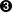
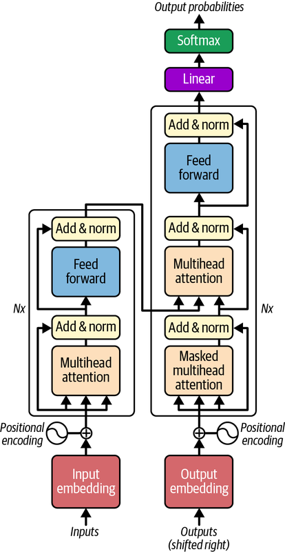
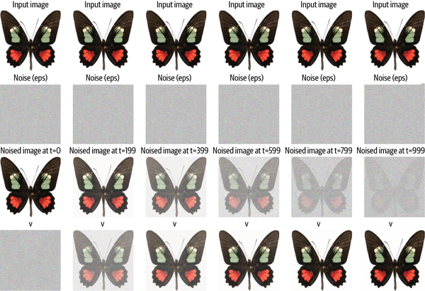
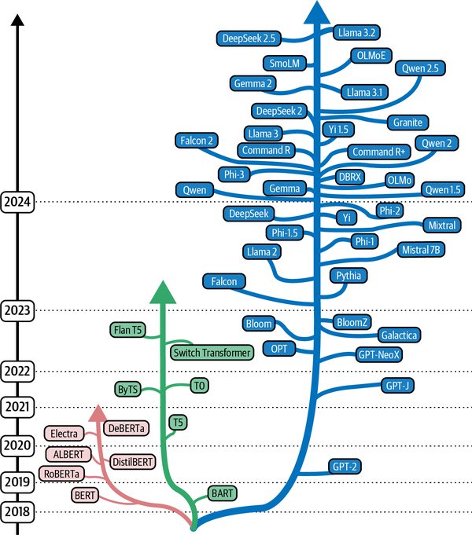
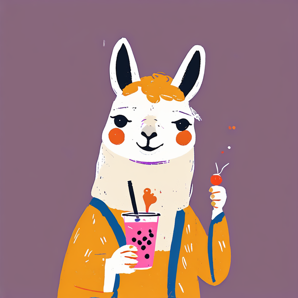
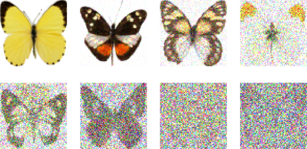
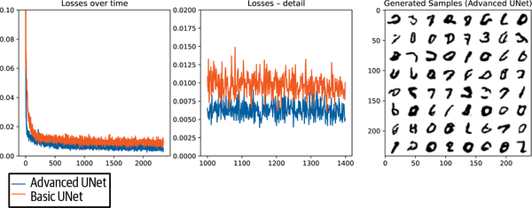
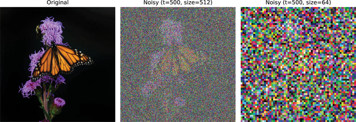

# Diffusion Model -- 노이즈에서 결함 이미지를 꺼내는 법

---

## 1-1. 문제 제기

### 제조 현장의 데이터 현실

- **정상 제품 이미지**: 수만 장 (라인이 정상 가동하면 끊임없이 쌓임)
- **스크래치 결함**: 수백 장
- **버블(기포) 결함**: 수십 장
- **크랙(균열) 결함**: 수 장 -- 학습 불가 수준

```{admonition} 왜 결함은 항상 부족한가
:class: important

결함은 애초에 희귀합니다. 자주 발생하면 그건 결함이 아니라 공정 문제입니다.
```

### 이미지 데이터에 SMOTE를 적용하면

- 두 결함 이미지의 픽셀을 평균 내면 **의미 없는 흐릿한 혼합 이미지**가 나옴
- 스크래치 반 + 버블 반 = 어떤 결함도 아닌 픽셀 덩어리
- 픽셀 보간은 새로운 결함 패턴을 만들지 못함
- 필요한 것: **진짜처럼 보이면서도 새로운 결함 이미지**

```{mermaid}
flowchart LR
    A["결함 이미지 A"] --> C["픽셀 보간"]
    B["결함 이미지 B"] --> C
    C --> D["흐릿한 혼합 이미지<br/>(의미 없음)"]
```

### 핵심 질문

> 세상에 존재하지 않는 결함 이미지를 진짜처럼 만들어 낼 수 있는가?

- Session 1·2의 데이터 부족 문제를 **데이터 생성**으로 해결하는 접근
- 이 시리즈 전체를 관통하는 질문: **"데이터가 부족하면 어떻게 하는가?"**
  - Session 1: SMOTE로 보강
  - Session 3: 임계값 조정으로 대응
  - Session 4: AI가 학습 데이터 자체를 생성

---

## 1-2. 이론

### STEP 01 -- Diffusion의 직관: 노이즈 추가, 노이즈 제거

> *Hands-On Generative AI* 4장: **"모델은 노이즈 제거를 학습한다."**

**Forward Process(노이즈 추가)** 는 원본 이미지 $x_0$에서 시작해 가우시안 노이즈를 조금씩 더해 가는 과정입니다($x_0 \to x_1 \to \cdots \to x_T$). 보통 $T=1000$번쯤 반복하면 **순수 가우시안 노이즈** 가 됩니다. 각 단계는 $q(x_t \mid x_{t-1}) = \mathcal{N}(x_t;\, \sqrt{1-\beta_t}\, x_{t-1},\, \beta_t \mathbf{I})$로 정의되며, 노이즈 스케줄 $\beta_t$는 시간이 흐를수록 커져 노이즈가 강해집니다. 이 과정에는 **학습이 전혀 없습니다** — 단순한 수학 공식일 뿐입니다.

**Reverse Process(노이즈 제거)** 는 반대로 순수 노이즈 $x_T$에서 시작합니다. 모델이 한 단계씩 노이즈를 예측해 제거하며($x_T \to \cdots \to x_0$), $T$번 반복하면 **완전히 새로운 이미지** $x_0$가 생성됩니다. 이 과정에는 **학습이 있습니다** — 모델이 "노이즈에서 원본으로 가는 방향"을 배우는 것입니다.

```{mermaid}
flowchart TD
    A["원본 결함 이미지 x₀"] -->|"노이즈 추가"| B["x₁ (약간 흐려짐)"]
    B -->|"노이즈 추가"| C["x₂ (더 흐려짐)"]
    C -->|"... T번 반복"| D["xₜ (순수 노이즈)"]
    D -->|"노이즈 제거 (모델)"| E["xₜ₋₁"]
    E -->|"반복..."| F["x₀ (새로운 결함 이미지!)"]
```



- 순수 노이즈에서 시작해 **단계적으로 노이즈를 제거**하며 이미지가 드러나는 과정
- Diffusion의 Reverse Process(노이즈 제거)를 시각적으로 보여줌
- "노이즈에서 이미지로 가는 방향"을 모델이 학습한다는 핵심을 드러냄



- Diffusion이 노이즈 예측에 쓰는 **U-Net** 구조(다운샘플링 → 업샘플링)
- 줄였다 키우며 전역·국소 정보를 모두 활용해 노이즈를 추정
- 각 스텝에서 "제거할 노이즈"를 출력하는 핵심 신경망



- 트랜스포머 기반 언어 모델의 구조 — 어텐션으로 토큰 간 관계를 학습
- 텍스트 프롬프트를 이해하는 **텍스트 인코더**의 기반
- 텍스트→이미지 생성에서 "조건(프롬프트)"을 처리하는 토대



- 인코더-디코더 형태의 트랜스포머 구조
- 입력을 표현으로 **인코딩**하고 그로부터 출력을 **디코딩**
- 멀티모달(텍스트↔이미지) 연결의 일반적 골격

```{admonition} 핵심 직관
:class: important

- 모델이 학습하는 것은 특정 이미지가 아니라 **"노이즈에서 이미지로 가는 방향" 자체**
- 한 번도 본 적 없는 새 이미지를 순수 노이즈에서 생성할 수 있음
- 기억할 두 단어: **Forward = 노이즈 추가, Reverse = 노이즈 제거**
```

**Diffusion vs GAN 속도 비교**

다만 Diffusion은 DDPM 기준 추론에 1000번의 forward pass가 필요해 GAN보다 훨씬 느립니다. 그래서 DDIM 같은 기법으로 50~100스텝으로 줄이는 것이 실무 표준입니다.

---

### STEP 02 -- Fine-tuning 전략: 적은 데이터로 특정 스타일 학습

> *Hands-On Generative AI* 7장 -- Fine-tuning의 원리와 전략 비교

Stable Diffusion을 처음부터 학습하는 것은 불가능에 가깝습니다 (수십억 장 데이터, GPU 수백 대, 수주 학습). 대안은 **Fine-tuning**: 이미 학습된 모델을 우리 결함 이미지에 맞게 미세 조정.

| 방법 | 필요 이미지 | 학습 시간 | 파라미터 변경 | GPU 메모리 |
|------|-----------|----------|------------|-----------|
| **DreamBooth** | 3~20장 | 수십 분 | 전체 모델 업데이트 | 24GB+ |
| **LoRA** | 10~100장 | 수 분~30분 | 0.1~1% 추가 | 8GB |
| **Textual Inversion** | 5~10장 | 수 분~수 시간 | 임베딩만 학습 | 8GB |

**LoRA (Low-Rank Adaptation) 직관**

LoRA의 직관은 이렇습니다. 원본 가중치 $\mathbf{W}$는 완전히 고정해 두고, 그 옆에 두 개의 작은 행렬 $\mathbf{A}$, $\mathbf{B}$를 덧붙입니다. 학습할 때는 $\Delta\mathbf{W} = \mathbf{A} \times \mathbf{B}$만 갱신하고, 학습이 끝나면 $\mathbf{W} + \Delta\mathbf{W}$가 새 모델이 됩니다. 덕분에 결함 이미지 10장만으로도 특정 결함 패턴을 학습할 수 있습니다.

```{mermaid}
flowchart LR
    A["원래 모델 가중치 W<br/>(거대한 행렬, 변경 안 함)"] --> B["+ LoRA 추가<br/>ΔW = A × B<br/>(작은 행렬 두 개)"]
    B --> C["결함 특화 모델<br/>(전체 파라미터의 0.1~1%만 학습)"]
```



- Stable Diffusion을 우리 데이터에 맞추는 **fine-tuning 전체 구조**
- 사전학습 모델 위에 추가 학습을 얹는 방식
- DreamBooth·LoRA 등 구체적 기법의 공통 틀


- 원본 가중치는 고정하고 **작은 행렬 A·B만 추가 학습**하는 LoRA 흐름
- 전체의 0.1~1%만 갱신해 적은 데이터·메모리로 특화
- 결함 이미지 10여 장으로도 스타일 학습이 가능한 이유



- 소수 이미지로 **전체 모델을 미세조정**하는 DreamBooth 흐름
- 특정 대상/스타일을 강하게 각인시킴(고품질, 대신 무거움)
- LoRA와 대비되는 fine-tuning 전략



- DreamBooth 학습에 쓰는 **소수의 대상 이미지 세트** 예시
- 3~20장만으로 특정 대상을 학습시킬 수 있음을 보여줌
- "적은 데이터로 특화"라는 fine-tuning의 강점

**파이프라인 로드 코드** (3단계 준비 코드)

```python
from diffusers import StableDiffusionPipeline
import torch

# 1. Hugging Face에서 사전 학습 모델 로드 (반정밀도로 메모리 절약)
pipeline = StableDiffusionPipeline.from_pretrained(
    "runwayml/stable-diffusion-v1-5",
    torch_dtype=torch.float16
)

# 2. LoRA 가중치 로드 (fine-tuning 결과)
pipeline.load_lora_weights("./lora_defect_weights")

# 3. GPU로 이동
pipeline = pipeline.to("cuda")
```

```{admonition} 실습 주의사항
:class: warning

- Fine-tuning 학습 자체는 GPU에서 수십 분~수 시간이 필요
- 이번 실습에서는 **사전 준비된 가중치**를 로드해서 생성 결과만 실험
- GPU가 없는 환경에서는 코드가 자동으로 합성 이미지로 대체 실행
```

---

### STEP 03 -- 생성 품질 평가: 무엇이 좋은 이미지인가

> *Hands-On Generative AI* Ch.4 -- 생성 이미지 품질 평가 지표

세 가지 평가 방법을 같이 사용하는 것이 정석입니다.

**① 육안 검사** 는 가장 기본입니다. 실제 결함처럼 보이는지, 결함의 위치와 형태가 자연스러운지를 사람이 직접 봅니다. 직관적이지만 주관적이고 대량 평가가 어렵습니다.

**② SSIM(Structural Similarity Index Measure)** 은 두 이미지의 **구조적 유사도** 를 0(완전 다름)에서 1(완전 동일) 사이로 측정합니다. 단순 픽셀 차이가 아니라 휘도·대비·구조 세 가지를 종합해 판단하며, 실무에서는 **SSIM > 0.7이면 유사한 이미지** 로 봅니다. 한 장 대 한 장 비교에 유용합니다.

**③ FID(Fréchet Inception Distance)** 는 이미지 **집합 대 집합** 의 분포 거리를 측정합니다. 값이 낮을수록 좋으며 10 미만이면 우수, 50 미만이면 양호입니다. 신뢰할 수 있는 FID를 얻으려면 **최소 수백 장** 이 필요합니다.



- FID 계산에 쓰이는 **특징 추출 CNN**(Inception 계열)
- 이미지를 특징 벡터로 바꿔 집합 대 집합의 분포 거리를 측정
- "생성 품질을 수치로" 평가하는 FID의 동작 기반

**SSIM 계산 코드**

```python
from skimage.metrics import structural_similarity as ssim
import numpy as np

def calculate_ssim(real_img, generated_img):
    """두 이미지의 SSIM 계산"""
    real_gray = np.mean(real_img, axis=2)   # (H, W, 3) -> (H, W)
    gen_gray = np.mean(generated_img, axis=2)
    score = ssim(real_gray, gen_gray, data_range=1.0)
    return score

# 사용 예시
score = calculate_ssim(real_defect, generated_defect)
print(f"SSIM: {score:.3f}")  # 0.7 이상이면 품질 양호
```

```{admonition} 평가 순서 정석
:class: tip

육안으로 거르고 -> SSIM으로 한 장씩 점검하고 -> FID로 전체 분포를 검증
```

---
