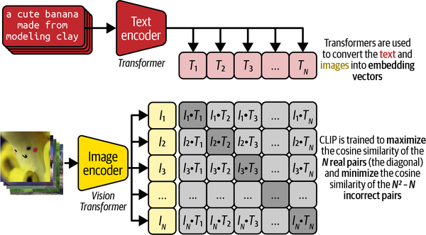
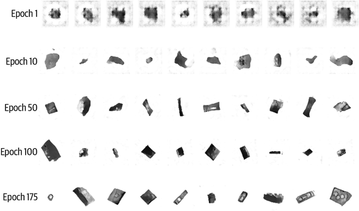
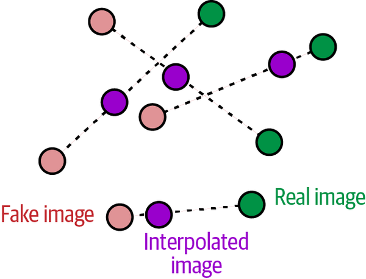
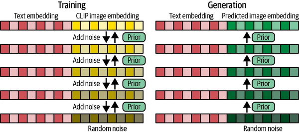
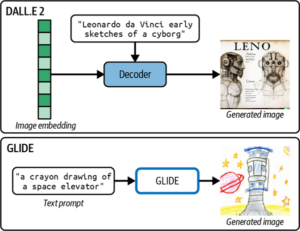
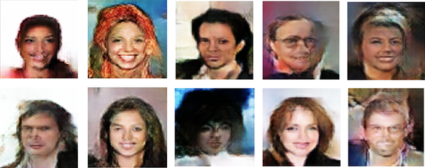
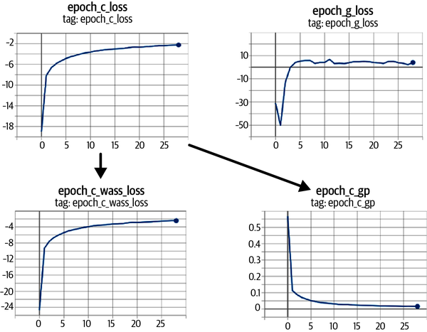

# 섹션 2 | Defect Generation -- 프롬프트로 결함을 설계한다

---

## 2-1. 문제 제기

### 섹션 1의 한계

- 섹션 1 프롬프트: **"스크래치 결함 이미지"**
- 결과: 무작위 스크래치 생성 -- **어디에, 얼마나 깊게, 어떤 방향인지 제어 불가**
- 그냥 "스크래치가 들어 있는 이미지"가 나올 뿐

### 현장에서 필요한 것

품질 검사 모델을 학습시키려면 **특정 조건의 결함을 골고루 모아야** 합니다.

- 스크래치 길이: 1mm, 5mm, 10mm 골고루 필요
- 깊이: 표면 긁힘부터 깊은 홈까지 다양
- 방향: 수직, 수평, 대각선 골고루

**현실**: 현장 데이터는 편향되어 있음

- 라인 특성상 수직 스크래치가 많고, 깊은 스크래치는 거의 없음
- 모델이 편향된 데이터로만 학습하면 본 적 없는 형태에는 약함

### 해결책: 부족한 조건의 결함을 정확한 명세로 생성

```
"스테인리스 스틸 표면 왼쪽 가장자리에
 깊이 5mm의 수직 스크래치 결함,
 산업용 품질 검사 사진, 고해상도"
```

텍스트 한 줄로 결함의 모든 속성을 지정하고, 그대로 이미지가 만들어진다면 **데이터셋의 빈 구멍을 정확히 채울 수 있음**.

### 핵심 질문

> 생성된 결함을 우리가 원하는 대로 정밀하게 제어할 수 있는가?
> 그 답이 **프롬프트 기반 조건부 생성**입니다.

---

## 2-2. 이론

### STEP 01 -- 조건부 생성의 직관: CGAN에서 Diffusion으로

> *Generative Deep Learning* 2판 Ch.4, Ch.13 -- 조건부 생성의 발전 흐름

**CGAN (Conditional GAN, 2014)**

- GAN에 **조건 $c$** (클래스 레이블)를 추가
- Generator 입력에 노이즈 $z$와 레이블 $c$가 같이 들어감
- 예: $c$ = "스크래치" -> 스크래치 이미지 생성
- **한계**: 조건이 클래스 레이블 수준. "왼쪽에 5mm 깊이의 수직 스크래치"는 표현 불가

```{mermaid}
flowchart LR
    A["노이즈 z +<br/>클래스 레이블 c"] --> B["Generator"]
    B --> C["조건에 맞는 이미지"]
    C --> D["한계: 클래스 레이블만<br/>세밀한 제어 불가"]
```

**Text-to-Image Diffusion (2022~)**

- 조건이 클래스 레이블이 아니라 **자연어 문장 전체**로 확장
- Stable Diffusion, DALL-E 2, Imagen 등이 이 흐름의 산물
- 자연어의 무한한 표현력 -> 무한한 제어 가능

```{mermaid}
flowchart LR
    A["노이즈 z +<br/>텍스트 문장 c"] --> B["Diffusion"]
    B --> C["텍스트에 맞는 이미지"]
    C --> D["강점: 언어의 유연성으로<br/>무한한 조건 표현 가능"]
```

```{admonition} 핵심
:class: important

조건부 생성이라는 아이디어는 같고, **조건을 표현하는 방법이 클래스에서 자연어로 진화**한 것.
핵심 아이디어는 변하지 않음.
```

**GAN의 Mode Collapse 한계** (*Generative Deep Learning* 4장)

- Generator가 Discriminator를 속이기 가장 쉬운 한두 가지 패턴에만 빠짐
- 같은 이미지만 반복 생성
- Diffusion은 학습 방식이 달라 mode collapse가 훨씬 덜 일어남
- Diffusion이 GAN을 대체하는 흐름이 강해진 이유


- GAN의 두 네트워크(**Generator·Discriminator**)의 입출력 관계를 보여줌
- 생성자는 가짜를 만들고 판별자는 진짜/가짜를 가름 → 적대적 학습
- 조건부 생성(CGAN)의 출발이 되는 기본 구조



- DCGAN 학습 과정 — 회색 박스는 그 단계에서 **동결된(업데이트 안 하는) 가중치**
- 생성자와 판별자를 번갈아 학습시키는 GAN 훈련 방식
- GAN 학습이 까다롭고 불안정할 수 있음을 시사



- **조건(레이블)** 을 입력에 추가한 CGAN의 생성자·비평자 입출력
- 노이즈 + 클래스 레이블 → 해당 클래스의 이미지 생성
- "조건부 생성"의 초기 형태



- CGAN이 **조건 레이블로 생성을 제어**한 출력 예시
- 같은 모델이 레이블에 따라 다른 종류의 이미지를 냄
- 다만 제어 수준이 클래스 단위에 머무는 한계를 보여줌

---

### STEP 02 -- CLIP: 텍스트와 이미지를 연결하는 다리

> *Generative Deep Learning* Ch.13 / *Hands-On Generative AI* Ch.2

**CLIP (Contrastive Language-Image Pre-training, OpenAI 2021)**

- **인터넷에서 수억 개의 (이미지, 텍스트 캡션) 쌍**으로 학습
- **대조 학습**(Contrastive Learning) 방식:
  - 한 배치에 $N$쌍의 (이미지, 텍스트)가 들어옴
  - $N \times N$개의 모든 쌍에 대해 유사도 계산
  - **정답 쌍의 유사도는 높이고, 나머지는 낮추는 방향**으로 학습
- 결과: **텍스트와 이미지를 같은 벡터 공간에 놓는 능력**을 획득

```
"a scratch on metal"  <->  [스크래치 이미지의 벡터]
"a bubble defect"     <->  [버블 이미지의 벡터]
"a crack on ceramic"  <->  [크랙 이미지의 벡터]

비슷한 의미 = 가까운 벡터 위치
```

```{mermaid}
flowchart TD
    A["텍스트 프롬프트"] --> B["CLIP Text Encoder"]
    B --> C["텍스트 임베딩 벡터<br/>(의미를 숫자로 표현)"]
    C --> D["Diffusion<br/>(Cross-Attention)"]
    D --> E["프롬프트 의미에 맞는 이미지 생성"]
```

**Stable Diffusion에서 CLIP의 역할**

- 프롬프트 입력 -> CLIP이 벡터로 변환 -> Diffusion 노이즈 제거 과정에 **조건으로 주입**
- 노이즈를 제거할 때마다 "이 텍스트 벡터에 가까워지는 방향으로 가라"는 가이드가 들어감



- 수억 쌍의 (이미지, 텍스트)로 **대조 학습**하는 CLIP 훈련 과정
- 정답 쌍은 가깝게, 오답 쌍은 멀게 → 텍스트·이미지를 같은 공간에 정렬
- 텍스트로 이미지를 제어할 수 있게 하는 핵심 다리



- **잠재 확산(latent diffusion)** 기반 Stable Diffusion의 전체 구조
- 텍스트(CLIP) 조건이 U-Net의 노이즈 제거에 **cross-attention**으로 주입됨
- 프롬프트 → 이미지가 실제로 어떻게 연결되는지 보여줌



- DALL-E 2의 **텍스트→이미지 생성** 결과 예시
- 자연어 문장만으로 새 이미지를 만들어내는 능력을 보여줌
- 조건이 클래스에서 자연어로 진화했음을 실증



- GLIDE에서 **텍스트 임베딩으로 U-Net을 가이드**하는 확산 과정
- 노이즈 제거 매 단계마다 프롬프트 의미 쪽으로 끌어당김
- 텍스트 조건이 생성에 주입되는 메커니즘의 구체 사례

**CLIP 임베딩 확인 코드**

```python
from transformers import CLIPTextModel, CLIPTokenizer

tokenizer = CLIPTokenizer.from_pretrained("openai/clip-vit-base-patch32")
text_encoder = CLIPTextModel.from_pretrained("openai/clip-vit-base-patch32")

prompts = [
    "scratch defect on metal surface",
    "deep crack on ceramic material",
    "bubble defect on painted surface"
]

for prompt in prompts:
    inputs = tokenizer(prompt, return_tensors="pt")
    embeddings = text_encoder(**inputs).last_hidden_state
    print(f"'{prompt[:30]}...' -> shape: {embeddings.shape}")
    # 결과: [1, 토큰 수, 512] -> 각 토큰별 512차원 벡터
```

**embedding shape이 `[1, 토큰 수, 512]`라는 것의 의미**

- 각 토큰별로 512차원의 벡터가 만들어짐
- "scratch defect on metal surface"가 7~8개 토큰으로 쪼개지면, 각 토큰별로 의미 벡터 생성
- 이 벡터들이 Diffusion의 **cross-attention 메커니즘**으로 이미지 생성에 영향

**CLIP의 zero-shot 일반화**

- 학습 데이터에 없는 단어 조합도 잘 처리
- "스테인리스 스틸 표면의 깊은 수직 스크래치"라는 조합이 학습 데이터에 정확히 있을 리 없음
- CLIP은 각 단어의 의미를 조합해서 합리적인 벡터를 생성
- 자유로운 프롬프트로 결함을 설계할 수 있는 근거

---

### STEP 03 -- 제조 결함 프롬프트 설계 원칙

> *Generative Deep Learning* Ch.13 -- 효과적인 텍스트 프롬프트 설계

### 프롬프트 설계 공식

```
[결함 유형] + [위치] + [심각도] + [재질/배경] + [촬영 스타일]
```

**예시 분해**

```
"a deep vertical scratch defect on the left edge
 of a stainless steel surface,
 industrial quality inspection photo,
 high resolution, studio lighting"
```

- **결함 유형**: "deep vertical scratch defect"
- **위치**: "on the left edge"
- **재질**: "stainless steel surface"
- **촬영 스타일**: "industrial quality inspection photo, high resolution, studio lighting"

### 좋은 프롬프트 vs 나쁜 프롬프트

| 나쁜 프롬프트 | 좋은 프롬프트 |
|------------|-------------|
| `"defect"` (모호, 결과가 들쭉날쭉) | `"hairline crack defect, 2cm length, diagonal orientation, on white ceramic surface, macro photography"` (구체적) |
| `"very very bad defect extremely damaged"` (강조 반복은 효과 없음) | `"severe deep crack defect, multiple branching lines"` (구체적 묘사) |

**첫 번째 함정**: "defect" 한 단어는 CLIP이 무수히 많은 가능성 중 무작위로 하나를 골라야 해서 결과가 불안정

**두 번째 함정**: 강조를 반복한다고 효과가 커지지 않음. "very very bad extremely damaged"는 CLIP 입장에서 비슷한 의미의 중복 노이즈. 구체적인 단어가 훨씬 효과적

### 네거티브 프롬프트

원하지 않는 요소를 명시하는 강력한 기법:

```python
positive_prompt = "scratch defect on metal surface, inspection photo"
negative_prompt = "blurry, low quality, cartoon, illustration, text, watermark"

image = pipeline(
    prompt=positive_prompt,
    negative_prompt=negative_prompt,
    num_inference_steps=50,
    guidance_scale=7.5    # 프롬프트 충실도
).images[0]
```

- "이런 요소는 빼 줘"라고 지정: 흐릿함, 만화풍, 일러스트, 텍스트, 워터마크 등
- **주의**: 너무 많은 단어를 넣으면 모델에 혼란만 줌. **5~7개 키워드가 적당** (*Generative Deep Learning* 13장)

### guidance_scale 매개변수

"프롬프트를 얼마나 강하게 반영할지"의 다이얼:

- **낮음**: 자유롭고 다양하지만 프롬프트와 다를 수 있음
- **높음**: 충실하지만 부자연스러울 수 있음
- **권장 기본값**: 7.5

```{admonition} guidance_scale 요약
:class: tip

- 낮으면 자유로움, 높으면 충실함
- 7.5가 기본 권장값
- 실습에서 직접 바꿔 보면서 효과 체감
```

---

## 2-3. Claude Code 시연

### 시연 목표

**프롬프트 설계가 생성 결과에 미치는 영향을 비교**하는 흐름에 집중

**Claude에게 던질 프롬프트**

```
제조 결함 유형별 프롬프트 템플릿을 설계하고 이미지를 생성해줘.

결함 유형별 프롬프트 (각각 3가지 강도):
1. 스크래치: 경미 / 중간 / 심각
2. 기포: 소형 / 중형 / 대형
3. 크랙: 표면 / 깊은 / 관통

- diffusers 파이프라인으로 각 프롬프트 생성
- 결과: 3x3 그리드 (행=결함유형, 열=심각도)
- guidance_scale=7.5 고정
- guidance_scale을 3 / 7.5 / 15로 바꾼 비교도 추가
```

### 시연 흐름

1. **프롬프트 템플릿 설계**: 결함 유형 x 심각도를 조합해서 자동으로 프롬프트를 만드는 함수

```python
def build_prompt(defect_type, severity, material="metal"):
    severity_map = {
        "light": "minor surface",
        "medium": "moderate",
        "heavy": "severe deep"
    }
    return (
        f"{severity_map[severity]} {defect_type} defect "
        f"on {material} surface, "
        f"industrial quality inspection photo, "
        f"high resolution, neutral background"
    )
```

2. **이미지 생성 루프**: 9가지 조합 각각에 대해 한 장씩 생성. 시드를 고정해서 차이를 명확히 비교

3. **3x3 그리드 시각화**: 같은 행 = 같은 결함 유형(심각도 변화), 다른 행 = 결함 유형 자체가 다름

4. **guidance_scale 비교 실험**: 같은 프롬프트, 같은 시드, 다른 guidance_scale 3가지 (3, 7.5, 15)
   - **gs=3**: 가장 다양하지만 프롬프트와 느슨하게 연결
   - **gs=7.5**: 균형점. 프롬프트도 잘 반영하고 자연스러움
   - **gs=15**: 너무 강하게 반영해서 **과포화**나 **아티팩트** 발생

```{admonition} guidance_scale 핵심
:class: important

너무 낮아도 안 되고 너무 높아도 안 됨. 7.5 근처에 sweet spot이 있음.
```

### 시연 후 토론: 재현성

**질문**: 동일한 프롬프트인데 결과가 매번 다른 이유는? 재현 가능한 결과를 얻으려면?

- Diffusion은 **시작 시점의 노이즈가 무작위**이기 때문에 매번 다른 결과
- 시드를 고정하면 같은 노이즈에서 시작해서 같은 결과

```python
import torch
generator = torch.Generator(device="cuda").manual_seed(42)
image = pipe(prompt, generator=generator).images[0]
```

- 실무에서는 **데이터셋 재현성을 위해 시드를 항상 기록**
- 어떤 결함 이미지가 어떤 시드에서 나왔는지 메타데이터로 함께 저장하면 나중에 같은 이미지를 재생성 가능

---

## 2-4. 실습

### 과제: guidance_scale 변화에 따른 트레이드오프 체험

| 실험 | guidance_scale | 특성 | 관찰 포인트 |
|------|---------------|------|------------|
| A | 3 | 프롬프트 약하게 반영 | 다양하지만 의도와 다를 수 있음 |
| B | 7.5 | 기본값 (권장) | 균형 |
| C | 12 | 프롬프트 강하게 반영 | 충실하지만 부자연스러울 수 있음 |
| D | 20 | 과도하게 반영 | 과포화, 아티팩트 발생 |

**성공 체크리스트**

1. gs=3은 다양하지만 프롬프트와 다소 동떨어짐
2. gs=7.5가 가장 균형 잡힌 결과
3. gs=20에서 과포화나 아티팩트가 보이면 실험이 의도대로 동작한 것

**실습 시작 코드**

```python
import torch
import numpy as np
import matplotlib.pyplot as plt
from diffusers import StableDiffusionPipeline

device = "cuda" if torch.cuda.is_available() else "cpu"

try:
    pipe = StableDiffusionPipeline.from_pretrained(
        "hf-internal-testing/tiny-stable-diffusion-pipe",
        torch_dtype=torch.float16 if device == "cuda" else torch.float32
    ).to(device)
    use_pipe = True
except:
    use_pipe = False
    print("파이프라인 없음: 합성 이미지로 대체")

prompt = ("scratch defect on stainless steel surface, "
          "industrial quality inspection photo, high resolution")
negative_prompt = "blurry, low quality, cartoon, text, watermark"

SEED = 42
guidance_scales = [3, 7.5, 12, 20]
generated_images = {}

for gs in guidance_scales:
    if use_pipe:
        generator = torch.Generator(device=device).manual_seed(SEED)
        image = pipe(
            prompt=prompt,
            negative_prompt=negative_prompt,
            guidance_scale=gs,
            generator=generator,
            num_inference_steps=30
        ).images[0]
        generated_images[gs] = np.array(image)
    else:
        np.random.seed(SEED)
        generated_images[gs] = (np.random.rand(512, 512, 3) * 255).astype(np.uint8)

fig, axes = plt.subplots(1, 4, figsize=(16, 4))
for idx, gs in enumerate(guidance_scales):
    axes[idx].imshow(generated_images[gs])
    axes[idx].set_title(f'guidance_scale={gs}')
    axes[idx].axis('off')
plt.suptitle('Guidance Scale 비교: 동일 프롬프트, 동일 Seed')
plt.tight_layout()
plt.show()
```

**추가 도전 과제**

1. **네거티브 프롬프트 효과 검증**: 비워서 생성한 결과와 5~7개 키워드를 넣어서 생성한 결과를 같은 시드로 비교
2. **프롬프트 가중치**: `(scratch:1.5)` 같은 구문으로 특정 단어를 강조하는 기법 (*Generative Deep Learning* 13장, *Hands-On Generative AI* 7장)

**제출 항목**

- 4가지 guidance_scale의 생성 이미지 비교 (동일 seed, subplot)
- **결함 데이터 생성 목적에서 어떤 guidance_scale을 선택할지, 그 이유를 한 문단으로 정리**
  - 단순히 숫자를 고르는 것이 아니라 **데이터 다양성과 프롬프트 충실도 사이의 우선순위**를 본인이 판단
