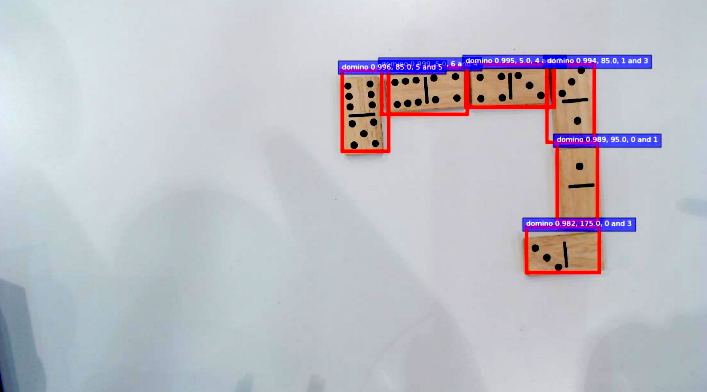
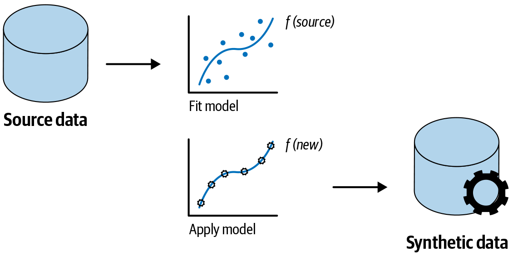

# 섹션 3 | 합성 데이터 고도화 -- 만든 데이터가 실제로 도움이 되는가

---

## 3-1. 핵심 개념 + 실험 설계

### 가장 중요한 질문

> 우리가 만든 합성 데이터가 실제로 모델 성능을 올려 주는가?

섹션 1과 2에서 결함 이미지를 자유롭게 생성하는 능력을 얻었지만, 이건 **수단**입니다. 진짜 목적은 **탐지 모델의 성능 향상**. 합성 데이터가 그 목적에 봉사하지 못한다면 아무리 좋은 이미지를 만들어도 의미가 없습니다.

### 합성 데이터의 본질

> *Practical Synthetic Data Generation* 1장: **"실제 데이터에서 학습한 분포의 통계적 성질을 공유하면서, 실제 개인을 식별할 수 없는 데이터."**

잘 만들면 매우 유용한 도구지만, 잘못 만들면 독이 됩니다.

### 합성 데이터가 효과적인 시나리오

**① 소수 클래스 보강**

- 결함처럼 애초에 희귀한 데이터를 합성으로 채우면 모델이 결함 패턴을 충분히 학습
- **Recall이 올라감**

**② 다양성 확보**

- 실제 데이터에 없는 결함 조합을 합성으로 생성
- 예: "오른쪽 모서리에 10mm짜리 깊은 스크래치"
- 모델이 처음 보는 형태에도 강해짐 -> **일반화 성능 개선**

**③ 라벨링 비용 절감**

- 합성 데이터는 생성 단계에서 이미 라벨이 결정되어 있음
- "스크래치 결함을 만들어 달라" -> 스크래치 라벨이 자동으로 붙음
- 사람이 일일이 라벨링할 필요 없음

### 합성 데이터가 해로운 시나리오

**① 생성 품질이 낮을 때**

- SSIM이 0.3 같은 낮은 품질의 이미지를 학습에 넣으면 노이즈를 주입하는 셈
- 모델이 잘못된 패턴을 외움

**② 합성 비율이 너무 높을 때**

- 합성이 80~90%가 되면 모델이 학습하는 분포가 실제 데이터 분포에서 멀어짐
- 테스트 시점에 실제 이미지를 만나면 일반화가 안 됨

**③ 도메인 불일치**

- 합성 이미지가 색상, 텍스처, 조명 같은 미묘한 부분에서 실제와 다르면
- 모델이 부수적인 특징을 결함의 신호로 잘못 학습

### 가장 흔한 실패 시나리오

```
합성 스크래치: 완벽하게 직선, 깊이가 균일
실제 스크래치: 불규칙한 방향, 깊이 변화

-> 합성으로만 학습한 모델은 "완벽한 직선 스크래치"만 인식
-> 현장의 진짜 스크래치는 놓침
```

```{admonition} 핵심 질문
:class: important

"얼마나 섞을 것인가"가 핵심 질문입니다.
0%도 아니고 100%도 아니고, 그 사이 어딘가에 최적점이 있습니다.
```






### 실험 설계: 무엇을 비교할 것인가

> *Practical Synthetic Data Generation* 4장의 평가 방법론

```{mermaid}
flowchart TD
    A["데이터셋 구성"] --> B["실제 결함 50장"]
    A --> C["합성 결함 200장"]
    A --> D["테스트셋: 실제 20장<br/>(절대 학습에 사용 안 함)"]
    B --> E["4가지 데이터 구성 실험"]
    C --> E
    E --> F["평가: F1, Recall, Precision"]
```

**데이터셋 구성**

- 실제 결함 이미지: 50장 (현실적으로 모은 소량)
- 합성 결함 이미지: 200장 (섹션 1·2에서 생성)
- 테스트셋: 실제 이미지 20장 (절대 학습에 사용 안 함)

```{admonition} 가장 중요한 원칙
:class: warning

**테스트셋은 절대 학습에 안 들어갑니다.**
합성 데이터의 효과를 검증하려면 평가는 항상 **실제 데이터**로 해야 합니다.
합성 데이터로 평가하면 "합성으로 학습한 모델은 합성을 잘 맞춘다"는 동어반복밖에 안 나옵니다.
```

**비교할 데이터 구성 4가지**

| 구성 | 실제 데이터 | 합성 데이터 | 비고 |
|------|-----------|-----------|------|
| **Baseline** | 50장 | 0장 | 기준선 |
| **실험 A (1:1)** | 50장 | 50장 | 실제와 합성을 균등 혼합 |
| **실험 B (1:3)** | 50장 | 150장 | 합성 비율을 높임 |
| **실험 C (합성만)** | 0장 | 200장 | 극단적 케이스 |

**평가 지표**

- **F1-Score**: Precision과 Recall의 조화 평균. 균형 잡힌 성능
- **Recall**: 결함을 놓치지 않는 능력. **제조 안전에서 가장 중요**
- **Precision**: 오탐 비율. 너무 낮으면 알람 피로 발생

Session 1에서 배운 불균형 데이터 평가 지표가 여기서 다시 쓰임. 같은 도구를 다른 문제에 적용.

**실험에서 보고 싶은 것**

> "실제만"이 가장 보수적이고, "합성만"이 가장 위험하고, 1:1 또는 1:3 어딘가에 최적점이 있을 가능성이 높다.

---

## 3-2. Claude Code 시연

### 시연 목표

코드를 만드는 것 자체가 아님. **나온 결과를 보고 "왜 이런 결과가 나왔는지" Claude와 대화하는 흐름**이 진짜.

**Claude에게 던질 프롬프트**

```
합성 데이터 추가 효과를 비교하는 실험 코드를 만들어줘.

실험 설정:
- 실제 결함 이미지: 50장 (numpy로 합성)
- 합성 결함 이미지: 200장 (품질이 약간 낮은 버전으로 시뮬레이션)
- 분류 모델: ResNet18 fine-tuning
- 4가지 데이터 구성: 실제만 / 1:1 / 1:3 / 합성만

결과 시각화:
1. 4가지 모델의 Confusion Matrix (2x2 subplot)
2. F1 / Recall / Precision 비교 막대그래프
3. 합성 비율 vs 각 지표 꺾은선 그래프

GPU 없는 환경에서도 실행 가능하게 (간단한 CNN으로 대체)
```

### 시연 흐름

**1. 데이터셋 시뮬레이션**

- 실제 결함: 일정한 패턴에 약간의 노이즈
- 합성 결함: 같은 패턴이지만 조금 더 단순하고 균일
- 이 차이가 모델 학습에 어떻게 영향을 주는지가 관찰 대상

**2. 모델 학습 함수**

- ResNet18 또는 간단한 CNN을 fine-tuning
- 같은 학습 설정으로 4번 학습시키고 각각의 결과를 저장
- 결정적 요인이 **데이터 구성**이라는 점을 명확히 하기 위해 다른 변수는 모두 고정

**3. 평가**

- 각 모델을 동일한 실제 테스트셋 20장으로 평가
- Confusion Matrix, F1, Recall, Precision 계산

### 시연 결과 분석

**가상 결과 예시**

| 구성 | F1 | Recall | Precision |
|------|-----|--------|-----------|
| 실제만 | 0.72 | 0.65 | 0.81 |
| 1:1 | 0.78 | 0.82 | 0.75 |
| 1:3 | 0.74 | 0.88 | 0.64 |
| 합성만 | 0.55 | 0.71 | 0.45 |

(실제 숫자는 머신마다 다름. 핵심은 패턴)

**가장 주목할 패턴**: 합성 데이터를 더할수록 **Recall은 올라가는데 Precision은 내려감**

```{mermaid}
flowchart LR
    A["합성 데이터 증가"] --> B["Recall 상승"]
    A --> C["Precision 하락"]
    B --> D["더 많은 결함 패턴 학습"]
    C --> E["합성 특유의 부수 특징까지<br/>결함 신호로 학습"]
```

### Claude에게 결과 해석 요청

```
합성 데이터를 추가했더니 Recall은 올라갔는데 Precision은 내려갔어.
왜 이런 일이 생기는지 설명해 주고,
이 상황에서 어떤 지표를 더 믿어야 하는지 알려줘.
```

**Recall이 올라간 이유**

- 합성 데이터가 모델에게 더 많고 다양한 결함 패턴을 보여 줌
- 모델이 결함을 잘 찾아내는 능력이 올라감
- "이런 형태도 결함이다"는 폭이 넓어짐

**Precision이 내려간 이유**

- 합성 결함과 실제 결함 사이에 미묘한 차이가 있고, 모델이 그 차이까지 "결함의 신호"로 학습
- 정상 이미지에서 합성 결함 비슷한 부수 특징이 보이면 결함이라고 잘못 판정
- 오탐이 늘어남

**어떤 지표를 믿을지는 응용 분야에 따라 다름**

```{admonition} 제조업에서는 Recall이 압도적으로 중요
:class: important

- 결함을 놓치면 불량품이 출하되거나 안전 사고로 이어짐
- 반면 오탐은 인력으로 재검사하면 됨 (비용은 들지만 회복 가능)
- Session 2에서도 강조한 원칙: **제조 안전에서는 Recall 최우선**
```

### 시연 결론

- **1:1 혼합이 최적에 가까움**: F1과 Recall이 둘 다 가장 좋고, Precision도 너무 떨어지지 않음
- **1:3**: Recall은 더 좋지만 Precision이 너무 낮아져서 알람 피로 우려
- **합성만**: 명백히 안 됨

이 결론은 시드와 데이터에 따라 다를 수 있으므로 **본인이 직접 돌려서 비슷한 패턴이 보이는지 확인**하는 것이 중요.

---

## 3-3. 자유 실습

세 가지 난이도로 준비. **하나를 깊게** 파는 것을 추천.

### 기본 -- 합성 데이터 비율 최적점 찾기

"그러면 최적 비율은 정확히 얼마인가?" 시연에서는 4가지였지만, 더 촘촘히 봐야 정확한 sweet spot을 찾을 수 있음.

**과제**

1. 합성 데이터 비율을 **0%, 25%, 50%, 75%, 100%** 다섯 가지로 변화시키며 모델 학습
2. 각 비율에서 F1-Score, Recall, Precision을 기록
3. 비율 vs 각 지표의 꺾은선 그래프를 그림

**힌트**

- 비율이 올라갈수록 Recall은 단조 증가하다가 어느 시점부터 꺾임
- Precision은 단조 감소
- F1은 둘의 균형이라 **종 모양 곡선**이 나올 가능성이 큼
- 최적점은 보통 25~50% 사이에 있음

**제출**: 비율별 성능 표 + 최적 비율과 그 이유를 한 문단으로

### 중급 -- 합성 이미지 품질 필터링

모든 합성 이미지가 동일하게 가치 있지는 않음. 품질이 낮은 합성을 걸러내면 같은 양으로 더 좋은 성능을 얻을 수 있을까?

**과제**

1. 합성 이미지 200장 전체에 대해 SSIM을 계산 (실제 결함 한 장과의 유사도)
2. 세 가지 필터링을 비교:
   - 전체 사용 (필터링 없음)
   - SSIM > 0.5만 사용
   - SSIM > 0.7만 사용
3. 각각의 데이터로 학습해서 성능을 비교

**제출**: SSIM 임계값별 사용 이미지 수 + 성능 표 + 한 문단의 결론

**Claude에게 추가 질문**: "FID와 SSIM 중 어떤 지표가 학습 성능을 더 잘 예측하는가?"

- FID는 분포 수준 평가라 학습 일반화와 더 잘 연결될 수 있음
- SSIM은 개별 이미지 평가라 노이즈 필터링에 더 적합할 수 있음
- 정답이 없는 질문. Claude의 답을 본인의 실험 결과와 비교하는 것이 핵심

### 심화 -- 결함 유형별 합성 효과 차이

합성이 모든 결함 유형에 동등하게 효과적인가?

- 스크래치: 단순한 직선 패턴 -> 합성이 쉬움
- 크랙: 가지 모양 -> 합성이 더 어려움
- 가설: **합성 품질이 높은 유형에서 학습 효과도 더 좋다**

**과제**

1. 스크래치, 버블, 크랙 세 가지 결함 유형 각각에 대해 **실제만 학습 vs 실제+합성 학습**의 Recall 개선폭을 측정
2. 각 유형의 평균 SSIM(생성 품질)도 측정
3. **SSIM(x축) vs Recall 개선폭(y축) 산점도**를 그림

**제출**: 산점도 + 상관관계 해석 한 문단

- 가설이 맞다면 양의 상관관계가 나올 것
- 안 맞다면 왜 그런지 추가 분석 (결함 유형의 본질적 복잡도? 데이터 양? 다른 요인?)

---

## 클로징 -- Session 4 정리

### 세 섹션 요약

**섹션 1 -- Diffusion Model**

- Forward는 노이즈 추가, Reverse는 노이즈 제거
- 모델이 학습하는 것은 노이즈 제거의 **방향성**
- DreamBooth, LoRA, Textual Inversion 세 가지 Fine-tuning 전략 중 LoRA가 일반 사용자에게 현실적
- SSIM, FID로 생성 품질 평가

**섹션 2 -- 프롬프트로 결함 제어**

- CLIP이 텍스트와 이미지를 같은 벡터 공간에 놓는 능력이 Text-to-Image 생성의 기반
- 프롬프트 설계 공식: [결함 유형] + [위치] + [심각도] + [재질] + [촬영 스타일]
- 네거티브 프롬프트와 guidance_scale의 적절한 활용
- 시드 고정으로 재현성 확보

**섹션 3 -- 합성 데이터 검증**

- 합성은 **적당히 섞을 때** 가장 효과적
- Recall과 Precision의 트레이드오프를 데이터로 확인
- Recall 중심 평가가 제조업에 적합

### 네 세션을 하나의 파이프라인으로

```{mermaid}
flowchart TD
    A["부족한 결함 데이터"] -->|"Session 4: 생성 AI로 보강"| B["충분한 학습 데이터"]
    B -->|"Session 1: 전처리·라벨링·증강"| C["정제된 데이터셋"]
    C -->|"Session 2 & 3: 모델 학습"| D["이상 탐지·RUL 예측·객체 탐지 모델"]
    D -->|"Session 3: 실시간 파이프라인 구축"| E["공장에 배포된 모니터링 시스템"]
```

**제조 데이터 AI 실무의 전체 흐름**: 데이터 확보부터 배포까지

### 참고 문헌

- 섹션 1: *Hands-On Generative AI with Transformers and Diffusion Models* (Omar Sanseviero et al., O'Reilly) Ch.4, Ch.7
- 섹션 2: *Generative Deep Learning, 2nd Edition* (David Foster, O'Reilly) Ch.4, Ch.13 / *Hands-On Generative AI* Ch.2
- 섹션 3: *Practical Synthetic Data Generation* (Khaled El Emam et al., O'Reilly) Ch.1, Ch.4

### 추가 학습 방향

- *Hands-On Generative AI* Ch.7: Fine-Tuning 심화
- *Hands-On Generative AI* Ch.8: **ControlNet** -- 텍스트 프롬프트를 넘어 엣지 맵이나 포즈 같은 이미지 구조 정보까지 조건으로 사용. 결함의 정확한 위치까지 지정할 때 유용
